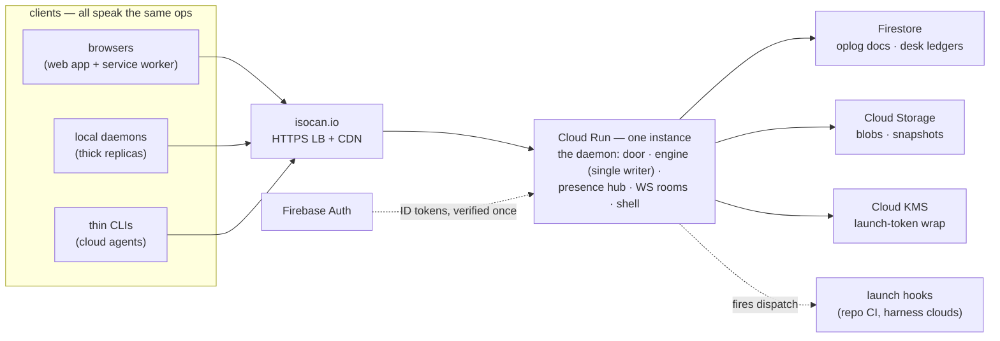

# The architecture

The [journey](multiuser-journey.md) is the experience; the
[design docs](design/) are the mechanisms; this doc is the physical
realization — what actually runs, where, on whose infrastructure. It is
a **living doc with a specific contract**: the whole system is mapped
here now, and the map changes only when reality produces something we
didn't see coming — never because a region was left blank to fill in
later. The record of what moved it lives in the phase findings of
[phases.md](phases.md): a finding that redraws the map edits this doc
in the same change.

## Givens

- **Google Cloud**, one region (`us-west1` — compute, Firestore, and
  buckets co-located), **isocan.io** as the domain.
- **Firebase is sanctioned.** One clarification owed to history: the
  reversed 2026-08-21 design put Firestore *between clients* — a mirror
  and mailbox the protocol depended on. That reversal stands. Here
  Firestore sits *behind* the home daemon as its disk; no client ever
  touches it, and the protocol never learns it exists.
- Constraints inherited from the journey and designs, not re-argued:
  the home is an ordinary isocan daemon (the deployment-detail thesis);
  people enter through one origin; each canvas has a single writer; the
  two-ledger rule (canvas state replicated, desk ledgers
  innkeeper-private); presence is ephemeral and never written; isocan
  never runs compute; and the protocol admits any innkeeper —
  commitment 2 is a test this doc must keep passing.

## The stack

| layer | choice |
| --- | --- |
| language / runtime | TypeScript on Node 22, run with `tsx` as today — the container pins the toolchain, and an always-on instance makes cold-start economics moot |
| the home | the existing daemon (`@isocan/server`), containerized, on **Cloud Run** — one service, **exactly one instance** (min = max = 1, CPU always allocated, concurrency raised for sockets) |
| op durability | **Firestore** (native mode) — one document per op |
| blobs, snapshots | **Cloud Storage** — one bucket per environment |
| desk ledgers | **Firestore** — badges, grants, attestations, registrations, audit; registration launch tokens wrapped by **Cloud KMS** |
| attesters | **Firebase Auth** — magic-link email (the floor), Google, GitHub |
| front door | global external HTTPS load balancer + Cloud CDN + managed cert → serverless NEG → the Cloud Run service |
| secrets | Secret Manager (GitHub app credentials and kin) |
| deploy | **Cloud Build triggers** on the GitHub repo — push to `main` builds and deploys dev; prod promotes only by an explicit gesture (a `prod` tag, moved deliberately) — NOT the `release` branch, which CI regenerates from every main commit: it is the CLI distribution branch, not a gate; build → Artifact Registry → `gcloud run deploy`, all inside GCP on a build service account, so no cross-cloud credentials exist at all |
| environments | two GCP projects: `isocan-dev` at dev.isocan.io, `isocan-prod` at isocan.io |
| observability | Cloud Logging + Error Reporting, uptime check on `/api/healthz` — see the note below |
| infra as code | `infra/` — small idempotent gcloud scripts; Terraform waits for a second operator |

**Why the health check is `/api/healthz` and not `/healthz`.** Two
reasons were given for this, one of them has since stopped being true,
and the surviving one is the better of the pair — so both are kept, in
order, rather than the dead one being quietly deleted.

The reason that has expired: **Google's frontend used to claim the exact
path `/healthz`.** Measured on the dev home 2026-08-22 — `/` 200, an
unknown path 200 through our SPA fallback, `/healthz/` 200, `/HEALTHZ`
200, and `/healthz` a branded 404 that never appeared in the container's
request log. Re-measured 2026-08-23 against the same home, and it is
gone: `/healthz` now returns **the daemon's own body**, `pid` and
`root: /app` and all, byte-identical to `/api/healthz`. What changed —
Google's frontend, or something in the load balancer between the two
measurements — is not established, and that is the point: it is not
ours to control and it moved under us inside a day.

The reason that stands, and always did the real work: **`/api/` is the
one prefix the SPA fallback does not answer with a cheerful 200.** The
same re-measurement makes this sharper than before — `/healthz/` and
`/HEALTHZ` return 1001 bytes of `index.html`, not health JSON, so a
check pointed at a near-miss path is green forever and cannot fail for
the right reason. If the handler ever vanishes, `/api/healthz` goes red;
a check on some bare `/health` gets the app shell and never does. That
argument never depended on the frontend at all.

`/healthz` is unchanged and stays the localhost path — the CLI's whole
daemon lifecycle probes it against 127.0.0.1, where no frontend is in
the way. `healthPath()` picking `/api/healthz` for a remote address is
therefore **defensive rather than necessary today**, and worth keeping
on those terms: the behaviour it guards against existed, went away
without notice, and can come back the same way.

Two roads not taken, each in one line. **A VM with a persistent disk**
would run today's daemon unchanged, but buys OS care, a deploy story,
and a single disk as the only copy — and the storage adapter it avoids
is work the two-ledger rule wants anyway. **Firebase Hosting** cannot
carry the WebSocket and would split the one origin in two; the daemon
already serves its own shell, and the CDN in front of it does the rest.

## The home, physically

The process is still one daemon. Everything that makes it correct
stays in-process exactly as it is today: the engine's single-writer
promise chain, the presence hub, the WS rooms, undo stacks, GC. Google
Cloud replaces the daemon's *disk*, never its judgment. The shape of a
deploy is the shape of a crash — which the next two sections make into
a feature rather than a risk.

## Storage: the Store grows a second backing

`Store` is already the seam — the engine mutates nothing except
through its methods. As of phase 1 it *is* an interface, with room for
two backings: **FileStore** (today's code, unchanged, and still the
default — any innkeeper with a disk runs a complete home) and
**CloudStore** (what the hosted home configures). The mapping, file by
file:

| FileStore | CloudStore |
| --- | --- |
| `oplog.jsonl` append + fsync | `canvases/{id}/ops/{seq}` — one create-only document write; the ack is the fsync. The seq is zero-padded (`ops/000000000041`), because document ids sort lexicographically and `ops/9` would otherwise sort after `ops/10`; the entry itself rides as an opaque JSON string, so a new `Operation` shape can never break persistence, with `seq`/`ts`/`actorId`/`opType` denormalized beside it for the console. An entry over ~900 KiB spills its bytes to `canvases/{id}/ops/{seq}.json` in the bucket — object first, document second, so the ack still means durable |
| `oplog` compaction — atomic rewrite of the live file | **advance a horizon; delete nothing.** The cloud has no equivalent of the file rewrite, and it must not grow one: deleting an op document frees its id, and a create-only precondition on a free id passes, so a stale writer could re-claim a compacted-away seq and succeed. Compaction appends the dropped entries to `oplog-archive.jsonl`, marks their documents compacted, and advances `compactedThrough` on the canvas document; boot reads `where("seq", ">", compactedThrough)`, which is what compaction is FOR in the cloud, where there is no file to keep small. Every seq ever used stays claimed forever, and the precondition is absolute rather than horizon-limited. The lever if a rollout ever proves nastier: assert `seq === lastSeq + 1` inside a transaction with the create — strictly stronger, at two round trips per op on the durability path |
| `canvas.json`, `trash.json` snapshots | GCS objects (snapshots can outgrow Firestore's document limit; the oplog is truth, snapshots are a fast boot) — and **debounced**, because a full-canvas object write on every op would put a bucket round trip on the latency path for data that is derived. The engine still calls `saveSnapshot` after every op and cannot tell; the backing flushes on a count, a timer, idle, and shutdown. The visible consequence: a cloud boot routinely replays a tail where a file boot does not, so recovery stops being the exceptional path and becomes the everyday one — which is what min-instances 0 on dev already wanted |
| `project.json` | the `canvases/{id}` document, written when the metadata changes rather than once per op — a single document has roughly a one-write-per-second ceiling, and the oplog is what carries the per-op rate |
| `project.delete` — soft, the directory moved aside (which frees the id) | soft too — `deleted: true` on the canvas document, ops untouched. The id therefore stays **taken forever**: its seqs are still claimed, so re-creating it is refused with `duplicate-id` rather than being fenced. The one place the two backings differ in what they *allow*; canvas ids are minted, never chosen, so nothing reaches it |
| `blobs/<sha256>.<ext>` | GCS objects, same content addressing |
| `blobs.json` index | `canvases/{id}/blobmeta/{hash}` — one doc per blob, no read-modify-write of a shared index. Costlier than it looks: `Engine.gc` drove that read-modify-write from *above* the seam (read the whole index, age each blob, delete, write back), so this row was not a schema swap behind an unchanged method. Phase 4 moved it: the seam now says `listBlobs` and `deleteBlobs`, the policy stays in the engine where `gc.test.ts` already tests it, and no shared-index concept crosses in either direction |
| `actors.jsonl` + `actors.json` | same op-docs-plus-snapshot pattern, for the registry's public face (ids, names, colors); the claims half re-keys onto `badges/` — the two-ledger split, drawn in code |

The durability contract is unchanged: an op is durable **before** it is
broadcast — `appendLineDurable`'s fsync becomes a Firestore write ack.
And boot is the crash-recovery path that already exists: load the
snapshot, replay the oplog tail through the reducer. An instance
restart, a deploy, a crash — all the same path, now reading from GCS
and Firestore, and already tested every day by the file backing.

**What a replica's store actually holds, as of phase 6.** "Canvas state
replicates through the store" is true of the state and not of the
history. A joining replica can only present cursor 0, and the connect
handshake answers a cursor it cannot serve with a snapshot — so a
replica's oplog begins at the moment it joined, and a replica that ever
falls behind the home's compaction horizon is re-snapshotted and starts
again from there. State converges exactly; the log is a cache, never a
claim to the whole history. Nothing downstream depends otherwise — undo
and redo are the home's, and `wait` and `tail` are cursor-based — but
"sovereignty by replica is also disaster recovery" is a claim about the
canvas, not about its oplog, and this is the line that says so.

**Deploy overlap is the one moment two instances exist.** During a
rollout the old instance drains while the new one starts. Two writers
against one oplog is the disaster the whole design forbids, so the
schema forbids it structurally: the op document's id *is* its seq, and
the write carries a create-only precondition. A second writer does not
interleave — it errors loudly and re-syncs. Ordering authority stays
in-process where it always was; Firestore is durability, not a judge.

What "errors loudly and re-syncs" means, concretely, as of phase 4:
`ALREADY_EXISTS` becomes an `OplogFencedError` — its own error with its
own wire code (`writer-fenced`, a 409), distinct from every validation
failure precisely because the one thing a client must never do with it
is retry. The daemon drops that canvas's runtime, so the next request
re-loads from the store and numbers itself from the winner's log.
Nothing was applied: the append happens *before* in-memory state is
touched, so a fenced writer is merely stale, never inconsistent. The
re-sync is per canvas; process-level fencing — a draining instance that
stops serving, or exits — is a rollout question and belongs to the
phase where a rollout exists.

## Single-writer on a platform that wants to scale

Why one instance is correct and not a compromise: the engine chain,
presence, and rooms are in-memory state that one process keeps
consistent for free. The moment there are two instances, every one of
those needs a coordination story — so there is one instance, and the
ceiling is stated in numbers instead of hidden.

**The ceiling.** Cloud Run tops out at 1000 concurrent requests per
instance, and a WebSocket holds one for its lifetime. Every person is
one socket, every thick daemon one, every thin agent one: the ceiling
is roughly a thousand simultaneous connections, minus long-polls —
hundreds of concurrently active collaborators before anything has to
change, with a vertical lever (4 vCPU) before an architectural one.

**The second ceiling, which is Firestore's.** A collection whose
document ids increase monotonically concentrates on one tablet —
Google's "500/50/5" rule — and tops out around **500 writes per second**
without ramping. Ours increase monotonically by construction and must:
the seq *is* the precondition, so sharding the key would trade the
guarantee for headroom we do not need. At one writer per canvas and
human-driven ops we are three orders of magnitude below it. Named
because it is the number that binds second, not because it binds.

**The growth path, chosen now so the schema can't warp later:** when
the ceiling is real, canvases **shard across instances** — a
home-assignment lease in Firestore, a thin router by canvas id — and
each canvas still has exactly one writer. Never multi-writer per
canvas; scaling multiplies homes, not writers. Every **canvas** in the
CloudStore schema is keyed per-canvas, so sharding canvases is a
router, not a data migration — but two things in it are deliberately
**home-scoped** and would not shard with them: the actor registry
(`meta/actors` plus the `actors/` oplog; `loadActors()` takes no canvas
id) and the whole desk. Both are one database behind whatever router
appears, which is why the conclusion survives — but the day somebody
shards on the strength of "everything is per-canvas" they will find a
shared registry, so it is written down here instead. Presence would
then need a cross-instance relay (Pub/Sub) — deferred until that day,
and only that part.

**WebSockets through the LB.** The backend timeout is set to an hour;
a socket that hits it drops and reconnects. That is not a mitigation —
the seq-cursor reconnect *is* the design (journey rule 4), and an
hourly reconnect walks the same path a lid-close does.

**Why min-instances is 1 in prod:** parked agents and presence are
held connections; scale-to-zero would hang up on every park. Dev runs
min-instances = 0 on purpose — every dev request cold-boots through
the crash-recovery path, which keeps the most important code path in
daily use.

## The desk on Firestore

The desk's ledgers are ordinary collections, innkeeper-private per the
two-ledger rule:

- `badges/{badgeId}` — `{secretHash, kind, createdAt, lastSeen,
  admissions: [{canvasId, provenance, at}],
  claims: [{actorId, boundAt, sessionKey?, projectId?}],
  claimIds: [actorId], claimKeys: [sessionKey], admittedTo: [canvasId],
  attestations: [{attribute, verifiedVia, at}]}`. The badge secret is
  256-bit random and stored **hashed** — the desk keeps no secret it
  doesn't have to, so a leaked ledger leaks no bearer tokens. A claim is a
  **row, not an id**: it carries `boundAt` (the 30-minute
  claim-stands window `reincarnate` judges an `as` against) and the
  demoted `sessionKey` — which of this badge's claims a client means, an
  index the home never trusts. The three flat arrays are the same data
  denormalized, one per question the desk is actually asked, because each
  is an `array-contains` here and a whole-table scan everywhere else:
  `claimIds` answers "who claims this actor?" (global — ids never
  recycle), `claimKeys` answers "who holds this session key?" (the
  lost-badge recovery route), and `admittedTo` answers "whose rosters does
  this badge share?" — the admission scope mechanism 10 judges names
  against. Two rules the cloud desk lives or dies by, made structural in
  phase 4: **exactly one function writes a badge document**, and it
  derives all three arrays from the record on every call, so "did you
  remember to update `claimIds`?" is not a question anybody has to ask;
  and the reads that use them are **queries with no fallback** — never
  "if the query came back empty, scan the collection", because a
  fallback would make a badge whose arrays were never written answer
  correctly anyway, which is precisely the phase 3 failure wearing a
  helpful face. `touch()`'s debounce is likewise not an optimization
  here but a correctness requirement: `lastSeen` on every request is one
  write per request against a single document, straight into Firestore's
  ~1/second limit. The migration **shelf** belongs to no badge and so has
  no home in `badges/{badgeId}`; it is `meta/shelf`, one document keyed
  by sessionKey, read alongside the queries exactly as `FileDesk` reads
  it alongside its walk. On a FileStore home the desk is
  `~/.isocan/desk/` — `badges.json` snapshot over an append-only
  `badges.jsonl`; the claims half is logged and fsynced (a claim carries
  authorization, so one lost file must not cost somebody their own name),
  while `lastSeen` and `admissions` are not, because the address admits and
  a returning badge re-admits itself.
- `grants/{id}` — `{canvasId, subject, grantedBy, at}`.
- `registrations/{id}` — frozen delegation's record; the scoped launch
  token is KMS-wrapped at write and unwrapped only at fire time.
- `audit/` — append-only firing and admission ledger. The audit ledger
  is Firestore, not Cloud Logging: logs rotate, the ledger answers.

Carriers are as the desk designed them — HTTP-only cookie at the one
origin, bearer token in the daemon's `auth` block — with the
`SameSite`-plus-Origin check enforced in the service (the LB passes
Origin through untouched).

## Attesters: Firebase Auth is the borrowed bench

Borrow, never mint — Firebase Auth is the attester bench, not an
account system isocan adopts. The web app runs its client flows
(magic-link email, Google, GitHub); the server verifies the resulting
ID token **once**, writes the attestation onto the caller's badge, and
the Firebase session is done mattering — the badge remains the only
credential isocan issues. Repo-read attestation rides the GitHub OAuth
token: one API check, one attestation row. If Firebase Auth were
swapped out tomorrow, the desk wouldn't notice — attestations name the
attribute, not the attester's vendor.

## Blobs

One catch was seen during mapping (so it lives here, not in the
surprise log): **Cloud Run caps HTTP/1 request bodies at 32 MiB**, and
today's blob route accepts 512 MiB. So the hosted home splits the
upload path by size: small blobs go through the daemon exactly as
today; large ones ask the daemon first — which checks badge and
admission, then mints a short-lived **signed PUT URL** — upload
straight to GCS, and register the blob meta after. The big bytes never
transit the instance. `MAX_DIRECT_UPLOAD_BYTES` in `@isocan/core` is
the one number both clients branch on, set at 24 MiB for headroom under
the cap. Downloads stream through the daemon and **Range is honored**
— `Accept-Ranges` unconditionally, `206` with a `Content-Range`,
`416` for a range that starts past the end, and an unparseable header
treated as absent per RFC 9110; the backing takes the range, so a seek
in a video does not re-read the whole object from the bucket. Signed
GETs and CDN fronting are tuning levers when egress asks for them.
FileStore keeps the single simple path at any size — `beginUpload`
returns null there, which is how a client learns to just post the bytes
— so the split is CloudStore's, and the CLI and web uploader grow one
branch.

Two properties of that branch, stated rather than assumed. The ticket
is minted only when `blobmeta/{hash}` does not already exist, and it
signs `x-goog-if-generation-match: 0` into the request: **blob writes
are create-only for the same reason op writes are**, so a leaked ticket
cannot replace bytes an item already points at. And the daemon never
sees the bytes, so it takes the client's word for the hash — an
**accepted limit**, bounded to one canvas that the same admitted client
could have emptied anyway, and a read-back to re-hash would defeat the
entire point of the direct upload. What is *not* taken on faith is that
the object arrived: a register naming nothing is refused, and the size
comes from the object store rather than from the client.

## Presence, hooks, GC, backups

- **Presence** — in-memory in the hub, TTL as today. One instance
  means multi-machine liveness needs nothing new, which was the
  journey's bet all along.
- **Launch hooks** — outbound HTTPS from the service at fire time. The
  service account is scoped to exactly its own furniture: this
  project's Firestore, this bucket, this KMS key, named secrets —
  nothing else, so home compromise stays the innkeeper doc's honest
  worst case and not a lateral move into the rest of the cloud.
- **GC** — Cloud Scheduler calls the existing GC endpoint on a
  schedule, authenticated by OIDC service identity, behind the door
  like every route.
- **Backups** — Firestore point-in-time recovery on, plus a scheduled
  export to the bucket. The export writes a **new timestamped folder
  per run**, never a fixed one, so the bucket holds many restore points
  and a bad export cannot land on top of a good one; a lifecycle rule
  sweeps whole exports by age. The bucket also keeps a soft-delete
  window under GC.

  **And a thick replica is NOT a backup, which this doc used to say the
  opposite of.** "The best backup remains a thick replica — sovereignty
  by replica is also disaster recovery" was written before replicas
  existed; phase 6 built them and measured what one actually holds. A
  replica holds the canvas **state**, live and exact. It does not hold
  the **history** — its oplog begins where it joined, because a joining
  replica can only present cursor 0. And it does not hold the **bytes**:
  blobs it did not itself upload are streamed from the home on demand
  and are not cached, so a second device shows every item and stores
  none of their files. Measured, not reasoned — a two-machine setup
  where the second machine's blob directory stayed empty across repeated
  reads of a file it displayed perfectly.

  So disaster recovery is Firestore PITR and the scheduled export, full
  stop. A replica is a live mirror, and calling it a backup would fail
  in the one direction that matters: it looks complete until the home is
  gone. **This lands on [phases.md](phases.md)'s phase 13 too** —
  re-homing is drawn as "a thick replica offers its store to a new home
  … hello, badge, offer, replay", and the store it would offer is
  missing exactly the two things a replay needs.

## Distance to the map

What the code does not have yet — an inventory, not a sequence (the
sequence is [phases.md](phases.md)):

- The service worker: cached shell, durable browser replica, offline
  queue.
- The Share dialog and grant routes; registrations and the dispatch
  path.
- **Which canvases a replica replicates.** The home connection discovers
  them by polling `GET /api/projects`, which is home-wide rather than
  scoped to the asking badge's admissions — so a replica of a
  MULTI-TENANT home would mirror strangers' canvases onto its own disk.
  Correct today, because a solo home has one member and that is what
  phase 6 proves; wrong the moment a home has two. The narrowing is
  mechanism 10's and belongs on the route, in phase 7.
- The **clients'** half of the large-blob upload: the daemon serves the
  ticket and the register route, and neither the CLI nor the web
  uploader branches on `MAX_DIRECT_UPLOAD_BYTES` yet. The intent is
  still "add this file", so it is a transport branch and not a verb —
  and when it lands, `agent-guide.md`'s advice to `POST …/blobs`
  directly needs the size caveat beside it.
- One assertion in the signed-URL branch, named rather than assumed:
  that GCS accepts a signature the service mints, that it honors
  `x-goog-if-generation-match: 0` inside a signed request, and that a
  Cloud Run service account — which has no private key — can sign at
  all. See Phase 5's Work.

## Any innkeeper, still true

The image builds from the public repo; FileStore is the default
backing; CloudStore is switched on by configuration — `ISOCAN_STORE=cloud`
and friends, read from the environment, because that is how Cloud Run
passes it and because a `--store` flag would be a surface an agent could
reach for and misuse. Google Cloud imports live in the CloudStore
adapter and the KMS wrap and **nowhere else** — core and the protocol
never learn the vendor exists.

As of phase 4 that is a **package boundary rather than a convention**:
`@google-cloud/*` are dependencies of `packages/cloudstore` and of
nothing else, `daemon.ts` reaches that package by dynamic import inside
the one branch that picks a backing, and `test/packaging.test.ts`
asserts both halves. The measurement that decided it: those two
libraries are 156 packages and ~43 MiB, and
`npm i -g github:dglazkov/isocan#release` resolves the ROOT manifest
only — so an installed CLI stays at 81 packages and 18.6 MiB, and could
not resolve the specifier even if something asked for it.

The litmus test, to be kept passing: `isocan serve` on a rented VM with
a disk is a complete home. A feature that only works on the GCP home has
broken commitment 2, whatever else it does.

## Cost, order of magnitude

Prod is dominated by the always-on instance: roughly $50/mo for
1 vCPU / 1 GiB with CPU always allocated, plus ~$20/mo for the load
balancer. Firestore, GCS, KMS, and Firebase Auth are cents at journey
scale. Dev scales to zero and rounds to nothing. Call it **under
$100/mo** for both environments until the ceiling section becomes
relevant — at which point the bill and the architecture change
together, which is the honest coupling.

## When this doc changes

When reality produces something this map didn't see, the map changes
**and** the reason is recorded as a dated finding on the phase that
surfaced it, in [phases.md](phases.md). Things seen during mapping
(the 32 MiB blob cap, deploy overlap) are in the map above, not there
— the findings are only for what the map missed.
