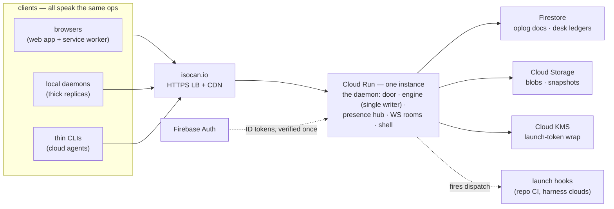

# The architecture

The [journey](multiuser-journey.md) is the experience; the
[design docs](design/) are the mechanisms; this doc is the physical
realization — what actually runs, where, on whose infrastructure. It is
a **living doc with a specific contract**: the whole system is mapped
here now, and the map changes only when reality produces something we
didn't see coming — never because a region was left blank to fill in
later. The record of what moved it lives in the phase findings of
[phases.md](phases.md): a finding that redraws the map edits this doc
in the same change.

## Givens

- **Google Cloud**, one region (`us-west1` — compute, Firestore, and
  buckets co-located), **isocan.io** as the domain.
- **Firebase is sanctioned.** One clarification owed to history: the
  reversed 2026-08-21 design put Firestore *between clients* — a mirror
  and mailbox the protocol depended on. That reversal stands. Here
  Firestore sits *behind* the home daemon as its disk; no client ever
  touches it, and the protocol never learns it exists.
- Constraints inherited from the journey and designs, not re-argued:
  the home is an ordinary isocan daemon (the deployment-detail thesis);
  people enter through one origin; each canvas has a single writer; the
  two-ledger rule (canvas state replicated, desk ledgers
  innkeeper-private); presence is ephemeral and never written; isocan
  never runs compute; and the protocol admits any innkeeper —
  commitment 2 is a test this doc must keep passing.

## The stack

| layer | choice |
| --- | --- |
| language / runtime | TypeScript on Node 22, run with `tsx` as today — the container pins the toolchain, and an always-on instance makes cold-start economics moot |
| the home | the existing daemon (`@isocan/server`), containerized, on **Cloud Run** — one service, **exactly one instance** (min = max = 1, CPU always allocated, concurrency raised for sockets) |
| op durability | **Firestore** (native mode) — one document per op |
| blobs, snapshots | **Cloud Storage** — one bucket per environment |
| desk ledgers | **Firestore** — badges, grants, attestations, registrations, audit; registration launch tokens wrapped by **Cloud KMS** |
| attesters | **Firebase Auth** — magic-link email (the floor), Google, GitHub |
| front door | global external HTTPS load balancer + Cloud CDN + managed cert → serverless NEG → the Cloud Run service |
| secrets | Secret Manager (GitHub app credentials and kin) |
| deploy | **Cloud Build triggers** on the GitHub repo — push to `main` builds and deploys dev; prod promotes only by an explicit gesture (a `prod` tag, moved deliberately) — NOT the `release` branch, which CI regenerates from every main commit: it is the CLI distribution branch, not a gate; build → Artifact Registry → `gcloud run deploy`, all inside GCP on a build service account, so no cross-cloud credentials exist at all |
| environments | two GCP projects: `isocan-dev` at dev.isocan.io, `isocan-prod` at isocan.io |
| observability | Cloud Logging + Error Reporting, uptime check on `/healthz` |
| infra as code | `infra/` — small idempotent gcloud scripts; Terraform waits for a second operator |

Two roads not taken, each in one line. **A VM with a persistent disk**
would run today's daemon unchanged, but buys OS care, a deploy story,
and a single disk as the only copy — and the storage adapter it avoids
is work the two-ledger rule wants anyway. **Firebase Hosting** cannot
carry the WebSocket and would split the one origin in two; the daemon
already serves its own shell, and the CDN in front of it does the rest.

## The home, physically

The process is still one daemon. Everything that makes it correct
stays in-process exactly as it is today: the engine's single-writer
promise chain, the presence hub, the WS rooms, undo stacks, GC. Google
Cloud replaces the daemon's *disk*, never its judgment. The shape of a
deploy is the shape of a crash — which the next two sections make into
a feature rather than a risk.

## Storage: the Store grows a second backing

`Store` is already the seam — the engine mutates nothing except
through its methods. As of phase 1 it *is* an interface, with room for
two backings: **FileStore** (today's code, unchanged, and still the
default — any innkeeper with a disk runs a complete home) and
**CloudStore** (what the hosted home configures). The mapping, file by
file:

| FileStore | CloudStore |
| --- | --- |
| `oplog.jsonl` append + fsync | `canvases/{id}/ops/{seq}` — one create-only document write; the ack is the fsync |
| `canvas.json`, `trash.json` snapshots | GCS objects (snapshots can outgrow Firestore's document limit; the oplog is truth, snapshots are a fast boot) |
| `project.json` | Firestore document |
| `blobs/<sha256>.<ext>` | GCS objects, same content addressing |
| `blobs.json` index | `canvases/{id}/blobmeta/{hash}` — one doc per blob, no read-modify-write of a shared index. Costlier than it looks: `Engine.gc` drives that read-modify-write from *above* the seam (read the whole index, age each blob, delete, write back), so this row is not a schema swap behind an unchanged method — GC's per-blob loop moves behind the seam first (phase 1 finding) |
| `actors.jsonl` + `actors.json` | same op-docs-plus-snapshot pattern, for the registry's public face (ids, names, colors); the claims half re-keys onto `badges/` — the two-ledger split, drawn in code |

The durability contract is unchanged: an op is durable **before** it is
broadcast — `appendLineDurable`'s fsync becomes a Firestore write ack.
And boot is the crash-recovery path that already exists: load the
snapshot, replay the oplog tail through the reducer. An instance
restart, a deploy, a crash — all the same path, now reading from GCS
and Firestore, and already tested every day by the file backing.

**Deploy overlap is the one moment two instances exist.** During a
rollout the old instance drains while the new one starts. Two writers
against one oplog is the disaster the whole design forbids, so the
schema forbids it structurally: the op document's id *is* its seq, and
the write carries a create-only precondition. A second writer does not
interleave — it errors loudly and re-syncs. Ordering authority stays
in-process where it always was; Firestore is durability, not a judge.

## Single-writer on a platform that wants to scale

Why one instance is correct and not a compromise: the engine chain,
presence, and rooms are in-memory state that one process keeps
consistent for free. The moment there are two instances, every one of
those needs a coordination story — so there is one instance, and the
ceiling is stated in numbers instead of hidden.

**The ceiling.** Cloud Run tops out at 1000 concurrent requests per
instance, and a WebSocket holds one for its lifetime. Every person is
one socket, every thick daemon one, every thin agent one: the ceiling
is roughly a thousand simultaneous connections, minus long-polls —
hundreds of concurrently active collaborators before anything has to
change, with a vertical lever (4 vCPU) before an architectural one.

**The growth path, chosen now so the schema can't warp later:** when
the ceiling is real, canvases **shard across instances** — a
home-assignment lease in Firestore, a thin router by canvas id — and
each canvas still has exactly one writer. Never multi-writer per
canvas; scaling multiplies homes, not writers. Everything in the
CloudStore schema is already keyed per-canvas, so sharding is a router,
not a data migration. Presence would then need a cross-instance relay
(Pub/Sub) — deferred until that day, and only that part.

**WebSockets through the LB.** The backend timeout is set to an hour;
a socket that hits it drops and reconnects. That is not a mitigation —
the seq-cursor reconnect *is* the design (journey rule 4), and an
hourly reconnect walks the same path a lid-close does.

**Why min-instances is 1 in prod:** parked agents and presence are
held connections; scale-to-zero would hang up on every park. Dev runs
min-instances = 0 on purpose — every dev request cold-boots through
the crash-recovery path, which keeps the most important code path in
daily use.

## The desk on Firestore

The desk's ledgers are ordinary collections, innkeeper-private per the
two-ledger rule:

- `badges/{badgeId}` — `{secretHash, kind, createdAt, lastSeen,
  admissions: [{canvasId, provenance, at}],
  claims: [{actorId, boundAt, sessionKey?, projectId?}],
  claimIds: [actorId],
  attestations: [{attribute, verifiedVia, at}]}`. The badge secret is
  256-bit random and stored **hashed** — the desk keeps no secret it
  doesn't have to, so a leaked ledger leaks no bearer tokens. A claim is a
  **row, not an id**: it carries `boundAt` (the 30-minute
  claim-stands window `reincarnate` judges an `as` against) and the
  demoted `sessionKey` — which of this badge's claims a client means, an
  index the home never trusts. `claimIds` is the same actor ids
  denormalized, because "who claims this actor?" is a
  `where("claimIds", "array-contains", …)` here and a whole-table scan
  everywhere else. On a FileStore home the desk is
  `~/.isocan/desk/` — `badges.json` snapshot over an append-only
  `badges.jsonl`; the claims half is logged and fsynced (a claim carries
  authorization, so one lost file must not cost somebody their own name),
  while `lastSeen` and `admissions` are not, because the address admits and
  a returning badge re-admits itself.
- `grants/{id}` — `{canvasId, subject, grantedBy, at}`.
- `registrations/{id}` — frozen delegation's record; the scoped launch
  token is KMS-wrapped at write and unwrapped only at fire time.
- `audit/` — append-only firing and admission ledger. The audit ledger
  is Firestore, not Cloud Logging: logs rotate, the ledger answers.

Carriers are as the desk designed them — HTTP-only cookie at the one
origin, bearer token in the daemon's `auth` block — with the
`SameSite`-plus-Origin check enforced in the service (the LB passes
Origin through untouched).

## Attesters: Firebase Auth is the borrowed bench

Borrow, never mint — Firebase Auth is the attester bench, not an
account system isocan adopts. The web app runs its client flows
(magic-link email, Google, GitHub); the server verifies the resulting
ID token **once**, writes the attestation onto the caller's badge, and
the Firebase session is done mattering — the badge remains the only
credential isocan issues. Repo-read attestation rides the GitHub OAuth
token: one API check, one attestation row. If Firebase Auth were
swapped out tomorrow, the desk wouldn't notice — attestations name the
attribute, not the attester's vendor.

## Blobs

One catch was seen during mapping (so it lives here, not in the
surprise log): **Cloud Run caps HTTP/1 request bodies at 32 MiB**, and
today's blob route accepts 512 MiB. So the hosted home splits the
upload path by size: small blobs go through the daemon exactly as
today; large ones ask the daemon first — which checks badge and
admission, then mints a short-lived **signed PUT URL** — upload
straight to GCS, and register the blob meta after. The big bytes never
transit the instance. Downloads stream through the daemon (Range
honored) for now; signed GETs and CDN fronting are tuning levers when
egress asks for them. FileStore keeps the single simple path — the
split is CloudStore's, and the CLI and web uploader grow one branch.

## Presence, hooks, GC, backups

- **Presence** — in-memory in the hub, TTL as today. One instance
  means multi-machine liveness needs nothing new, which was the
  journey's bet all along.
- **Launch hooks** — outbound HTTPS from the service at fire time. The
  service account is scoped to exactly its own furniture: this
  project's Firestore, this bucket, this KMS key, named secrets —
  nothing else, so home compromise stays the innkeeper doc's honest
  worst case and not a lateral move into the rest of the cloud.
- **GC** — Cloud Scheduler calls the existing GC endpoint on a
  schedule, authenticated by OIDC service identity, behind the door
  like every route.
- **Backups** — Firestore point-in-time recovery on, plus a scheduled
  export to the bucket; the bucket keeps a soft-delete window under
  GC. And the best backup remains a thick replica — sovereignty by
  replica is also disaster recovery, which is worth saying out loud.

## Distance to the map

What the code does not have yet — an inventory, not a sequence (the
sequence is [phases.md](phases.md)):

- The door: badge minting and cookie/bearer resolution on every route
  and the WS upgrade; today the daemon listens on 127.0.0.1 and
  believes what it's handed.
- The `Store` interface split and the CloudStore backing.
- The daemon's **home connection** — the sync-client role that makes a
  local daemon a replica: dial the home, present the badge, carry the
  two planes, reconnect by seq cursor. The web client already speaks
  this protocol, which is the isomorphism thesis paying again.
- The service worker: cached shell, durable browser replica, offline
  queue.
- The marker gaining the home address; setup creating the canvas at
  the home.
- The page server becoming home-only: `registerStaticWebApp` is
  exactly the code the home needs and exactly what the local daemon
  must stop doing for persons — same code, one configuration flag.
- The Share dialog and grant routes; the signed-URL upload branch;
  registrations and the dispatch path.

## Any innkeeper, still true

The image builds from the public repo; FileStore is the default
backing; CloudStore is switched on by configuration. Google Cloud
imports live in the CloudStore adapter and the KMS wrap and **nowhere
else** — core and the protocol never learn the vendor exists. The
litmus test, to be kept passing: `isocan serve` on a rented VM with a
disk is a complete home. A feature that only works on the GCP home has
broken commitment 2, whatever else it does.

## Cost, order of magnitude

Prod is dominated by the always-on instance: roughly $50/mo for
1 vCPU / 1 GiB with CPU always allocated, plus ~$20/mo for the load
balancer. Firestore, GCS, KMS, and Firebase Auth are cents at journey
scale. Dev scales to zero and rounds to nothing. Call it **under
$100/mo** for both environments until the ceiling section becomes
relevant — at which point the bill and the architecture change
together, which is the honest coupling.

## When this doc changes

When reality produces something this map didn't see, the map changes
**and** the reason is recorded as a dated finding on the phase that
surfaced it, in [phases.md](phases.md). Things seen during mapping
(the 32 MiB blob cap, deploy overlap) are in the map above, not there
— the findings are only for what the map missed.
