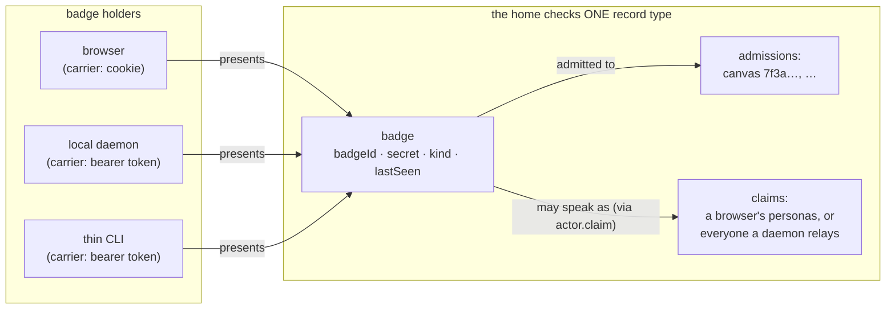
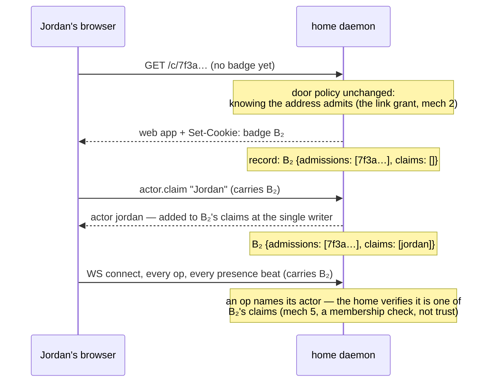
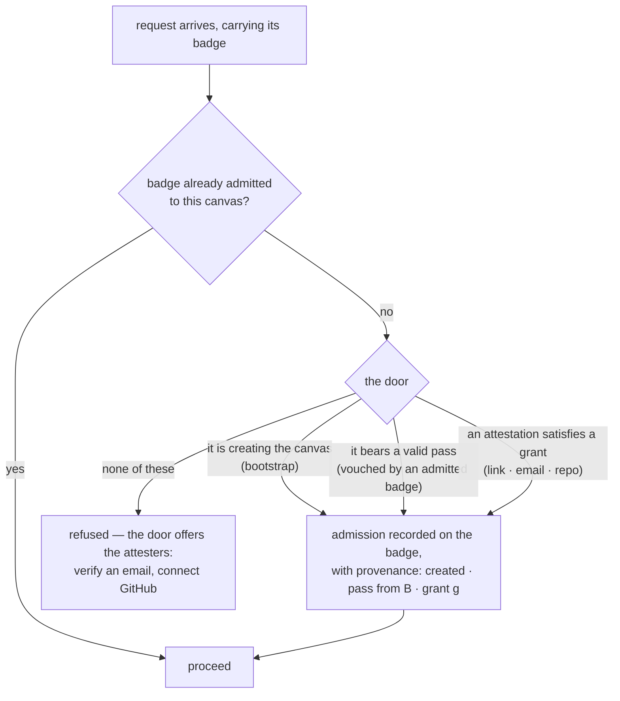
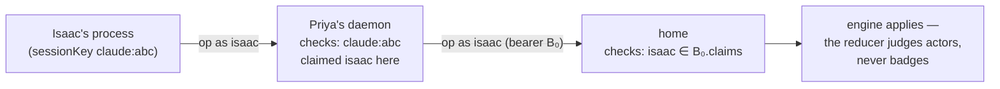

# The identity desk

The first of the [journey](../multiuser-journey.md)'s open debts, taken up.
The journey stays ground truth for the *experience*; this doc owns the
*mechanism* — who may enter a canvas, what credential anything presents, and
how an actor claim is vouched across surfaces. It is written as an
inventory of **missing mechanisms**: the things that must exist for the
scenes to be true, none of which exist yet.

Status: mechanisms 1, 2, 3, 5, and 10 are **designed** (the badge;
grants, attestations, and the door; actor binding; registry scope —
below); 4, 6, 7, 8, and 9 collapsed into them; 11 is designed in
[innkeeper.md](innkeeper.md) (frozen delegation), where it belongs. The
desk's design is complete.

## What the journey already fixed

Decisions the scenes forced, which any mechanism must honor rather than
reopen:

- **People enter through one origin** — the home's web app; the local
  daemon serves ops to CLIs, never pages to persons.
- **An actor is minted on arrival, never provisioned by the invite**
  (Scene 3). Nobody exists on a canvas before they enter it.
- **Authenticated identity only changes how an Actor is minted** (Scene 5's
  rule). The desk hardens the door; it does not restructure what stands
  behind it.
- **Credentials flow outward from an admitted session**, never typed inward
  at doors (the escalation pass, Scene 5). The one place this inverts —
  Scene 7's standing registrations — is mechanism 11's problem, not a
  license.
- **The grant grants exactly what the sentence named** (Scenes 1–2), and
  **sharing is daemon-API parity, not an op** — the oplog never records
  grants.
- **Presence tells the truth** — which, at a shared home, quietly depends
  on this desk (mechanism 5).
- Lean at first, **decided in mechanism 3**: borrow accounts rather than
  mint them.

## Where the desk stands today

The address is the secret, and the daemon believes every field it is
handed. Concretely, in code:

- The door checks nothing but the URL; the WS connect carries only a
  `projectId` (`packages/server/src/ws.ts`).
- Every op's `actor` is client-supplied (`PostOpRequest.actor`), and
  `actor.claim` with `as:` reassigns any actor to any session key.
  `engine.ts` says so out loud: "there is no authentication here, and a
  daemon that only listens to one machine's people and agents does not
  pretend otherwise." Honest on localhost; the home removes the premise.
- The browser's identity is localStorage the code itself calls "memory,
  not authority" (`packages/web/src/lib/identity.ts`).
- The CLI stubs the credential slot it doesn't have: "Future: an `auth`
  block" (`packages/cli/src/identity.ts`).

## The missing mechanisms

Numbered for cross-reference; each names the scenes that need it. These
are the *original problem statements*, kept as written; the designs below
answer 1, 2, and 3 directly and collapse 4, 6, 7, 8, and 9 into them —
each item's fate is tagged.

1. **A session the home can recognize.** *(→ the badge, below)* Some artifact minted at admission
   that the home can check later. Upstream of everything below — passes
   (Scene 5), grants (Scenes 1–2), and registrations (Scene 7) all say
   "admitted session," and no such checkable thing exists.
2. **A door that can tell holders apart.** *(→ the door, below)* Enforcement of grants needs
   per-caller credentials at entry — a different door than address-as-
   secret, not a hardened one. Until it exists, the Scene 1–2 grant stays
   recorded intent.
3. **A grant subject type.** *(→ grants + attestations, below)* Something a grant binds to — account, email,
   key — so "revoke Jordan" can point at anything. This is where the
   borrow-vs-mint-accounts lean becomes a decision.
4. **Revocation.** *(collapsed: provenance sweep, below)* Un-share, expel, rotate. Structurally impossible under
   address-as-secret; becomes possible only after 2 and 3.
5. **Server-side actor binding.** *(→ actor binding, below)* The home stamps ops and presence with who
   the *connection* is, instead of trusting the asserted `actor` field.
   Turns `comment.update`'s "only the author," actor-scoped undo, and
   honest presence from conventions into enforcement.
6. **Person resumption across browsers.** *(collapsed: email attestation)* A way for Jordan's phone to *be*
   Jordan. Today the honest path is refused (name taken) and the dishonest
   one (`as:`) is open to anyone — exactly backwards.
7. **Pass → durable credential exchange.** *(collapsed: the pass mints a badge)* The Scene 5 pass is single-use
   and short-lived; the daemon it enrolls reconnects for months. What the
   pass exchanges into — lifetime, storage, scope, revocation — is unnamed.
8. **A bootstrap credential.** *(collapsed: the door badges everyone)* Scene 0 reaches the home before any admitted
   session exists; the flow-outward rule cannot mint its own first link.
9. **A repo-membership check.** *(collapsed: subject type `repo`)* Scene 6's "the committed marker admitted
   her" currently reduces to URL-knowledge; "can read the repo ⇒ admitted"
   needs a real mechanism.
10. **Scoped registry / tenancy.** *(→ registry scope, below)* The actor registry (names, claims,
    colors) is per-home, and claims consult every project on it
    (`Engine.heldNames()`). On a multi-tenant home that is cross-tenant
    name collision and leakage. The registry's scope must be chosen.
11. **Bounded standing mint** (Scene 7). *(→ designed in [innkeeper.md](innkeeper.md))* Registrations mint passes with
    nobody present. Scope and revocation of that power is this desk's half
    of the launch-custody debt.

## Mechanism 1, designed: the badge

The desk needs something to check, so the desk hands something out: a
**badge** — a secret the home mints at the door and the caller presents
ever after. (Not "session": the code already has presence sessions, which
are a different, ephemeral thing. A badge is the desk's own word.)

**The shape.** One server-side record — `{badgeId, secret, kind, createdAt,
lastSeen, admissions, claims}` — with two carriers for one artifact:
browsers hold it as an HTTP-only cookie at the home origin (the one-origin
rule means exactly one cookie jar — that decision pays again here);
daemons and CLIs hold it as a bearer token in the `auth` block
`identity.json` already stubs, presented on every request and on the WS
upgrade. The home refuses badge-less requests; getting a badge is free
today, so this refusal changes recognition, not policy.



**Deliberately policy-free.** The door's *policy* is untouched — the
address still admits (changing who gets in is mechanism 2). What changes is
that admission now *produces* something. Trust attaches to the badge from
then on, never to the address again. This is the layering that lets 1 ship
before the borrow-accounts decision (3) is made.

**Badge and actor are different axes — and not 1:1.** A badge is a holder
the home recognizes; an actor is who it speaks as; one badge may hold
*several* claims. The thick daemon forces this: Priya's daemon carries one
connection to the home on behalf of her CLI self AND Isaac, so its badge
must vouch for both. The browser needs it too — a browser wears a roster
of personas (#43) under one cookie. So `actor.claim` becomes "add an actor
to this badge's claims" — at the single writer, as it already is — with
the claim table re-keyed from client-chosen `sessionKey` strings to badge
ids. The `sessionKey` survives demoted: a client's local index for
*finding its own stored badge* (a harness resuming a conversation looks up
the badge that conversation holds), never something the home trusts.

**Admissions ride the badge.** The record lists the canvases this badge
was admitted to; entering another canvas URL adds to the list. What a
badge can see is its admissions, not the home — which is mechanism 10's
tenancy handle, and makes "who has been here" a per-canvas listing of
badges.

The whole life of a badge, at the door and after — this is Scene 3, Jordan
arriving (Scene 0's bootstrap goes through the same door but starts from a
terminal; see the bootstrap bullet below):



**What it collapses downstream:**

- The Scene 5 **pass becomes a badge-minting voucher**: short-lived,
  single-use, minted by badge A; redeeming it mints badge B carrying the
  admissions and the *named* claim. A pass names which of the minting
  badge's claims it endows — a daemon badge vouches for several actors,
  and a pass hands over one identity, not the household — though
  mechanism 3 widens the mintable set by exactly one hop: for an
  *agent's* actor, a badge may also endow a claim it sponsored (see
  resumption there). The claim slot
  is **optional**: an admission-only pass admits a surface that will
  claim its *own* actor — Scene 6's instruction line (Sonia claims
  fresh, never Inna), and day-one `isocan open`, before the human has an
  actor to resume. Mechanism 7's
  "durable exchange" is just this — the pass was never the credential,
  the badge it mints is.

  ```mermaid
  sequenceDiagram
      participant T as Jordan's tab (badge B₂)
      participant H as home daemon
      participant D as Jordan's new local daemon
      T->>H: mint a pass (carries B₂)
      H-->>T: pass p — single-use, short-lived,<br/>remembers B₂'s actor + admissions
      T-->>D: setup command with #p<br/>(copy button → terminal — the only hop outside the home)
      D->>H: redeem pass p
      H-->>D: badge B₃ {admissions: [7f3a…], claims: [jordan]}
      Note over H: p is dead. B₃ is durable —<br/>two badges, one actor: Jordan's tab and her daemon
      D->>H: reconnects for months (bearer B₃)
  ```
- **Bootstrap (8)** stops being special — but note it starts in a
  *terminal*, not a browser. `npx skills add` never touches the home; the
  home's first caller is setup, run by Priya's agent, arriving badge-less
  with no pass in existence (there is no admitted anything yet to mint
  one). The door hands it a badge like anyone — a bearer token, since
  there is no cookie jar here — and the canvas is created under it: that
  badge holds the first admission. Priya's *browser* gets its own cookie
  badge later, entering through the canvas URL like any person. Two
  badges before anyone shared. The flow-outward rule's first link is the
  door doing what doors do.

  ```mermaid
  sequenceDiagram
      participant S as setup (Priya's agent, terminal)
      participant H as home daemon
      participant P as Priya's browser (later)
      Note over S: npx skills add → "use isocan" → setup runs.<br/>No browser, no pass, nothing admitted anywhere.
      S->>H: hello (no badge yet)
      H-->>S: badge B₀ (bearer token → daemon's auth block)
      S->>H: project.create (carries B₀)
      H-->>S: canvas 7f3a… born
      Note over H: B₀ {admissions: [7f3a…]} — the first admission.<br/>The id + home address land in the committed marker
      P->>H: GET /c/7f3a… (isocan open)
      H-->>P: web app + Set-Cookie: badge B₁
      P->>H: actor.claim "Priya" (carries B₁)
      Note over H: the name's first claim — no badge holds "Priya" yet,<br/>so no vouch is owed (a later machine resumes her via<br/>isocan open's pass — mech 2). B₀ relays the machine's<br/>agents; B₁ is her tab. Two badges before anyone shared.
  ```
- **Kill-a-badge** is revocation's enforcement primitive (4): not yet
  "revoke Jordan," but "end that holder's recognition" exists.
- **Server-side actor binding (5)** gets its anchor: once claims key on
  badges, an op still names its actor (a daemon's badge vouches for
  several), but the home *verifies the named actor is among the badge's
  claims* instead of believing the request body — a membership check, not
  a redesign.

**One door; badges differ only in dowry.** It can look like Priya and
Jordan enter differently — terminal-first versus browser-first. They
don't: the door does exactly one thing, hand a badge to whoever arrives,
and both women's *browsers* walk through it identically (B₁ and B₂ are the
same flow). What differs is what a badge starts out knowing. A bootstrap
badge is born knowing nothing and earns its first admission by creating
the canvas; a pass-endowed badge is born knowing its person, because it
arrived late to an existing identity and the only honest way to be "the
same Jordan" is to be handed that by a session that already is her —
self-claiming a worn name is either refused or impersonation. So the split
is not Priya versus Jordan; it is *first surface versus every later
surface of the same person*. Priya's second machine enrolls by pass
exactly like Jordan's first (Scene 5 says so), and a canvas born in a
browser would send the creator's own later terminal down Jordan's flow.
Whoever arrives first bootstraps; everyone after is vouched for.

**What changes in code, minimally:** the daemon (local and hosted — same
code, per the deployment-detail thesis) grows a door endpoint that mints
badges; HTTP routes and the WS upgrade read cookie-or-bearer; the actor
registry's claims re-key to badge ids with a one-time migration of
existing `sessionKey` bindings. The cookie carrier ships with its
standard defenses — `SameSite` plus an Origin check on API and
WS-upgrade requests (browsers do not enforce CORS on WebSockets) — so a
foreign site cannot ride the cookie. Nothing yet *enforces* beyond
"present a badge" — enforcement is mechanisms 2 and 5, standing on this.

## Mechanisms 3 + 2, designed: grants, attestations, and the door

Mechanism 3 asks what a grant binds to; mechanism 2 asks how the door
checks it. One design, two halves.

**The decision: borrow, never mint.** isocan holds no passwords and no
user table. A grant's subject is a **provable attribute** — something the
holder can demonstrate by borrowing an attester they already have. The
badge stays the only account-shaped thing isocan itself issues, and it is
just a secret.

**Three subject types, v1:**

- **`link`** — anyone presenting the address. This is the status quo
  *demoted to data*: every canvas born today carries a standing link
  grant, so "the address is the secret" stops being a regime and becomes
  one revocable row. Turning it off is the familiar "anyone with the link"
  toggle every sharing product has taught.
- **`email:<addr>`** — the Share dialog's one "who" field takes an email.
  The name "Jordan" still resolves in Slack, where it always meant
  something; what isocan records is the attribute Jordan can prove.
- **`repo:<host>/<owner>/<name>`** — Scene 6's sentence made checkable:
  committing the marker was a grant to whoever can read the repo, so the
  subject *is* "can read the repo." One mechanism note the scene hides:
  the commit is a *git* act the home never sees — it distributes the
  address but writes no grant. The sentence must also be spoken to the
  home, and the gesture that writes the marker is its natural speaker
  (setup offers the grant as it stages the marker). Until it is spoken,
  repo members enter on the link grant like anyone — which is why the
  scene worked before the desk existed.

A grant is `{canvasId, subject, grantedBy, at}`, written through the
daemon API — never an op, per the journey's rule 5.

**Attestations ride the badge.** A badge accumulates verified attributes:
`{attribute, verifiedVia, at}`. Attesters are borrowed: an OIDC sign-in
(Google, GitHub) attests an email; a magic link to the inbox attests it
with no IdP at all; a GitHub token check attests repo read access — how
*Inna herself* qualifies under Scene 6's standing grant when she arrives
from the committed marker (her cloud agent enters by pass, as the journey
plays it). Verifying never *creates* anything; it decorates the badge the
holder already carries.

**The door, then, is one test.** A badge asking after a canvas is admitted
if any of three things holds — and everything the desk has built so far is
one of them:



One subtlety the diagram bakes in: `isocan open` appends a pass minted by
her daemon's badge — Scene 5's outward flow, pointed the other way. Under
the default link grant Priya's plain GET would admit her browser anyway;
the pass matters twice over: it keeps her own surfaces working when she
turns the link off, and it carries whatever actor claim her daemon's
badge holds — on a pass-enrolled machine, herself — so picking "Priya"
in the dialog is a resume, never a re-mint or a refusal. (On the
bootstrap machine her tab's claim is the name's *first* and needs no
vouch — mechanism 1's diagram plays that beat.) Admission spreads
badge-to-badge among your own surfaces; grants exist for strangers.

**Provenance is revocation's grip (4).** Every admission records its root:
`created`, `grant g`, or `pass from badge B` — and a pass-derived
admission inherits the *root* of the badge that minted the pass. Revoking
a grant sweeps every admission rooted in it, however many pass-hops away —
but the sweep **re-runs the door test first**: a badge whose attestations
satisfy a surviving grant re-roots instead of dropping. So revoking
Jordan's email grant expels her tab, her daemon, and Nico in one pass —
while turning off the *link* grant expels only those no other grant
covers: it stops strangers without expelling the invited, which is the
semantics every sharing product has taught. Kill-a-badge (mechanism 1)
handles the stolen-laptop case; grant revocation handles the un-invite.
The two compose.

**What this collapses downstream:**

- **Revocation (4)** is now designed in outline: delete the grant, sweep
  by provenance. "Turn off the link" is the same gesture on the link
  grant.
- **Person resumption across browsers (6)**: a verified email is the
  person-level key the badge never was. A badge attesting the same email
  as the badge that claimed an actor may *resume* that actor — Jordan's
  phone verifies jordan@…, and picking "Jordan" is a resume, not a
  refusal. The `as:` lever stops being open assertion: resuming an actor
  now requires a vouch. A badge already holding the claim vouches for
  anyone — `isocan open`'s pass at work. Past that, the routes split by
  what the actor has: a person's actor resumes on a matching attestation
  (a person has an inbox); an agent's on a pass — minted by a holder, or
  by the badge that **sponsored** the holder into existence, the
  provenance parent whose pass vouched it in. A sponsor already
  authored that agent's whole existence, so re-vouching it grants
  nothing new — and it is what survives a thin agent's death: Sonia's
  claim sits on a badge whose bearer secret died with the sandbox, and
  Inna, who sponsored that badge, can mint the pass that resumes her
  (Scene 7's registrations lean on exactly this — mechanism 11). How
  the home's badge-level membership check and the local daemon's finer
  per-conversation discipline divide that enforcement is mechanism 5's
  detail to settle.
- **Repo membership (9)** is subject type `repo`, done.
- **Scene 3 gains one honest beat, only when the link grant is off**: a
  stranger arriving without attestation is asked to verify their email at
  the door. Default posture preserves the journey exactly — link grant on
  at birth, Scene 3 friction-free; tightening is the owner's explicit
  trade. The journey's door stays the journey's door until somebody locks
  it.

**Not yet decided here:** which attesters ship first (magic-link email is
the floor — it borrows only an inbox); whether grants may carry roles
(viewer/editor) — the journey never played a read-only member, so that
waits for a scene that forces it; and the registry-scope question (10),
which admissions narrow but do not settle.

## Mechanism 5, designed: actor binding

The badge made "who is connected" checkable; this makes "who is speaking"
checkable — everywhere an actor is named, the name must be one the
speaker's badge vouches for.

**The rule: each hop vouches for what only it can see.** The home cannot
tell Isaac's process from any other process on Priya's machine — both
arrive through her daemon's one connection — and it should not pretend
to. So enforcement splits along the line of sight:

- **The local daemon** verifies *session-level*: an op from a local
  client must name an actor that client's `sessionKey` claimed. It knows
  which conversation is which; the home never will.
- **The home** verifies *badge-level*: the op's named actor must be among
  the presenting badge's claims. Coarser, and honestly so.
- **Within a machine, localhost trust stands** — processes stating their
  own `sessionKey` is today's posture, unchanged. What the badge adds is
  a boundary: **a badge bounds a compromise.** A stolen machine can speak
  only as the actors its badge claims, on the canvases its badge is
  admitted to — never as Jordan, never elsewhere.



**Where the check lives.** The transport layer resolves the badge
(cookie or bearer) and hands it to the engine beside the request; the
membership check runs inside the single-writer chain, where the claims
registry already lives — so a claim and an op racing serialize, like
everything else. Refusal is a validation error (`not-your-actor`); the
honest client's remedy is to claim first, which the agent guide already
teaches as the first act.

**What gets checked, uniformly:** ops, undo/redo (or you could undo
someone else's work by naming them), and every presence beat — including
a daemon's *relayed* presence, where one connection carries several
actors and each must be in the badge's claims. Alongside actor checks,
every project-scoped route checks `projectId ∈ badge.admissions` — the
door's test, re-asked cheaply on each request rather than only at entry.
Resume vouches (`as:`) are enforced in the same place claims apply:
attestation match for a person's actor, a pass (holder- or
sponsor-minted — mechanism 3's rule) or an already-claiming badge for
an agent's.

**Two things deliberately stay desk-blind:**

- **The reducer.** It keeps judging actors — `comment.update`'s "only the
  author," actor-scoped undo — and never learns badges exist. Enforcement
  lands *under* the vocabulary, in the pipeline; the isomorphism contract
  is untouched, which is the whole trick: the rules that looked like
  authorization become authorization the moment actors mean something.
- **The oplog.** Envelopes keep `actor` and `clientId`; badge ids stay
  out. The oplog is shared state that every replica sees — the badge
  table is the desk's private ledger, and which badge issued which op is
  the home's audit log, not the canvas's history. (Same instinct as "the
  oplog never records grants.")

## Mechanism 10, designed: registry scope

The registry holds three different kinds of fact, and the scoping answer
is different for each — the mistake would be scoping "the registry" as
one thing.

- **Actor ids: global, forever.** Opaque, minted once, never recycled,
  never scoped. Continuity across canvases — the same Isaac on every
  canvas Priya's machine touches — is the point of the id, and mentions,
  authorship, and undo all key on it. Ids cannot collide, so they need no
  tenancy.
- **Colors: per actor, global.** A color is the actor's own choice and
  travels with it. What scopes is the *broadcast*: a color change repaints
  the rooms of canvases where that actor appears, not every room on the
  home (`engine.onColors` currently floods home-wide — that is the one
  behavior that must narrow).
- **Names: judged against the claiming badge's admissions.** Name
  uniqueness was never a global property — it exists so `@`-mentions
  resolve and the facepile reads, which are *roster* needs. So "is this
  name taken" consults exactly the rosters and live sessions of the
  canvases the claiming badge is admitted to — `heldNames()` stops
  walking the home and walks the badge's admissions instead. Two
  strangers on unrelated canvases can both have an Isaac; neither ever
  hears about the other.

That scoping also closes the leak for free: a refusal can only name
holders the claimant could already see, because the check never consulted
anyone else.

**Late collisions are survivable by construction.** Two neighborhoods can
meet: a canvas gets shared into a group that already has its own Isaac,
and now one roster wears the name twice. This is not a new problem — the
vocabulary already mints deliberate duplicates (`actor.claim` with
`fresh:` — "a second Kenny on purpose"), so every client must already
render two same-named actors distinguishably (color, id-derived
disambiguation). A cross-tenant meeting degrades to exactly that handled
case; nobody is renamed on entry.

**The solo home degenerates correctly.** A local daemon's badge is
admitted to everything on it, so admission-scoped checks collapse to
today's walk-the-home behavior — the same code, with the scope emerging
from the badge rather than hard-coded.

## Order of attack

**1, 3, 2, 5, and 10 are designed above.** Of the rest: 4 falls out of
2+3 (provenance sweep with re-rooting); 6 collapsed into email
attestation; 7 and 8 collapsed into the badge; 9 is subject type `repo`,
done. The one item that could not be designed apart from who runs the
home, **11** (bounded standing mint), is designed as *frozen delegation*
in [innkeeper.md](innkeeper.md). **The desk's design is complete** and
implementation can be sequenced.
