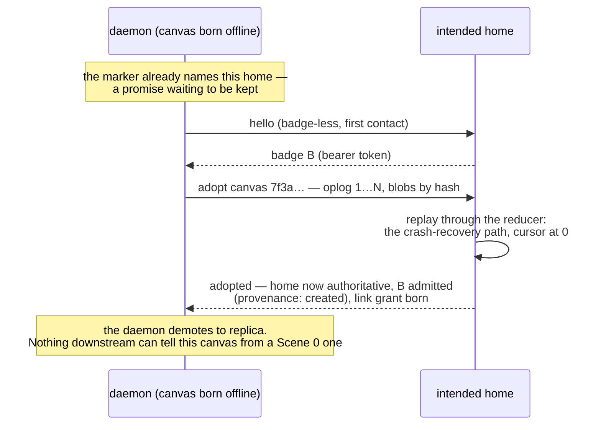

# Offline birth

The third of the [journey](../multiuser-journey.md)'s open debts, taken
up: a canvas created on a plane births locally and adopts a home on
first reconnect. Small, but it owns three questions the other docs lean
on — what the marker promises, what adoption *is*, and what
[re-homing](innkeeper.md) actually moves.

## Birth writes a promise

Setup with no network still knows the intended home — the default
address needs no lookup. So the marker is written exactly as Scene 0
writes it, id and address both, from the first minute: **birth writes a
promise, not a fact.** The canvas exists only in the local daemon;
nothing about the marker's shape reveals the difference, which is the
point — a clone, a script, an agent reading the marker behaves
identically either way.

Two consequences, both already accepted:

- The interval is **CLI-and-agent only**. The one-origin rule stands —
  the local daemon serves ops to CLIs, never pages to persons — so a
  browser cannot visit a canvas whose origin has never held it.
- A teammate who clones the repo *during* the interval and asks the home
  gets a distinct answer: **"not yet arrived"** — a promise pending, not
  a 404. The home can say this honestly because the marker's address
  names it: being named a home is checkable even before the store shows
  up.

## Adoption is the reconnect path, started from seq 1

The journey demoted "push the store up" to background repair; the badge
design makes it ordinary. When the daemon first reaches the home it is
just the bootstrap flow (identity desk, mechanism 8) with history in
hand — the same door, the same badge, and the same queued-ops-reconnect
path every offline daemon already walks, with the queue starting at
seq 1:

The details all fall out of designs already made:

- **Seqs transfer verbatim.** The local daemon was the single writer of
  a canvas nobody else could reach; its 1…N *is* the history, and the
  home replays it exactly as it replays any tail.
- **Actor ids travel untouched** — they are global and opaque (registry
  scope, mechanism 10). The claims the local registry held move onto the
  adopting daemon's badge; the name-uniqueness check runs against that
  badge's admissions, which at this moment is one canvas — no stranger
  can collide.
- **The link grant is born at adoption, not at birth.** Grants exist
  where doors do; the local interval had no door.

## Twins park, they don't merge

The marker can spread through git before the promise is kept: a
teammate clones, works offline in their own daemon, and now two stores
claim one canvas id. **Adoption is first-writer**: the first store to
arrive becomes the canvas; a later store offering seq-1 history for a
canvas that already exists is refused and **parked** — kept whole beside
the store (the `deleted-projects/` gesture), never merged. This is the
journey's rule 2 holding at its hardest edge: no peer-merge machinery,
even here. The parked twin's owner re-enters through the door like
anyone and brings work over by hand or by agent. The edge of the edge,
priced accordingly.

## Re-homing moves the work, not the desk

The [innkeeper](innkeeper.md) doc generalizes adoption into the
sovereignty gesture: a thick replica offers its store to a *new* home
and rewrites the marker. The flow is identical — hello, badge, offer,
replay. What must be said out loud is what does **not** travel: the
desk's ledgers are innkeeper-private, so badges, attestations, grants,
and registrations stay behind. Re-homing moves the *work*; the roster
re-forms at the new address — grants are re-spoken, people re-enter
through new links, agents re-enroll by pass. Sovereignty by replica is
sovereignty of the canvas, not of the guest book — which is honest:
the guest book was always the innkeeper's.

## Open

- The "not yet arrived" page's UX, and whether adoption notifies the
  canvas (a system note in the main thread would fit the
  failure-may-not-be-silent instinct).
- Whether a parked twin's items can be offered back semi-automatically
  (an agent's job, not a merge algorithm's).
