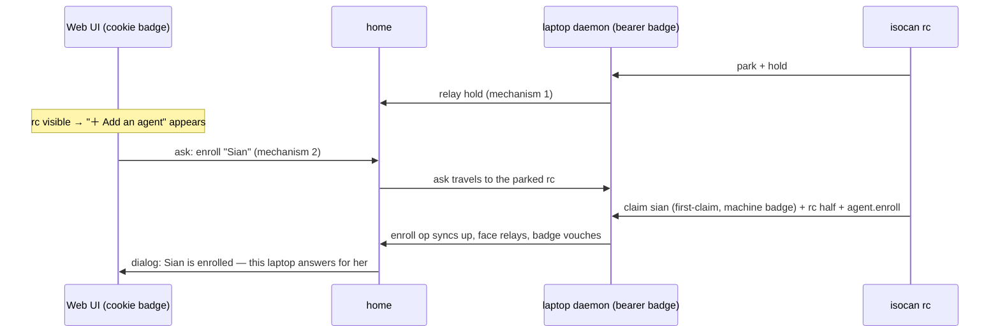

# Agent custody

Who answers for an enrolled agent, and how the home knows. Opened for
issues [#83](https://github.com/dglazkov/isocan/issues/83) and
[#81](https://github.com/dglazkov/isocan/issues/81); leans on mechanisms
recorded in the multiuser project's
[identity-desk](../multiuser/identity-desk.md) (the vouch predicate, the
sponsor rule) and [innkeeper](../multiuser/innkeeper.md) (actor custody,
mechanism 11) docs, and the [on-demand](../on-demand/design.md) rc.
Those docs are records; this one is where the design moves.

## The cast, in surface terms

Three parties, two of them the ones a user can point at:

- **The Web UI** — the app in the browser. It talks straight to the
  canvas's home, and its badge there is a cookie.
- **The CLI** — `isocan rc`, `isocan agent add`. It talks to the daemon
  on the user's machine, a full replica that syncs up to the home under
  its own badge (the bearer token in identity.json).
- **The home** — the server both of the above end at: the daemon at the
  canvas's address (isocan.io for hosted canvases, anyone's daemon for
  self-hosted ones). It orders the ops and runs the identity desk that
  decides who may speak as whom. "The home" below always means this
  server — the one the Web UI is served from.

## One gap, two issues

The enrolment record split custody deliberately: WHO is canvas state
(`agent.enroll`), WHERE and HOW are a machine file (`rc-agents.json`).
What was never designed is the third fact: **which machine speaks for
the agent, in the home's eyes.** When the Web UI enrolls and the CLI
runs, the home cannot answer it on either axis:

- **Identity (#83).** The Web UI's add dialog claims the agent's actor
  on the browser's cookie badge at the home. The CLI runs turns fine —
  the enroll op replicates down like any op — but when the laptop's
  daemon relays the agent's face up, that is a *different* badge asking
  to speak as the same actor, and the desk refuses — correctly:
  another surface already holds the claim, and nothing vouches. The
  face is dropped; the agent works invisibly.
- **Liveness (#81).** "Answerable" is a connection-bound fact — an rc
  holds `/api/rc/hold` open and its agents are answerable exactly while
  the hold is open (`http.ts`, on-demand phase 6). But the rc holds
  that connection against the **laptop's** daemon, and holds never
  travel: the home's `/api/projects/:id/rc` is empty forever, so the
  Web UI reads every standing agent as "nobody listening" even while
  one answers. And the button stands even when nothing could ever
  answer it — a person who only browsed in clicks "＋ Add an agent"
  and nothing happens.

Both refusals are right where they stand. The desk should refuse an
unvouched claim; the home should not guess at liveness it cannot see.

**The shape of the fix (decided 2026-08-31):** the Web UI does not
offer to add an agent until it can see the machine that would run it.
With that gate in place, enrolment from the web becomes a handshake the
rc completes — the agent's actor is born on the machine that answers
for it, exactly as CLI enrolment already works, and the desk needs no
new rule at all. An earlier draft designed a desk-side hand-off row
(the enroll op as the sponsor's word, redeemed by the relay's claim);
it is set aside, not refuted — it is the mechanism an *invitation* flow
would need, if enrolling with no rc parked ever becomes worth offering.

## Mechanism 1: the home can see the rc

The prerequisite for everything else: rc liveness must reach the home.
The hold stays connection-bound at every hop — a TTL anywhere in the
chain is the lie journey 7 forbids. The laptop's daemon, which holds
the rc's socket, relays the fact up the home-link the way it relays
faces: the hold rides the same connection whose death already takes
the faces down, so home-side answerability dies the instant the laptop
does, with no new failure mode to narrate.

The home's `/api/projects/:id/rc` answers with the union of its own
holds and relayed ones. `useAnswerable` and `roster()` change nothing.

## Mechanism 2: adding an agent is a handshake the rc completes

"＋ Add an agent" appears in the Web UI only while mechanism 1 shows a
live rc on the canvas. For everyone else — including every person who
has never heard of `isocan rc` — there is no button, so there is
nothing to click that does nothing. (This also leaves room to add an
invitation flow later without un-teaching anything.)

When the button is there, the gesture stops being "mint an actor on my
cookie badge and hope" and becomes an **ask, addressed to the machine
that will answer**:

1. The Web UI sends the ask — agent name, nothing else — through the
   home to the parked rc.
2. The rc makes the same two moves `isocan agent add` makes: claim the
   actor first-claim on **its machine's badge**, write its rc half
   (directory, harness), send `agent.enroll`.
3. The dialog reports the handshake's completion with the machine's
   own word — the agent exists, and this laptop answers for it — or
   its failure, out loud.

What falls out:

- **The records are indistinguishable from CLI enrolment** — the
  design goal the add dialog already states, now true at the home too,
  not only in the oplog.
- **#83 dissolves rather than being patched.** The face relays and the
  desk vouches, because the badge relaying the face is the badge that
  claimed the actor. No hand-off, no redemption, no demotion.
- **The desk changes not at all.** No new row kind, no new satisfier,
  no change to the vouch predicate or the sponsor rule.
- **The fresh-actor rule holds.** The actor exists from enrolment (the
  rc claims before the enroll op lands), so mentions resolve and the
  spark face shows — innkeeper's claimed-at-registration reasoning,
  kept rather than excepted.

## Mechanism 3: the words

With the gate, the remaining copy is small: the tray without an rc
simply offers no add — the CLI path (`isocan agent add` in a checkout,
`isocan rc` to answer) remains the documented way in, and nothing in
the Web UI names a directory the reader may not have. The dialog with
an rc names the machine that will answer before the click, so the
promise being made is the one being kept.

## Decided at build (2026-08-31)

- **The channel of the ask is the hold's reply.** The rc was already
  long-polling `/api/rc/hold` back-to-back; the response gained an
  `asks` list, and the hop from home to member machine is an `rc-ask`
  message down the same home-link socket the relay rides. Nothing
  touches the oplog; the ask outlives nothing (a 15-second queue covers
  the microsecond gap between back-to-back holds, and an ask nobody
  drains dies there while the dialog's countdown says so). The registry
  is `server/src/rc-holds.ts`; the walk is tested end to end in
  `home-link.test.ts`.
- **The home believes a hold only about enrolled agents.** A relayed
  "answerable" id must be an agent the canvas's enrolment record names
  AND one the relaying badge can vouch for — a hold shouting an
  arbitrary id relays nothing.
- **The asker is checked like an op's actor** (mechanism 5): the ask's
  `from` must be an actor the asking badge may speak as, because the rc
  narrates "«from» asked to add …" where its person is looking.
- **Two rcs parked: first hold (then first parked mirror) wins.** The
  dialog does not yet name the machine it is promising — recorded
  below.

## Open

- **Whose ask a parked rc honors.** Any admitted member of a shared
  canvas can send the ask, and turns bill the rc owner's harness — the
  compute-consent question the gate narrows but does not answer. (This
  is also the posture the rc's adoption of enrolments already had.)
  Candidates: owner-only by default with an rc-side allow, or the rc
  announcing its policy with its hold.
- **The dialog does not name the machine.** With two rcs parked it says
  "the parked rc" and first-wins picks silently; the promise should
  name its keeper once the hold carries a machine label.
- **A dead machine's agent.** The actor's claim sits on the dead
  laptop's badge; a successor machine cannot claim it unvouched. The
  sponsor rule covers the badge-was-pass-vouched case; dismiss and
  re-add is the graceless fallback. Waits for a real occurrence.
