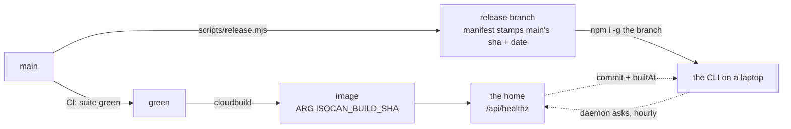

# Auto-upgrade: a CLI that catches up with its home

**The debt this discharges.** Nothing in the journey names it, which is why it
has gone unwritten: every scene assumes the person and the agent are running
*this* build. In a project that ships several times a day and whose op
vocabulary is the isomorphism contract, that assumption expires overnight. The
web app renews it on every reload — it is served by the home. **The CLI is the
only surface that does not, and it is the surface an agent lives in.**

Phase 8 made this sharper rather than softer, and phase 14 sharpens it again:
the line a person pastes is `npx <spec> setup <address>#<pass>`, and `setup`
installs the CLI for them when it is not on PATH (`main.ts`, the
`npm i -g ${INSTALL_SPEC}` block). **A machine that never chose a version is
the normal case now**, not the developer case.

## What is already built, and what is measured missing

Most of the machinery exists, built for the neighbouring problem — the one
[local-bridge.md](../multiuser/local-bridge.md) lists first among its failure modes, *"a
daemon that is stale, serving an older build than the page"*:

- **`buildStamp()`** (`packages/server/src/build.ts`) gives a copy an identity:
  `commit` and `builtAt` from the release manifest, or from `.git` on a
  checkout, plus a `codeAt` mtime heuristic.
- **`/healthz` reports it**, both routes, one handler (`http.ts`).
- **`stalenessOf()`** already knows two ways to be stale — another copy holds
  the port, or this copy changed under a daemon that started before it.
- **`warnIfStale()`** (`cli/src/ctx.ts`) already knows how to say something
  **once per daemon** rather than on all thirty commands an agent runs, via the
  `.stale-warned` marker keyed on `startedAt`.
- **`planUpgrade()`** (`cli/src/upgrade.ts`) already knows the four install
  shapes and already refuses to touch a dirty checkout.

So auto-upgrade is not a new subsystem. It is a third kind of stale, a place to
notice it, and a way to swap the code that is safe to do unattended.

**The measurement, 2026-08-25**, `curl -s https://isocan.io/api/healthz`:

```json
{"ok":true,"pid":10,"startedAt":"2026-08-25T21:54:52.403Z",
 "version":"0.1.0","root":"/app","codeAt":"2026-08-25T21:52:59.000Z"}
```

**No `commit`. No `builtAt`. The home cannot say which build it is.** Both
sources `buildStamp()` reads are absent from the image by construction:
`.dockerignore` excludes `.git` (correctly — it is most of the repo's bytes),
and the `isocan` manifest key is written by `scripts/release.mjs` onto the
`release` branch, which the image is not built from. The Dockerfile already
passes `ARG ISOCAN_BUILD_SHA` and stores it in `ENV`, `cloudbuild.yaml` already
fills it with `${_TAG}` — and `grep -rn ISOCAN_BUILD_SHA` over the TypeScript
returns nothing. **It is passed, stored, and read by nobody.** The one field
the whole design turns on is a comment in a Dockerfile.

That is the first line of work, and it is four lines of code.

## 1. The oracle: your home, not GitHub

The obvious feed is the repo: `git ls-remote https://github.com/dglazkov/isocan
release` — one line, no API, no rate limit, no token, over the same transport
npm will use to install. It works, and it answers the wrong question twice.

**It compares the wrong shas.** The release tip names a *release* commit; the
installed manifest stamps the *main* commit that release was built from. There
is no local ancestry to check against — an installed tree has no `.git` — so
the comparison needs a cache of "the tip I last installed from", which is state
that goes wrong on exactly the machines nobody is watching.

**And it names a build nobody runs yet.** `ls-remote main` would report new
work in the window before CI cuts a release, so the CLI would nag, upgrade to
an older build than the sha it was told about, and nag again — forever, until
the pipeline caught up.

**The home is the better oracle**, on three counts:

- **It is already on the wire.** `HomeLink` polls it every two seconds
  (`DEFAULT_POLL_MS = 2000`); the answer can ride traffic that already exists.
- **It runs the same code**, from the same repo, via `green` — so it is a
  build, not a branch tip, and it is a build somebody is already using.
- **It answers the question that actually bites.** Not "is there newer code on
  GitHub" but **"does my CLI disagree with the home it is talking to"** —
  the op-vocabulary skew that the isomorphism rests on. That is the same
  question `stalenessOf` already asks about the daemon, one hop further out.

It also generalises the way this project is going: **a home is a distribution
channel.** Everyone working at a home runs what that home runs, and an
innkeeper who pins a build has pinned it for the desk. `innkeeper.md`'s posture
survives — this is configuration of the house, not of the guest.

`ls-remote` stays as the fallback for a daemon with no home, once a day.



**Both stamps must come off one clock.** `release.mjs` already stamps
`builtAt` as `git log -1 --pretty=%cI` — the *commit date on main*, not the
time the release was cut. The image should stamp the same thing (one more
build-arg beside `ISOCAN_BUILD_SHA`, `git log -1 --pretty=%cI` in the build
step). Then the two dates are drawn from the same sequence of commits and
comparison is exact. Stamp the image with its own build time instead and you
are comparing two pipelines' latencies, which is a clock skew that will one day
tell a current CLI it is behind.

Say only what that comparison supports: **shas answer *who is who*, dates
answer *who is behind*.** Neither answers "how far", and a design that pretends
otherwise will invent a version number to do it with, which is how `0.1.0`
became a field with no information in it.

## 2. Where the check lives: the daemon, free at the call site

Never put the network in front of a command. The daemon does the check in the
background — a self-rescheduling timeout, `gc.ts`'s pattern, not a second
`setInterval` — at most hourly and on every home-link reconnect, and caches the
verdict. **Not on the two-second beat**: that is 1,800 requests an hour to ask
a question whose answer changes twice a day.

The verdict then rides the health body, which `makeCtx` already fetches on
every single command:

```jsonc
"upgrade": {
  "available": true,
  "commit": "a1b2c3d",
  "why": "your home runs a1b2c3d, this copy is 04279b2 (2 days older)"
}
```

**Zero extra round trips at the call site.** Offline is silently a no-op — the
field is simply absent, which is what `warnIfStale` already does with a health
body it could not get. The CLI's side is `warnIfStale`'s sibling, marker and
all: say it once per daemon, never on every command.

`isocan status --json` carries the same field, because an agent should be able
to read this without parsing stderr — and because an agent that has just been
upgraded needs to know the guide may have changed underneath it
(`agent-guide.md` ships inside the build).

## 3. The swap: own an install root, stop arguing with `npm -g`

**`npm i -g` overwrites in place, and that alone disqualifies it from running
unattended.** Three ways, all of them quiet:

- A failed install leaves no working CLI and nothing to fall back to. #47's
  empty-directory failure is exactly this shape, and it took a branch to fix.
- `main.ts` does `await import("@isocan/server")` **lazily**. Rewriting the tree
  under a running command can break that command — the more so during
  `isocan upgrade`, which is a running command by definition.
- "Which copy is this" stays a riddle. `whichInstall()` exists because the
  answer is genuinely hard; `transientDir()` exists because npx's cache lies
  about it (#48).

Instead, do what every self-updating tool ends up doing: **own the install
root.**

```
~/.isocan/builds/a1b2c3d/     one tree per build, installed and smoke-tested
~/.isocan/builds/04279b2/     the one before it, kept
~/.isocan/current -> builds/a1b2c3d
```

`isocan` on PATH is a shim into `current`. Upgrading is: install into
`builds/<sha>` (with `npm --prefix`, so a failure is confined to a directory
nobody is pointing at), smoke-test it — `node .../bin/isocan.js --version`
already prints the stamp, so the test is that it prints the sha it should — and
only then flip the symlink.

What that buys, none of it available in place:

- **Atomicity.** A half-fetched build is never on anybody's PATH.
- **Rollback.** `isocan upgrade --rollback` flips the link back. Keep three.
- **Safety mid-session.** A running process holds its resolved path, so the
  lazy imports resolve into the tree it started from, forever.
- **Detection for free.** `stalenessOf`'s *root* comparison fires by itself:
  the old daemon's root is `builds/04279b2`, this copy's is `builds/a1b2c3d`.
  The mechanism that notices an upgrade has already happened is already
  written, and `rootOfBin` already `realpath`s through symlinks to reach it.

`~/.isocan` is the right home for it: it is already the root of all state,
`ISOCAN_HOME` already redirects it, and tests already point that at scratch
dirs — so a test can exercise a full upgrade cycle without touching the
machine. `npm i -g` remains the bootstrap, once.

## 4. When it applies

Three seams that are idle **by construction**, so nothing has to guess:

- **Park and wake.** The agent loop's wait is the definition of idle. Upgrade
  there; on wake the agent is on the new build and is told so in the same
  breath as the feedback it woke for.
- **`ensureDaemon` starting a daemon.** Already a fresh process; check before
  binding, and the daemon that comes up is current.
- **`isocan restart`.** Already means "come back on current code". Fold the
  fetch in and it means it more.

**Never auto-apply to a checkout.** `planUpgrade` already refuses a dirty tree;
the rule generalises to *auto is for managed installs, notify is for anyone
with a working copy* — the conductor's own machine included. An upgrade that
touches somebody's working copy is not an upgrade.

## 5. The controls, which are not optional

- `upgrade: "auto" | "notify" | "off"` in `config.json`, plus `ISOCAN_NO_UPGRADE=1`
  for one shell.
- `isocan upgrade --pin <sha>` and `--rollback`. **Auto-upgrade without a pin
  makes "when did this start failing" unanswerable**, and this project answers
  that question constantly; the kept builds directory is what makes a bisect a
  symlink flip.
- `--channel release | main`, for the machine that builds from source.
- **Say what changed.** The home knows both shas and could hand back the
  subject lines between them: *"upgraded to a1b2c3d — 4 commits, incl. 'the
  face that never went up'"*. One field, and the difference between an upgrade
  that is legible and one that is spooky.

## What it costs

- **A new trust edge, stated plainly.** Auto-upgrade means whatever is on
  `release` runs on every machine unattended — a compromised branch is a
  compromised laptop, with no gesture in between. For a single-innkeeper
  project this is the right trade, but it is a trade and belongs written down
  rather than discovered. `--pin`, `off`, and the kept builds are the way back.
- **A second install layout to support.** Machines installed by `npm i -g`
  today do not have `builds/`; the shim has to adopt them (install once into
  `builds/<sha>`, flip, leave the global copy alone) and `whichInstall` grows a
  fifth kind, `managed`.
- **The home becomes load-bearing for the CLI's freshness.** Not for its
  function — a homeless or offline daemon simply does not upgrade — but a home
  pinned to an old image now silently pins every CLI that answers to it. That
  is arguably correct and definitely surprising; `isocan status` should name
  the home it is taking the answer from.

## The failure modes to design against first

This codebase's recurring bug is *the default answer to a wrong address is a
cheerful one*, met six times through phases 6–10. Auto-upgrade's versions of it:

- **The oracle that cannot speak.** A home with `commit: null` — today's home —
  must produce *no* verdict, never "you are current". A check that cannot fail
  is the defect `/api/healthz` exists to avoid, and this is the same shape.
- **The upgrade that flaps.** Two homes, two builds, one machine (10.3's world
  is many homes). Whose build wins? Probably the birth home's, and probably
  the answer is to name it rather than to silently take the newest.
- **The smoke test that passes on a broken tree.** `--version` proves the
  process boots and reads its manifest. It does not prove the daemon binds.
  A stronger test is to start it on an ephemeral port and ask `/healthz` for
  the sha it should be, which is the whole upgrade in one assertion.
- **The pin that rots.** A machine pinned in March, notified never.
- **The upgrade during a write.** The park/wake seam avoids it; the daemon-start
  seam has to prove the old daemon is fully down, which `stopDaemons` already
  waits for.

## Where it sits

Small and useful in this order, each shippable alone:

1. **Make the home say which build it is** — read `ISOCAN_BUILD_SHA` in
   `buildStamp()`, pass the commit date beside it. Four lines, and it fixes a
   Dockerfile comment that is currently false. *No upgrade behaviour at all.*
2. **A third kind of stale** — `stalenessOf` learns "the daemon disagrees with
   its home", the daemon checks hourly, the field rides `/healthz`, the CLI
   says it once. **Notify only.** This is most of the value: nobody debugs
   yesterday's build for an afternoon again.
3. **The managed install root** — `builds/<sha>`, `current`, the shim, the
   smoke test, `--rollback`, adoption of existing global installs.
4. **Auto-apply**, at the three idle seams, with the controls from §5.

Steps 1 and 2 are worth doing whatever happens to 3 and 4.

## Status

**Not chosen.** A design, not a plan — recorded so a later session meets it
awake rather than mid-phase. If it is taken up it wants a fractional phase of
its own (numbers are addresses here, not positions), and it sits naturally
after **phase 14**: the front door installs the CLI for people, prod is where
the oracle lives, and a fleet you cannot upgrade is a fleet you have to
support. Its proof is a walk, like 10.5's — a machine deliberately installed
from an old release, left alone, and later found current, with the note it
printed when it noticed.
