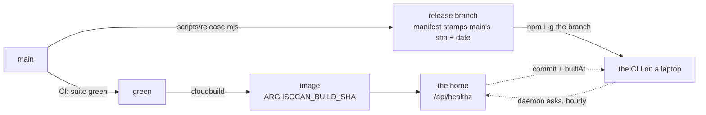

# Auto-upgrade: a CLI that catches up with its home

**The problem.** The journey never names it, which is why it went unwritten:
every scene assumes the person and the agent are running the current build.
In a project that ships several times a day, and whose op vocabulary is the
isomorphism contract, that assumption expires overnight. The web app renews
it on every reload, because the home serves it. **The CLI is the only surface
that does not renew itself, and it is the surface an agent lives in.**

Multiuser phases 8 and 14 made this worse, not better: the line a person
pastes is `npx <spec> setup <address>#<pass>`, and `setup` installs the CLI
when it is not on PATH (`main.ts`, the `npm i -g ${INSTALL_SPEC}` block). **A
machine that never chose a version is now the normal case**, not the
developer case.

## What is already built, and what is measured missing

Most of the machinery exists, built for the neighbouring problem — the first
failure mode listed in [local-bridge.md](../multiuser/local-bridge.md), *"a
daemon that is stale, serving an older build than the page"*:

- **`buildStamp()`** (`packages/server/src/build.ts`) gives a copy an
  identity: `commit` and `builtAt` from the release manifest, or from `.git`
  on a checkout, plus a `codeAt` mtime heuristic.
- **`/healthz` reports it**, both routes, one handler (`http.ts`).
- **`stalenessOf()`** already knows two ways to be stale: another copy holds
  the port, or this copy changed under a daemon that started before the
  change.
- **`warnIfStale()`** (`cli/src/ctx.ts`) already knows how to report
  something once rather than on all thirty commands an agent runs, via the
  `.stale-warned` marker keyed on `startedAt`.
- **`planUpgrade()`** (`cli/src/upgrade.ts`) already knows the four install
  shapes and already refuses to touch a dirty checkout.

So auto-upgrade is not a new subsystem. It is a third kind of stale, a place
to notice it, and a way to swap the code that is safe to run unattended.

**The measurement, 2026-08-25**, `curl -s https://isocan.io/api/healthz`:

```json
{"ok":true,"pid":10,"startedAt":"2026-08-25T21:54:52.403Z",
 "version":"0.1.0","root":"/app","codeAt":"2026-08-25T21:52:59.000Z"}
```

**No `commit`. No `builtAt`. The home cannot report which build it is.** Both
sources `buildStamp()` reads are absent from the image by construction:
`.dockerignore` excludes `.git` (correctly — it is most of the repo's bytes),
and the `isocan` manifest key is written by `scripts/release.mjs` onto the
`release` branch, which the image is not built from. The Dockerfile already
passes `ARG ISOCAN_BUILD_SHA` and stores it in `ENV`, `cloudbuild.yaml`
already fills it with `${_TAG}` — and `grep -rn ISOCAN_BUILD_SHA` over the
TypeScript returns nothing. **It is passed, stored, and read by nobody.** The
one field the design depends on exists only as a Dockerfile comment.

That is the first piece of work, and it is four lines of code.

## 1. The oracle: your home, not GitHub

The oracle is the source the CLI trusts to answer "am I current?" The obvious
candidate is the repo: `git ls-remote https://github.com/dglazkov/isocan
release` — one line, no API, no rate limit, no token, over the same transport
npm uses to install. It works, and it answers the wrong question, twice.

**It compares the wrong shas.** The release tip names a *release* commit; the
installed manifest stamps the *main* commit that release was built from. An
installed tree has no `.git`, so there is no local ancestry to check against.
The comparison would need a cached record of "the tip I last installed from",
which is state that goes wrong on exactly the machines nobody watches.

**And it names a build nobody runs yet.** `ls-remote main` reports new work
in the window before CI cuts a release. The CLI would report an upgrade,
install an older build than the sha it reported, and report again — over and
over until the pipeline caught up.

**The home is the better oracle**, for three reasons:

- **It is already on the wire.** `HomeLink` polls it every two seconds
  (`DEFAULT_POLL_MS = 2000`); the answer can ride traffic that already
  exists.
- **It is a build, not a branch tip.** The home runs the same code from the
  same repo via `green`, and it is a build somebody is already using.
- **It answers the question that matters.** Not "is there newer code on
  GitHub" but **"does my CLI disagree with the home it is talking to"** — the
  op-vocabulary skew the isomorphism depends on. `stalenessOf` already asks
  the same question about the daemon; this is the same check one hop further
  out.

It also generalizes in the direction the project is going: **a home is a
distribution channel.** Everyone working at a home runs what that home runs,
and an innkeeper who pins a build has pinned it for everyone at that home.
The innkeeper posture holds: this is configuration of the house, not of the
guest.

`ls-remote` remains the fallback for a daemon with no home, once a day.



**Both dates must be main's commit date.** `release.mjs` already stamps
`builtAt` as `git log -1 --pretty=%cI` — the commit date on main, not the
time the release was cut. The image should carry the same value: one more
build-arg beside `ISOCAN_BUILD_SHA`, filled with `git log -1 --pretty=%cI` in
the build step. Then both dates come from the same sequence of commits, and
the comparison is exact. If the image were stamped with its own build time
instead, the comparison would measure the two pipelines' delays, and would
eventually tell a current CLI that it is behind.

Report only what the comparison supports: **shas identify builds; dates order
them.** Neither measures how far apart two builds are, and a design that
pretends otherwise will invent a version number to do it with — which is how
`0.1.0` became a field with no information in it.

## 2. Where the check lives: the daemon, at no cost to commands

Never put a network request in front of a command. The daemon does the check
in the background — a self-rescheduling timeout, `gc.ts`'s pattern, not a
second `setInterval` — at most hourly and on every home-link reconnect, and
caches the verdict. **Not on the two-second poll loop**: that would be 1,800
requests an hour for an answer that changes about twice a day.

The verdict then travels in the health body, which `makeCtx` already fetches
on every command:

```jsonc
"upgrade": {
  "available": true,
  "commit": "a1b2c3d",
  "why": "your home runs a1b2c3d, this copy is 04279b2 (2 days older)"
}
```

**Zero extra round trips at the call site.** Offline, the field is simply
absent, which matches how `warnIfStale` treats a health body it could not
get. The CLI reports the verdict once per verdict — `warnIfStale`'s marker
pattern, but keyed on the sha pair, because a long-lived daemon outlives
several verdicts — never on every command.

`isocan status --json` carries the same field, because an agent should be
able to read this without parsing stderr — and because an agent that has just
been upgraded needs to know its guide may have changed underneath it
(`agent-guide.md` ships inside the build).

## 3. The swap: an install root isocan owns

**`npm i -g` overwrites in place, and that alone disqualifies it from running
unattended.** Three failure modes, all quiet:

- A failed install leaves no working CLI and nothing to fall back to. #47's
  empty-directory failure had exactly this shape, and fixing it cost a
  branch.
- `main.ts` resolves `@isocan/server` through a **lazy** `await import`.
  Rewriting the tree under a running command can break that command — above
  all during `isocan upgrade`, which is a running command by definition.
- "Which copy is this" stays hard to answer. `whichInstall()` exists because
  the answer is genuinely hard; `transientDir()` exists because npx's cache
  misreports it (#48).

Instead, do what every self-updating tool ends up doing: **own the install
root.**

```
~/.isocan/builds/a1b2c3d/     one tree per build, installed and smoke-tested
~/.isocan/builds/04279b2/     the one before it, kept
~/.isocan/current -> builds/a1b2c3d
```

`isocan` on PATH is a shim that resolves through `current`. Upgrading is:
install into `builds/<sha>` (with `npm --prefix`, so a failure is confined to
a directory nothing points at), smoke-test it (the strong form of the test is
described under failure modes below), and only then flip the symlink.

What that buys, none of it available with in-place installs:

- **Atomicity.** A half-fetched build is never on anyone's PATH.
- **Rollback.** `isocan upgrade --rollback` flips the link back. Keep three
  builds.
- **Safety mid-session.** A running process holds its resolved path, so its
  lazy imports resolve into the tree it started in, for the life of the
  process.
- **Detection for free.** `stalenessOf`'s *root* comparison starts firing on
  its own: the old daemon's root is `builds/04279b2`, this copy's is
  `builds/a1b2c3d`. The mechanism that notices a completed upgrade is already
  written, and `rootOfBin` already resolves symlinks with `realpath`.

`~/.isocan` is the right location: it is already the root of all state,
`ISOCAN_HOME` already redirects it, and tests already point it at scratch
directories — so a test can exercise a full upgrade cycle without touching
the machine. `npm i -g` remains the bootstrap, run once.

## 4. When it applies

Three points that are idle **by construction**, so nothing has to guess
whether applying is safe:

- **Park and wake.** An agent blocked in `isocan wait` is idle by definition.
  Upgrade there; on wake the agent is on the new build and is told so, in the
  same message as the feedback it woke for.
- **`ensureDaemon` starting a daemon.** A fresh process either way; check
  before binding, and the daemon that comes up is current.
- **`isocan restart`.** Already means "come back on current code." Adding the
  fetch makes that fully true.

**Never auto-apply to a checkout.** `planUpgrade` already refuses a dirty
tree. The general rule: auto is for managed installs; notify is for anyone
with a working copy, including the conductor's machine. Auto-apply must never
modify a working copy.

## 5. The controls, which are not optional

- `upgrade: "auto" | "notify" | "off"` in `config.json`, plus
  `ISOCAN_NO_UPGRADE=1` for one shell. `auto` is the managed install's
  default; phase 4 carries the argument.
- `isocan upgrade --pin <sha>` and `--rollback`. **Auto-upgrade without a pin
  makes "when did this start failing" unanswerable**, and this project
  answers that question constantly. The kept builds directory is what makes a
  bisect a symlink flip.
- `--channel release | main`, for the machine that builds from source.
- **Report what changed.** The home knows both shas and can return the commit
  subject lines between them: *"upgraded to a1b2c3d — 4 commits, incl. 'the
  face that never went up'"*. One field, and it is the difference between an
  upgrade people can audit and one they turn off.

## What it costs

- **A new trust boundary, stated plainly.** Auto-upgrade means whatever is on
  `release` runs on every machine unattended — a compromised branch means
  compromised machines, with no human step in between. For a
  single-innkeeper project this is the right trade, but it is a trade, and it
  belongs written down rather than discovered. `--pin`, `off`, and the kept
  builds are the recovery paths.
- **A second install layout to support.** Machines installed by `npm i -g`
  today have no `builds/`; the shim has to adopt them (install once into
  `builds/<sha>`, flip, leave the global copy in place), and `whichInstall`
  grows a fifth kind, `managed`.
- **The home becomes load-bearing for the CLI's freshness.** Not for its
  function — a homeless or offline daemon simply does not upgrade — but a
  home pinned to an old image now silently pins every CLI that answers to
  it. That is arguably correct and definitely surprising; `isocan status`
  should name the home the answer came from.

## The failure modes to design against first

This codebase's recurring bug, met six times in multiuser phases 6–10: given
a wrong address, the system returns a false success instead of an error.
Auto-upgrade's versions of it:

- **The oracle that cannot answer.** A home with `commit: null` — today's
  home — must produce *no* verdict, never "you are current." A check that
  cannot fail is the same defect `/api/healthz` exists to prevent.
- **The upgrade that flaps.** Two homes, two builds, one machine (multiuser
  10.3 allows several homes per machine). Whose build wins? Probably the
  birth home's, and the verdict should name its home rather than silently
  using the newest.
- **The smoke test that passes on a broken tree.** `--version` proves the
  process boots and reads its manifest. It does not prove the daemon binds.
  The stronger test: start the candidate on an ephemeral port and ask
  `/healthz` for the sha it should be — the whole upgrade in one assertion.
- **The pin that rots.** A machine pinned in March and notified never.
  Pinned machines still receive notices.
- **The upgrade during a write.** The park/wake point avoids it; the
  daemon-start point has to confirm the old daemon is fully down, which
  `stopDaemons` already waits for.

## Where it sits

Four phases, each shippable alone, defined in [`phases.md`](phases.md) —
which owns the order, the proofs, and the status line — with
[`journey.md`](journey.md) as the acceptance suite: the scenes a closed phase
must play. The order: make the home report its build; then detect and report
skew (notify only, and most of the value); then the managed install root;
then auto-apply at the idle points. The first two are worth doing regardless
of the last two.

## Status

**Designed 25 Aug 2026; phases and journey written the same day; nothing
built.** Not gated on the multiuser project, and nothing there is gated on
this — multiuser phase 14 closed with next steps being a choice, not a
queue, and this is one of the choices.

The argument for doing it now: the front door installs the CLI for people, so
machines that never chose a version are the normal case; prod, where the
oracle lives, is live; and a fleet you cannot upgrade is a fleet you support
by hand. The final proof is a walk like multiuser phase 10.5's: a machine
deliberately installed from an old release, left alone, and later found
current — with the notice it printed when it noticed.
