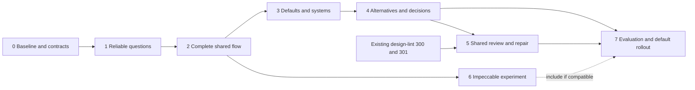

# A design partner — the walk

**Where we are:** phases 0–6 CLOSED; phase 6 closed on 15 September 2026.
Both entrances share discovery, scoped systems, working alternatives, durable
adoption and bounded review/repair. Optional adapted Impeccable guidance uses
that same context, with exact exports, freshness and honest native limits.
Local browser/CLI proofs and full strict gates pass. **Phase 7 is next**:
measure generated-design results and real-user partnership, then decide rollout.
The workflow stays opt-in; engineering proofs do not establish quality uplift.
Read [journey.md](journey.md), [design.md](design.md), then this walk.

The first useful release fixes discovery integrity. The next delivers one
complete design task through either entrance. Stronger systems, comparisons
and shared repair deepen that path. The broad default changes only after
[evaluation.md](evaluation.md)'s output and partnership gates hold.

The [planning verification](verification/planning-2026-09-14.md) records the
documentation checks and existing checkout failures at handoff; it closes
none of the implementation phases below.

## Delivery map

| Milestone | Phases | What a person gains | Release condition |
| --- | --- | --- | --- |
| A — Trustworthy discovery | 0–1 | Questions keep their identity; uploaded references reach the agent; answers survive | Protocol and real CLI/browser proofs; independent correctness release |
| B — One complete path | 2 | An ordinary request gets a brief, working task slice and honest browser receipt from either entrance | Opt-in workflow; no claim yet that it beats the current default |
| C — Design partnership | 3–5 | Contextual craft defaults, reusable systems, useful alternatives and consistent repair | Feature-complete P0 candidate with the journey walked locally |
| D — Proven default | 7 | The workflow becomes the supported default on both entrances | Controlled comparison, real-user partnership study and hosted acceptance |
| Craft integration experiment | 6 | Compatible Impeccable guidance using the same context | Bounded integration and incremental evaluation; not a prerequisite for D |

This is a dependency map, not a request to start multiple agents. Phases
run in numerical order by default; already-proven dependencies can be reused.
The diagnostics foundation can progress independently under its existing
issues. A phase 6 stop decision cannot block phase 7's core-workflow comparison.
No calendar estimate is asserted before phase 0 has reconciled the baseline.

**Execution baseline, 14 September 2026:** the reconciled checkout starts at
`304346276dbabd3b7c10dff3f55070dbcff10ab2`, on `main` in
`/Users/dionalmaer/code/isocan-design-partner`. The original checkout retains
its unrelated staged context work. Design-lint phases 1–4 are now CLOSED:
parsed diagnostics, shared contextual reports, conditional repair and scoped
recipe contracts are available. Its phase 5 model pilot completed but showed
no objective lift, and human preference ratings remain open. This project's
phase 5 consumes the shipped mechanisms; it does not wait for or close that
separate human study.

## Execution rules and existing ownership

Every phase names an outcome and a falsifiable proof. Closing one records
the exact commit, commands, failures and browser evidence in
`verification/phase-N.md` (created during execution), then updates its Status,
the Where-we-are paragraph, primary front matter and project index. Record
course-changing findings under Trajectory; do not prefill success narratives.

For implementation phases, `npm test` and `npm run typecheck` must pass.
Run any required deep/emulator checks for changed boundaries too. A browser
claim requires a real browser walk, with build, target, viewport, actions and
observed result recorded. A mocked agent is useful for deterministic routing
tests but cannot close a model-quality gate. Use synthetic fixtures throughout.

The research inspected local `da47c586` and remote-main `cb272b20`, with
unrelated staged context work present. Start implementation from reconciled
main; do not reset or accidentally commit that work. In particular, inspect
the newer questionnaire and conditional `item.edit` before reimplementing them.
Phase 0 records any baseline failures; a known red check is not permission
to declare later product work green.

| Existing work | How this plan uses it |
| --- | --- |
| Questionnaire #293 | Phase 1 completes the shared protocol, attachment and lifecycle gaps identified by the research; keep the useful dock |
| Design lint [#299](https://github.com/dglazkov/isocan/issues/299), [#300](https://github.com/dglazkov/isocan/issues/300), [#301](https://github.com/dglazkov/isocan/issues/301), [#302](https://github.com/dglazkov/isocan/issues/302) | [Design-lint phases 1–4](../design-lint/phases.md) have shipped accurate diagnostics, declarative contracts and shared repair. Phase 5 here integrates and proves them in the ordinary creation journey. Its human pilot ratings remain separate; do not create a rival auditor or duplicate issue queue |
| Optional Tailwind adapter [#303](https://github.com/dglazkov/isocan/issues/303) | Repository-specific extension, outside the P0 critical path |
| [Context](../context/), [memory](../memory/), [canvas groups](../canvas-groups/) | Reuse authority, explicit pins, manifests, membership and undo; no second memory or workflow store |
| [Design competition](../design-competition/phases.md) | Reuse scoped systems and safe adoption ideas. Its real distinctiveness/cost acceptance remains separate; a competition is not the default design funnel |
| [Evals](../evals/plan.md) and [#276](https://github.com/dglazkov/isocan/issues/276) | Reuse recording and preference infrastructure, keep models fixed for the core comparison; designer/model-factor experiments remain separate |

No new issues have been opened by this plan. If work is later ticketed, link
one issue to each bounded outcome and cross-reference the existing owners.

## Phase 0 — Freeze the baseline and the acceptance contract

**Status: CLOSED.** 14 September 2026 — the offline matrix, baseline adapter and shared contract proofs held; full fast, typecheck, build and strict emulator checks passed. See [verification/phase-0.md](verification/phase-0.md).

**Outcome:** an implementer can run the same cases before and after the
workflow change, and knows exactly which shared facts and acts to build.

- Reconcile the source baseline, existing issue status and applicable surface
  implementations without disturbing unrelated work. Record the exact main
  commit, deployed build if inspected, and current test failures separately.
- Fix the record schemas and operation mapping from `design.md`: identity,
  authority, versioning, idempotency, undo, cancellation and projection rules.
  Choose the CLI verbs and rollout-policy location. Update `design.md` with
  those concrete decisions; no architecture decision is left to a web-only
  component.
- Add the 12 synthetic briefs, reference assets, answer bank, expected primary
  tasks and entry-point cases from `evaluation.md` under the existing eval
  project's fixture conventions. Store the baseline prompt/procedure revision
  and a runnable baseline adapter; freezing a hash alone is insufficient if
  the later runtime cannot execute it.
- Add a dry-run manifest and result validator. Cost, provider use and browser
  availability are explicit fields, not guessed defaults. Save the baseline
  source-probe output and planned browser scenarios beside this project.

**Proof:** a documented offline command enumerates all 12 cases for both
entrances, validates their assets and answers, emits the expected run matrix,
and rejects a result lacking artifact/context/model identity. It makes zero
provider calls. Core contract tests demonstrate invalid payload rejection,
actor/request association, and the operation plan for one undoable answer and
one decision. `verification/phase-0.md` contains the baseline, exact next
commands and the resolved contract; full suite and typecheck results are
recorded honestly. This closes preparation, not a quality baseline.

**Trajectory:**

- **2026-09-14** — Existing operation groups do not provide atomic writes. Answers need refusing canonical operations at the writer; selection and adoption fit one conditional item edit, with additional request/source checks still owed at the writer.
- **2026-09-14** — An accepted retry remains observable after cancellation without permitting fresh work. Superseding an answer must retain each prior question resolution; the protocol bound of 32 is separate from the ordinary initial budget of three.
- **2026-09-14** — Source/evidence identity validation is not comparison eligibility. The frozen corpus, executable baseline envelopes and complete run matrix make preparation reproducible; candidate/model/capability/spend conditions and human evidence remain phase 7 work.

- **2026-09-14** — Release CI found 33 undocumented new exports that local git-driven measurement omitted before staging. It also found premature unused exports. Purpose comments and narrower exports preserve both guards; subsequent phases stage intended files before the full gate. See the phase 0 verification correction and lesson 70.

## Phase 1 — Questions and references that can be trusted

**Status: CLOSED.** 14 September 2026 — shared questions, exact references, browser/CLI recovery and one-answer Undo passed the independent walks, full fast/typecheck/build and strict emulator gates. See [verification/phase-1.md](verification/phase-1.md).

**Depends on:** phase 0. Useful as an independent correctness release.

**Outcome:** Scene 2 works from the dock and CLI, with one validated protocol.

- Move payload validation and question-resolution logic from
  `QuestionnaireDock.tsx` into shared core/API semantics. Keep a compatible,
  validated read path for old `/ask` messages; malformed legacy content stays
  readable as text instead of crashing the dock or inventing an answer.
- Publish and answer questions through both surfaces with stable IDs, explicit
  intended respondents, option/freeform/skip/delegate/dismiss outcomes and
  idempotent retries. Other agents and unrelated human comments do not close
  them. Enforce existing actor custody and permissions at the mutation boundary.
- Use real uploads and versioned reference attachments. URL and upload state
  belongs to each question. Preserve drafts across navigation and refresh;
  reconcile a changed questionnaire and retain retryable failures.
- Expose structured question/answer reads and writes in CLI help, JSON output
  and the guide. Web and CLI text use the same shared result, with readable
  fallback where a harness cannot render a questionnaire.

**Proof:** meaningful core/API tests reject malformed options, stale answers,
unauthorized respondents and duplicate submission. A real browser walk creates
a question, uploads a synthetic sketch, goes back and refreshes, survives
another agent's reply, retries a failed submit and answers once. CLI retrieves
and opens the exact uploaded bytes and answer IDs; reverse the producer and
consumer for a second question. Cover two successive upload/URL questions,
freeform drafts, keyboard focus and narrow-screen use. One undo restores the
answer state. Legacy questions remain readable. Record these in
`verification/phase-1.md` with the full required checks.

**Trajectory:**

- **2026-09-14** — Exact referenced versions must outlive the source stack, including a later superseding answer. Canonical retained metadata, actual GC and restart preserved both versions; live-item lookup alone was insufficient.
- **2026-09-14** — A snapshot can confirm an accepted answer without revealing its operation ID. Delivery results keep the submitted retry ID separate from canonical receipt identity; uncertain writes retain the original intent.
- **2026-09-14** — A relay's transport identity is not the human's provenance. Preserve original feature declarations and known actor kind; an old client cannot decode a typed receipt merely because its relay can.
- **2026-09-14** — Shared validation must fit the initial-load budget. Command metadata stays synchronous while full instruction bodies load on demand; all thirteen commands, aliases and 41,070 instruction bytes remain unchanged.
- **2026-09-14** — Capability measurement must follow actual shared API calls. The audit now resolves referenced implementations with negative controls; unused imports and documentation do not establish a reachable client act.

## Phase 2 — A request becomes a complete design task

**Status: CLOSED.** 14 September 2026 — both entrances completed the same synthetic primary task, preserved settled answers and exposed honest versioned receipts; full fast/typecheck/build and strict emulator gates passed. See [verification/phase-2.md](verification/phase-2.md).

**Depends on:** phase 1. The concrete [request protocol](request-protocol.md)
settles the write/read boundary before implementation.

**Outcome:** Scenes 1 and 6 have a small end-to-end implementation behind
the shared rollout policy. Both entrances can create and resume the same
brief, deliver one working task slice, and report honest verification.

- Add the shared design-request start/read/resume path and durable brief.
  Resolve request facts, selected/inherited context, incumbent design and
  delivery type before identifying missing decisions.
- Put the compact adaptive procedure at both real agent entry points; make
  it discoverable on demand through the guide/CLI. Exercise semantic creation,
  extension and refinement intents, including designed HTML and connected
  app work. Archive imports and precise edits do not get a new interview.
- Implement the zero-to-three-question budget, correctable assumptions,
  delegation, and continuation from a submitted answer. Start with a single
  recommended direction; use existing systems or a recorded provisional
  direction. Do not await the later comparison UI to build a complete task.
- Deliver a task slice with real content/states and a version-linked receipt.
  Use the agent's supported browser capability for the first verification
  path. Unsupported inspection yields an unverified draft. A canceled or
  superseded request cannot later mark an output accepted.

**Proof:** drive a sparse operational request from canvas chat and an external
agent against equivalent synthetic context. Both persist the same material
brief facts, ask only missing consequential questions, and produce a working
primary task. Resume one through the other entrance without repeating settled
questions. Walk a precise edit with no interview, an import with no design
enrollment, and a connected-app request whose receipt names the actual runtime.
Use a real browser for the task; with browser capability removed, prove the
same path yields an unverified draft. Scripted agents prove routing and
contract behavior; model-generated quality remains phase 7's proof.

**Trajectory:**

- **2026-09-14** — Current task inputs and historical citations have different freshness rules. A new version does not invalidate an intentionally cited older sketch; a new governing winner can invalidate policy evidence without changing the former winner's bytes. Readers now expose structured per-check freshness.
- **2026-09-14** — A receipt draft must capture versions before inspection is reported. Resolving latest versions at publication could attach old checks to new content. Captured input drift requires explicit refresh and rechecking; uncertain writes preserve exact semantic intent and actor identity.
- **2026-09-14** — Reconcile a settled question batch with every effective response identity in one conditional brief edit. Partial answers remain available; brief drift does not erase valid outcomes, and skipped answers do not become human facts. Native conversation remains attributed agent reporting.
- **2026-09-14** — Canonical request admission needs its own writer boundary. An ordinary JSON edit cannot manufacture lifecycle authority; snapshot retries bind full intent and authenticated actor, while Undo intentionally restores prior identity subject to remaining live guards.

## Phase 3 — Defaults that fit, systems that carry forward

**Status: CLOSED.** 15 September 2026 — scoped defaults, all three runnable references, cross-entrance reuse, incumbent components and recoverable source projections passed actual browser/CLI and full repository gates. See [verification/phase-3.md](verification/phase-3.md).

**Depends on:** phase 2. Coordinate governing-system resolution with #300/#301.
[systems-and-defaults.md](systems-and-defaults.md) settles selection, explicit
exemption and projection before implementation.

**Outcome:** Scenes 4 and 5 work: a first screen has deliberate craft, and
a later screen extends the accepted design through either entrance.

- Use one governing-context result for creation, CSS/system reads and later
  checking. Cover explicit group, ancestor, canvas and permitted inherited
  context according to existing precedence. Report missing and ambiguous
  context honestly; another group's system cannot clear this target's standing.
- Build and review the small native HTML recipe kit described in `design.md`,
  with distinct operational, reading and persuasive examples, responsive
  behavior and relevant interaction states. These are working examples and
  guidance; #301 owns their machine-checkable contract format.
- Teach agents to inspect an incumbent repository's actual components and
  tokens. Choose a stack only when necessary; do not add a universal UI library.
- Record a provisional direction before a new build, and reusable accepted
  treatments before expanding to a second screen. Carry choice rationale
  without promoting it into global memory automatically. Reconcile stale
  working-file projections through versioned canvas edits.

**Proof:** actual browsers exercise all three reference surfaces at narrow
and wide widths, keyboard focus and long/error/empty content where relevant.
Core/API cases show distinct systems in two groups and correct inherited
resolution across both clients. A two-screen synthetic product preserves its
accepted controls and spacing after an entrance switch. A constrained-brand
repository extends its own components. A concurrent system change invalidates
the old context receipt; `design=none` remains an explicit supported decision.
Record a brief-grounded craft review of the kit separately from automated
conformance; phase 7 supplies the independent human quality judgment.

**Trajectory:**

- **2026-09-15** — Exemption and incumbent policy are independent facts. Combining them widened request decoding, so `design-requests-v2` gates the change; actual old-daemon refusal and current HTTP/WebSocket paths prove compatibility instead of relying on parser tests.
- **2026-09-15** — Validate authored content before freezing retry intent. Accepted writes and later consistency reads are separate outcomes; exact canonical payload and actor establish acceptance even after removal, while uncertainty preserves the original intent.
- **2026-09-15** — A standalone task pass does not prove its embedded preview. Actual opaque frames exposed blocked form submission and history navigation failures; references now keep local navigation, focus and honest temporary state in that exact runtime.
- **2026-09-15** — Different governing winners need archive-before-close recovery. Legacy area geometry cannot promise scoped creation in one ordinary add, so the library requires groups for new creation while preserving previews, downloads and existing source editing.

## Phase 4 — Useful alternatives and a decision that survives

**Status: CLOSED.** 15 September 2026 — actual structural/visual tasks, safe adoption and correction, cross-entrance rationale, recovery and full strict gates passed. See [verification/phase-4.md](verification/phase-4.md).

**Depends on:** phase 3.

**Outcome:** Scene 3 works without requiring a sprint or competition. The
person sees an actual decision, a recommendation and a safe way to adopt it.

- Route structural uncertainty to working wireframes and aesthetic uncertainty
  to comparable polished previews. Default to two materially different options
  when exploration is useful; preserve the fast delegated path and explicit
  requests for more exploration.
- Extend comparison cards to reference rendered item/version previews and
  open interactive examples. Show the hypothesis, recommendation and tradeoff.
  The CLI reads the same options and can select or delegate without a pointer.
- Implement safe greenfield and existing-screen adoption as specified in
  [comparisons-and-decisions.md](comparisons-and-decisions.md). Preserve the brief, references, rejected alternatives and reason;
  do not reuse `choose` in a way that overwrites a Markdown brief. Capture
  a human preference separately from an agent's recommendation.
- Let the next request read the accepted decision. Version changes to an
  option or adoption target require a refreshed decision, not silent copying.

**Proof:** real browser and CLI walks compare and select two structural
options, then two visual options, using equal content and fidelity. A precise
edit and a delegated choice bypass required comparison. Test greenfield
adoption, an existing screen, mismatched MIME, a stale option and a concurrent
target edit. One undo restores decision and adoption; brief/history remain
readable. A follow-up screen uses the accepted rationale. The study in phase 7,
not an option count or screenshot test, establishes whether choices help.

**Trajectory:**

- **2026-09-15** — Adoption needs one canonical edit/comment pair and a non-consuming conditional Undo. After GC, its operation identity must also remain reserved on the generic submit path; an ordinary edit previously reused an archived decision ID. Real writer, archive and relay probes now refuse that collision.
- **2026-09-15** — Context continuation follows exact adopted-version edges, not merely matching request IDs. Brief corrections within an epoch retain those edges; a missing decision, fork or unrelated metadata edit breaks them. Later repair work must preserve this distinction instead of silently recapturing context.
- **2026-09-15** — One request for more alternatives remains one request across linked batches. Each batch retains the original effective response and exact authored predecessor; repeating the human response or accepting an unrelated chain changes the requested exploration.
- **2026-09-15** — Responsive layout must not own an active approval or prototype. A stable page host preserves its exact frame, focus and selected source. Recovery exposes the original pending action even when publication disappears, and every Retry must save that identity before sending.

## Phase 5 — One critique and repair path on every surface

**Status: CLOSED.** 15 September 2026 — one continuous request-to-review journey, real source/task checks, two bounded repairs and exact browser/CLI recovery passed independent proofs and full strict gates. See [verification/phase-5.md](verification/phase-5.md).

**Depends on:** phases 2–4; #300/#301's required contracts are present in the
execution baseline. Own the default journey integration jointly with #302.
The explicit repair continuation extends phase 4's exact adoption-edge model;
design-lint's pending human ratings are not a technical prerequisite.
[review-and-repair.md](review-and-repair.md) settles the shared review artifacts,
explicit repair transition, budget and verifier handoff before implementation.

**Outcome:** Scene 6 is dependable across add/edit and CLI text/JSON, API and
web. A clean source check cannot substitute for trying the artifact.

- Land or consume the existing accurate diagnostic and scoped recipe work.
  Use the same resolver and diagnostic schema everywhere, including inherited
  systems. Return actionable existing repairs and coverage/unsupported status.
- Add bounded automatic review to the design workflow: deterministic checks,
  actual browser/task inspection, a brief-grounded craft critique, and up to
  two repair passes within the run budget. Do not trigger paid model turns on
  arbitrary edits; preserve explicit audit-only intent.
- Use conditional edits and evidence invalidation for output, context and
  system changes. Preserve one undo per repair act. Reconcile concurrent edits
  instead of allowing an old review to overwrite new work.
- Make receipt states visible on the canvas and readable through CLI JSON:
  checked for agreed scope, failed with details, unsupported or stale. Provide
  an available-verifier handoff without claiming a check ran before it did.

**Proof:** feed the same synthetic violations through API, web, CLI and
`--json`, on add and revision; their diagnostic facts agree. The existing
seven audit counterexamples regress correctly under #300's coverage contract.
Actual browser walks catch and repair a broken primary action and mobile
overflow that source lint alone misses. Inject a concurrent edit and governing
system change; stale repairs are refused and old evidence loses current status.
Undo works. The repair cap terminates with an honest failed/unverified draft.
Normal unrelated edits make no model call. Complete local Scenes 1–6 as one
journey and record it as the P0 candidate, not a proven default.

**Trajectory:**

- **2026-09-15** — A conditional repair needs full-target checks before Undo and Redo. Dependent edits also exposed an older grouped-Redo double reversal. Actual archived and candidate daemons establish both failures and their fixes; restoration conflicts do not consume history.
- **2026-09-15** — Missing or contradictory review history means unknown budget, not remaining attempts. Original canonical request/run bindings isolate proven unrelated history. Reused ordinary version IDs cannot overwrite prior observations or grant a new repair.
- **2026-09-15** — A finished review remains current only across its exact canonical completion edge. Source coverage, browser task success and craft observations stay separate, and retained completion evidence survives removal and GC without promising every old report eternal storage.
- **2026-09-15** — Verifier discovery needs actual live canvas actors before their first authored edit. Eligibility still requires registry identity, a current native tool offer, reachability and wake authorization. Responsive remounts preserve the selected review and actor-owned pending intent.
- **2026-09-15** — An unchanged eval control bypassed repair and concealed a broken consumer. Passing the original audit basis, then proving a changed candidate and metadata race, restored integration without recapturing context or altering the old pilot's evidence.

## Phase 6 — A bounded Impeccable integration

**Status: CLOSED.** 15 September 2026 — pinned resource/launcher compatibility, shared adapted guidance, exact context/export/freshness, real browser/CLI and bounded receipt proofs passed with full fast/typecheck/build and strict emulator gates. See [verification/phase-6.md](verification/phase-6.md).

**Depends on:** phase 2's context and receipt contracts. Optional for rollout.
[craft-integration.md](craft-integration.md) records the pinned compatibility
probe and settles the supported adapted-guidance subset before implementation.

**Outcome:** Scene 7 uses a verified package or states precisely which adapted
guidance ran. The integration cannot impose a second discovery ceremony.

- Start with a compatibility probe of the pinned package: references, launcher,
  context files, required tools, supported local and hosted harness behavior,
  licensing and update pin. Document capabilities before building an adapter.
- Project brief/system/reference context with version provenance, and reconcile
  skill-authored changes back through normal operations. Route only the relevant
  new-work, critique or finishing knowledge; record package and mode in receipts.
- Handle missing browser, image tools, runtime or review roles truthfully. Keep
  optional expensive exploration separate from the core procedure. Do not
  describe a rewritten checklist as native Impeccable execution.
- Build only a coherent supported subset. If no such subset survives the
  probe, record the evidence and explicitly narrow or retire this integration;
  the core workflow remains a candidate for phase 7.

**Proof:** a supported-environment matrix demonstrates actual package/resource
resolution and the right context, plus deliberate missing-capability and stale
projection cases. Native claims have native execution evidence. The same
brief is not re-asked, and existing style constraints survive the adapter.
The matched craft condition in `evaluation.md` tests added value; compatibility
alone does not enable it by default. Record negative findings rather than
leaving an incompatible package as an invisible dependency.

**Trajectory:**

- **2026-09-15** — The native package loads supplied context but still imposes generic interview, image and role instructions. The supported integration is explicit adapted guidance with pinned resources, not native playbook execution. Its quality advantage remains a separate phase 7 condition.
- **2026-09-15** — Recommendation and accepted choice differ. Actual human choice against the recommendation now survives export and readable guidance. Structural actor DTOs also required explicit public attribution before closed-packet validation; types alone did not remove extra runtime fields.
- **2026-09-15** — Canonical completion can change an author's envelope without changing the underlying facts. Original source attribution and exact completion history establish currentness; substantive patches, forged authors and missing evidence do not. Open views recheck their original capture and preserve it until explicit refresh.

## Phase 7 — Measure the partnership, then enable the default

**Status: NOT STARTED.**

**Depends on:** phases 1–5. Include phase 6's experimental condition only if
it has a supported implementation; record its omission otherwise.

**Outcome:** the project has evidence of better results and useful collaboration,
and a reversible default rollout on both entrances. A negative or inconclusive
study produces specific next work; it cannot close this phase as successful.

- Execute the staged comparison in `evaluation.md` against the preserved
  baseline. Keep models, supplied facts/assets and resource ceilings matched.
  Include failures, repeats and both entrances; report uncertainty and costs.
- Run the separate real-user partnership study. Observe whether questions,
  recommendations and comparisons actually help, not merely whether outputs
  look attractive. Diagnose failures by stage and amend the responsible phase.
- Walk the full journey on dev, then the authorized production rollout,
  recording actual build identities. Test canvas-summoned, external and
  supported hosted-agent paths, refresh/resume and capability fallback.
- Roll out to an opt-in cohort before broad enablement. Expose one shared
  policy/kill switch, preserve existing records when disabled, and document
  measured limitations in the shipped README and agent guide.

**Proof:** `verification/phase-7.md` links the versioned dataset, blinded
review results, task-success results, cost/latency distribution, user-study
observations and go/no-go against preregistered criteria. Actual hosted browser
and CLI evidence covers both entrances and rollback without lost work.
All required checks pass. Technical completion with inconclusive quality stays
PART-DONE; enabling the craft adapter requires its own incremental result.

**Provision and people:** ⚑ Before paid runs or recruitment, name the model,
run matrix, maximum spend, participant effort and stop rule and obtain any
authorization not already supplied for that execution. Phase 0's dry run and
local engineering work do not wait on this. ⚑ Broad production enablement
needs the rollout decision against the completed evidence; preparing the
candidate and reviewable results comes first.

**Trajectory:**

- **2026-09-14** — Open: real-user quality and partnership evidence is still owed. The executing agent owns the dataset and analysis; the product owner supplies the paid-run ceiling, participants and final rollout decision when the candidate is ready. No model spend or recruitment is authorized by writing this plan.

## Outside this P0

Full competition orchestration and its persona/model-factor studies; a universal
component marketplace; mandatory image generation or multi-agent design;
production deployment infrastructure for generated apps; and the optional
Tailwind repository adapter. The design workflow must correctly describe a
connected app's delivery scope, but need not build a new hosting product.

After rollout, use sampled accepted versions, reversals, corrections and
failure receipts to propose new corpus cases. Preserve privacy and existing
permissions; passive signals are not automatic judgments of human preference.
