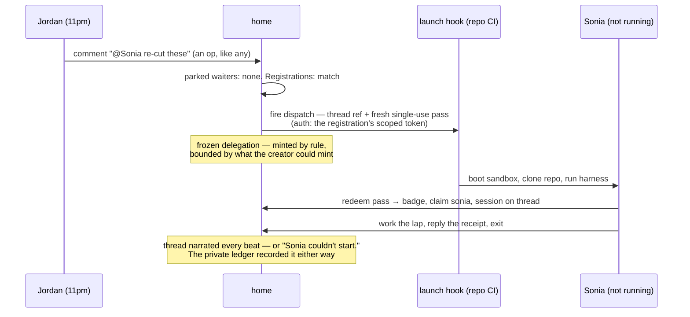

# The innkeeper

> **This is a record, not a living document.** The multiuser project is
> complete; this doc says what was designed and why, as of its closing.
> New design work — even work that extends these mechanisms — starts in
> a new document and may cite this one, but does not edit it.

The second of the [journey](journey.md)'s open debts, taken
up. Someone runs the home, pays for it, and answers for uptime, abuse,
and privacy — and with birth-at-home it holds *unshared* canvases too.
The journey said this posture "should be chosen out loud, not inherited";
this doc chooses it. It also takes custody of the [identity
desk](identity-desk.md)'s mechanism 11 (bounded standing mint), which
could not be designed apart from who runs the home.

## The posture, chosen out loud

**isocan is a hosted product with a local-first cache — and its host is
*an* innkeeper, never *the* innkeeper.** Two commitments, made together
because either alone would be dishonest:

1. **There is a default home.** Canvases are born at a hosted daemon at a
   stable address ("isocan.io" as placeholder), run by an operator who
   accepts the obligations below. Solo users park their unshared work
   there from day one; that is the product, said plainly.
2. **The protocol admits any innkeeper.** The home is an ordinary isocan
   daemon — the deployment-detail thesis, load-bearing at last. Nothing
   but the marker's address binds a canvas to a home: a team can run its
   own, and the setup command's address argument already carries the
   choice. The default home earns its keep; it cannot hold hostages.
   **Physically true since phase 10.3, not merely permitted.** This
   commitment always implied a person working for two teams, and two
   teams is two homes on one machine — which the configuration model
   could not express while a daemon answered to exactly one address and
   pointing it at a second demoted every canvas on the disk. The home is
   now a property of the canvas (a row per canvas in
   `~/.isocan/homes.json`, written at binding), so one laptop holds work
   at two innkeepers and work of its own at the same time, and choosing a
   different innkeeper for one canvas conscripts none of the others.

What keeps commitment 2 true is **sovereignty by replica**: a thick
daemon's `~/.isocan` holds the full store — oplog and blobs — so any
canvas with at least one thick member has a complete copy outside the
innkeeper's walls, kept current by ordinary sync. Re-homing is the
[offline-birth](offline-birth.md) adoption flow, generalized: a replica
can offer its store to a *new* home and rewrite the marker. Leaving the
innkeeper is a push, not an export request — though it moves the work,
not the desk's ledgers: the roster re-forms at the new address (the
offline-birth doc says what does and does not travel). (A browser-only
canvas has no thick replica — the tab's service-worker replica is real
but does not qualify: browser storage is the browser's to evict, holds
the working set rather than the whole store, and cannot stand as an
adoption source. Durable enough to work offline, never durable enough
to answer for the canvas — so its members' sovereignty is only as good
as the innkeeper. The UI should say so where it counts: escalation,
Scene 5, is also the sovereignty gesture.)

## What the innkeeper holds, and sees

Stated honestly, because the architecture decides it: **the home reads
everything it hosts.** The home *applies ops through the reducer* — that
is what makes it a home — so end-to-end encryption of canvas content is
off the table by design, not by oversight. What the innkeeper holds
falls in two ledgers with different rules:

- **Canvas state** — oplogs, snapshots, blobs, and the actor
  registry's public face: ids, names, colors. Ops name actors and
  every replica renders them, so who an actor *is* travels with the
  work — which is what lets re-homed history keep its authors.
  Replicated to every admitted badge; the innkeeper's copy is
  authoritative for order, not the only copy.
- **The desk's ledgers** — badges, the claims table binding actors to
  badges (who may *speak as* an actor — the registry's private half),
  attestations (emails: the desk
  brought PII with it), grants, provenance, registrations and their
  launch tokens, the badge-to-op audit log. **Innkeeper-private, never
  replicated**: no client, thick or thin, ever syncs another holder's
  secrets. This line already existed in the desk's design ("the oplog
  never records grants; badge audit is the home's private ledger") — it
  is the innkeeper's line to hold.

## What the innkeeper answers for

- **Uptime — a liveness SPOF, never a data SPOF.** A dead home stops
  cursors, summonses, and thin guests; it loses nothing a thick replica
  holds, and daemons ride it out in the queue-and-reconnect path that
  already exists (offline is not an error state in this architecture).
  The answerability is for *liveness*, priced accordingly.
- **Abuse — the desk already forged the tools.** Kill a badge, revoke a
  grant (provenance sweep), delete a canvas, refuse the door. Takedown
  of hosted blobs is `project.delete` plus GC, both extant. What the
  innkeeper adds is policy — terms for what it will host — and rate
  limits at the door (badges are free to mint; free may not mean
  unmetered).
- **Privacy — the two-ledger rule above,** plus a plain statement to
  users: the operator can read your canvas; if that is unacceptable, run
  your own home — the protocol was built so you can.
- **Cost — storage and relay only, structurally.** isocan never runs
  compute; the harness does (Scene 6's rule). Sonia's minutes bill to
  her owner's harness account; the innkeeper's bill is blobs, oplogs,
  and sockets. Quotas (canvas count, blob size, GC horizons) are tuning,
  not structure.

## Mechanism 11, designed: the bounded standing mint

Scene 7's registration inverts the desk's flow-outward rule: the home
mints passes with nobody at the keyboard. The bound that makes this safe
is **frozen delegation**:

> A registration may mint only what its creating session could have
> minted, on the canvas it was created for, one summons at a time — and
> it dies with its creator's grant.

Concretely, a registration is
`{canvasId, actorId, hook, scopedToken, createdBy: badge, provenance}`:

- **It joins the provenance graph.** `createdBy` roots the registration
  in the badge — and thus the grant — that stood at its creation. The
  desk's revocation sweep applies unchanged: revoke Inna's access and
  Sonia's registration dies with it, no separate cleanup protocol. And
  like any admission, the sweep re-runs the door test first: a
  registration whose creating badge re-roots to a surviving grant
  re-roots beside it — turning off the link grant while Inna's repo
  attestation stands carries her registration over; revoking *her*
  kills it. The badge itself is only the root's carrier: a
  registration outlives its creating badge — a cleared cookie, a
  killed badge — so long as the grant beneath it stands. Kill-a-badge
  ends a holder's recognition, not the standing rules it created; the
  private ledger's `createdBy` is how an operator reviews what a
  compromised badge left behind.
- **The registered actor is taken into custody, never asserted.** A
  registration may name only an actor its creating badge could vouch a
  pass for — one it holds, or one it **sponsored** (the desk's sponsor
  rule: Inna's pass created the badge that claimed Sonia, so she may
  re-vouch what she vouched in) — or a fresh actor, claimed **at
  registration, never at first summons**: a summons is a mention, and
  mentions resolve only against actors that exist, so an actor that
  waited for its first summons could never receive one. For a fresh
  actor the registration *is* the arrival — the spark in the pile is
  its face from that moment — which keeps the minted-on-arrival rule
  intact rather than excepted. Register-to-impersonate dies at
  creation: nobody may
  register an actor they neither hold nor sponsored. This is what makes
  the frozen-delegation sentence literal — every per-summons pass is
  one the creating session could have minted itself.
- **The pass is per-summons, fresh, and ordinary.** The standing record
  holds *no* isocan credential — the home mints a Scene-5 pass at fire
  time (single-use, short TTL, naming the registered actor and canvas)
  and sends it in the dispatch payload. A leaked workflow file, a
  scrollback, a stale payload: all inert.
- **The scoped token is the sharpest thing stored.** It can fire one
  hook in someone's account — as narrow as the vendor allows (one
  workflow, one repo) — and that is all it can do: canvas access always
  arrives via the fresh pass, never the token. Stolen token = ability to
  start (and bill) one workflow; it reads nothing.
- **Home compromise is the honest worst case.** An attacker with the
  innkeeper's ledgers holds every registration's token: the power to
  start compute in many accounts. No cleverness dissolves this — it is
  bounded by token scope at registration time, and it is the reason the
  ledgers are innkeeper-private, encrypted at rest, and the posture is a
  named operator who answers for them.
- **Audit is two-layered, one of them public by design.** The journey's
  rule — *failure may not be silent* — made the thread the visible
  audit: summoned / starting / receipt / "couldn't start". Beneath it
  the home keeps the private ledger of every firing (who summoned, what
  was minted, what the hook answered). The visible layer is the one
  users check; the private one is the one the operator answers with.

## Open

- **Who operates the default home, under what terms** — a named
  operator, a terms document, and pricing are product work this doc only
  obligates.
- **Encryption at rest and key custody** for the desk's ledgers —
  implementation of the two-ledger rule, not a change to it; since
  answered in the [architecture](../../architecture.md): the ledger
  store's own encryption at rest beneath, the launch tokens
  additionally KMS-wrapped, badge secrets stored only hashed.
- **Quotas and rate limits** — tuning; the door and GC already give the
  levers.
