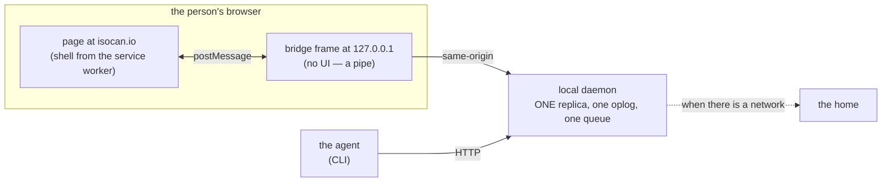

# The local bridge: one replica on a machine, not two

> **RETIRED 2026-08-30, never built. Kept as history and for one section.**
>
> The premise below is that a machine has two replicas that cannot see each
> other, and that this matters because both surfaces need to survive a lost
> network. The second half is false. An agent works by reaching a model, so
> an agent with no network is not an agent whose writes are refused — it is
> an agent that is not running. There was never a plane scene to write, and
> phases 12.5 and 12.7 were waiting on one.
>
> The first half is being answered a different way: the CLI speaks to the
> canvas's home directly when the canvas lives elsewhere, which leaves one
> replica on the machine (the tab's) rather than bridging two. See the
> closed entries in [phases.md](phases.md).
>
> **Read "The security rule, which must not be got wrong" anyway.** It is
> not about the bridge. The daemon still has no framing policy, and if
> anything ever frames it, `frame-ancestors` and the `postMessage` origin
> check derive from the home of the canvas being shown — per canvas, off
> `GET /api/homes`, never a whole-machine value. That rule outlives the
> design it was written for.

**The debt this discharges.** The [journey](journey.md)'s rule 6
says people enter through one origin, always — the local daemon serves ops to
CLIs, never pages to persons — and that *"offline in the browser is the
service worker's job"*. Phase 10 built exactly that and it works. But the
sentence quietly assumes the browser is the only surface that needs to survive
a lost network, and on a machine that has a daemon it is not. **The plane has
two surfaces and only one of them works.**

Concretely, at 35,000 feet with a local daemon that is a replica of some home:

- The **tab** keeps going: cached shell, durable replica, queued writes
  (phase 10).
- The **agent** cannot write at all. A replica forwards every write to its
  home and answers `home-unreachable` (503) when it cannot reach it — loudly,
  and nothing queued. `server/home-link.ts` argues that seam deliberately: an
  in-memory queue with no durability, no ordering story and no adoption path
  is the almost-working machinery phases 10 and 13 exist to do properly.
- And **the two cannot see each other**, which is the part that matters. The
  tab is served from the home's origin (out of the service worker's cache);
  the daemon lives at `127.0.0.1`. Two origins, no channel. Offline they are
  two independent replicas of one canvas, queueing toward a home neither can
  reach, invisible to one another until the plane lands.

That last bullet is not an inconvenience. "A person in the browser and an
agent in the terminal, on one canvas" is the product's whole thesis; the plane
is simply where it is most obviously suspended.

## The idea

The page at the home's origin embeds a **bridge document served by the local
daemon** in an iframe, and talks to it with `postMessage`. Inside that frame
everything is same-origin with the daemon: its badge cookie works, its
WebSocket works, its blob URLs resolve. The tab's canvas traffic goes through
the frame to the local daemon instead of over the network to the home.

**The prize is not offline support — phase 10 already has that. It is one
replica instead of two.** The agent and the tab become two clients of the same
local daemon, so they see each other's work with no network at all, and there
is a single queue to reconcile with the home rather than two racing ones.

## Why an iframe rather than plain CORS

The tab could simply `fetch()` the daemon cross-origin. The frame is better
for a reason that is about surface area rather than capability: cross-origin,
*every* interaction pays the tax — CORS on each route, mixed-content questions
for `ws://`, blob `` sources, cookie behaviour on the badge. Inside the
frame all of that is same-origin, and the only cross-origin surface left is
`postMessage` — one boundary, which is also the only kind you can actually
audit.

## What makes it possible, and what could take it away

`http://127.0.0.1` and `http://localhost` are **potentially trustworthy
origins**, so an HTTPS page may frame them without mixed-content blocking.
This is the same carve-out hardware wallets and local dev bridges have used
for years.

The part that is somebody else's roadmap is **Private Network Access**:
browsers want a preflight for public→local requests, answered with
`Access-Control-Allow-Private-Network`. That is a header this daemon can
serve, but it is a dependency on browser policy, and it should be written down
as such rather than discovered when it tightens.

## The security rule, which must not be got wrong

Any page on the internet can frame `127.0.0.1`. The daemon has **no framing
policy at all today** (`grep -rn "frame-ancestors\|X-Frame-Options"
packages/server/src` returns nothing), which is fine while nothing frames it
and becomes load-bearing the moment something does. Two locks, both cheap:

- serve the bridge document with `Content-Security-Policy: frame-ancestors
  <the home of the canvas being framed>` — so only the origin that legitimately
  serves that canvas can frame it at all;
- check `event.origin` against that same value on every `postMessage`, and
  never trust a `source` without it.

Both derive from one value, and **phase 10.3 changed which one**: not "the home
this daemon answers to", which stopped existing when the home became a property
of the canvas rather than of the machine, but **the home of the canvas the
framing page is showing** — `GET /api/homes` answers it per canvas, and a daemon
that is the home of the canvas in the frame is being framed by its own origin
and locks to that. Same daemon, two tabs, two locks, and no whole-machine value
that could have stood in for either.

## What it costs

- **The daemon must still learn to queue.** The bridge does not dodge that; it
  means the queue is built **once**, in the place that already has an oplog,
  durability and an adoption path, instead of twice. Phase 13's offline birth
  wants the same machinery.
- **Two code paths.** No daemon on the machine → the browser replica of phase
  10 is still the answer. So phase 10 is not wasted; it becomes the fallback,
  and the bridge is the upgrade when a daemon is present.
- **It bends "never pages to persons."** The daemon would serve a document.
  The rule survives in substance — that document has no UI and is not a door;
  the person still enters at the home's origin, and per-viewer state still
  lives in exactly one origin's storage. But it is a bend and should be
  recorded as one rather than waved through.

## The failure modes to design against first

This makes the local daemon a dependency of the *browser* experience, and the
ways that goes wrong are quiet ones — which is precisely this codebase's
recurring bug (see phases 6–10: *the default answer to a wrong address is a
cheerful one*, now met six times):

- **a daemon that is stale**, serving an older build than the page;
- **a daemon answering for a different home** than the tab is showing;
- **a daemon on a different port**, or none at all;
- **a daemon whose badge holds no claim** for the person the tab is being.

A tab that silently fell back to a *stale* local daemon would be the worst
version of that shape yet: two surfaces agreeing with each other and both
wrong. Every one of these needs a legible answer before the first byte of
transport is written.

## Status

**Not chosen.** This is a design, not a plan: it is recorded so that a later
session picks it up awake rather than meeting it mid-phase. If it is taken up
it wants a fractional phase of its own (numbers are addresses here, not
positions), and the journey should probably grow the scene it currently
lacks — a person and their agent, on one canvas, with no network.
