# How the Isocan Wireframe System Works — A UX Designer's Guide

Most AI screen generators treat wireframing like painting a finished billboard: you type a prompt, stare at a spinner for thirty seconds, and receive a monolithic wall of over-styled HTML. If you want to try an alternative for one section, ask *why* a layout was chosen, or swap a table for a card grid, you have to re-roll the whole screen and watch your navigation flow break.

Isocan's wireframe system (`/wire` in the Chat, `isocan wire` in the terminal) is built around how UX designers actually work: **structure first, explicit trade-offs, believable content, surgical edits, live click-through flows, and contrast-safe design systems — with every step undoable in one gesture.**

```mermaid
flowchart LR
  Brief["1. Brief & Clarify\n/wire · entropy /ask"] --> Blueprint["2. Blueprint (<100ms)\nBlue-on-white slots"]
  Blueprint --> Compose["3. 3-Round Jev Layout\n7 @container templates\n50 components · 52 intents"]
  Compose --> Explore["4. Explore & Question\nwire vary · wire why"]
  Explore --> Content["5. Content & Naming\n24 packs · wire copy --ai\nwire name"]
  Content --> Edit["6. Surgical Section Edit\nwire edit (1 slot, 1 undo)"]
  Edit --> Proto["7. Flow & Prototype\n📐 wire use · wire play"]
  Proto --> Style["8. System & Polish\nwire style · wire ds\nwire polish (WCAG AA)"]
```

---

## 1. Why Designers Needed a Different Engine

Under the hood, `/wire` separates **structural design judgment** from **prose generation**:

- **A System-One Decision Model (Jev) makes every layout and component choice.** Instead of asking a slow text model to invent raw HTML from scratch, Jev answers structured multiple-choice and scoring questions over a curated UX catalog (**18 screen archetypes**, **7 responsive multi-region layout templates**, **28 composite blocks**, **22 primitives**, and **52 semantic action intents**). Because Jev returns a **calibrated probability distribution** across every option in milliseconds (around **\$0.001** for a full multi-screen flow), Isocan knows not just *what* the model picked, but *how sure it was* and *what the runner-up was*.
- **Every screen is a real HTML item carrying its own `WireSpec`.** There are no hidden sidecar files or locked proprietary formats. Every screen embeds its specification, layout template, probability decisions, and semantic element paths (`data-sec`, `data-wf`, `data-intent`) right inside the HTML item on the canvas.

---

## 2. End-to-End Walkthrough: The 7 Stages of a Flow

### Stage 1 — From Brief to Blueprint in <100ms (`/wire "<request>"`)

When you type `/wire a stock-receiving app for warehouse staff — sign in, scan deliveries, see what's outstanding` in the canvas Chat (or run `isocan wire "<request>"`):

1. **Clarify Before Drawing (Entropy-Gated `/ask`):** Before laying out screens, Jev checks the root decisions (`platform`: mobile app vs. desktop web app vs. marketing site; `pack`: domain content pack). It computes the **Shannon entropy** $H(P) = -\sum p_i \log_2 p_i$ of the probability distribution.
   - If the brief is clear, it proceeds immediately.
   - If the brief is genuinely ambiguous ($H(P) > 1.0\text{ bit}$), `/wire` pauses *before* drawing and posts a 3-option multiple-choice `/ask` card showing Jev's top 3 interpretations and their probabilities. Once you click an answer (or pass `--pin platform=web --pin density=compact` up front, or `--no-ask` to never pause), that decision is pinned in `WireSpec.pinned` for the rest of the flow's life.
2. **Instant Blue-on-White Blueprint:** Within a tenth of a second — before the layout rounds finish — a row of **blueprints** lands on the canvas: classic blue rules on white, with labelled structural regions (*app-bar*, *main*, *side*, *tab-bar*) and screen titles above each frame. You can see the scope of the flow immediately rather than waiting on a blank canvas.

---

### Stage 2 — Multi-Region Layouts, Density & Typed Structure (3 Jev Rounds)

The blueprints fill in place in three fast rounds behind a priority queue (`PriorityGate`, which always lets interactive edits jump ahead of background batch work):

- **Round 1 — Flow & Shared Chrome:** Jev evaluates all 18 screen archetypes against your prompt:
  - **Core screens ($P(\text{yes}) \ge 0.5$)** are added to the flow and marked `📐` (*In the prototype*).
  - **Borderline screens ($0.3 \le P(\text{yes}) < 0.5$)** are still drawn in their natural sequence with a dashed outline and a **`maybe`** badge. UX flows are much easier to prune than to invent from thin air: if you want a *maybe* screen, click `📐 Use in prototype`; if not, leave or delete it.
  - **Shared chrome** (`top-bar`, `tab-bar`, `side-nav`) is decided once across the flow so navigation stays consistent from screen to screen.
- **Round 2 — Responsive `@container` Layout Templates, Regions & Density:**
  Phone apps stack vertically, but desktop consoles and tablets need multi-region hierarchy. For each screen, Jev picks one of **7 responsive CSS `@container` layout templates**, assigns each slot to a region, and scores the screen's information **density**:

  | Layout Template | Regions | Responsive `@container` Behavior | Typical Screens |
  | --- | --- | --- | --- |
  | `single` | `main` | Single vertical flow at all widths | Mobile screens, focused forms, sign-in |
  | `split` | `main`, `side` | Two columns (`1fr 1fr`) above `640px`, stacked on mobile | Detail views, checkout + order summary, profile |
  | `master_detail` | `list`, `detail` | `320px` list rail + `1fr` detail pane with independent scroll | Inbox, deliveries, chat, search results |
  | `grid` | `header`, `cells` | Full-width header over auto-filling card grid (`minmax(240px, 1fr)`) | Galleries, catalogs, feeds |
  | `bento` | `hero`, `wide`, `tall`, `cells` | 12-column asymmetric bento workspace above `640px` | Executive overviews, rich home screens |
  | `hero_then_grid` | `top`, `grid` | Full-width hero banner over a 3-column feature grid | Marketing landing pages, onboarding, welcome |
  | `dashboard` | `kpis`, `main`, `side` | Top KPI metric strip over a `2fr 1fr` main + side rail | Analytics consoles, operations dashboards |

  In the same round, Jev scores **density** (`compact` → `6px` base unit, `default` → `8px`, `spacious` → `12px`) and chooses the best component block for every slot from the 28 composite blocks and 22 primitives.
- **Round 3 — Component Variants & Semantic Intents:**
  Jev configures each block's visual variant (e.g., *table* vs. *card list*, *horizontal* vs. *stacked* stats) and binds every button, row, and tab to a **semantic `Intent`** (`go:detail`, `go:list`, `go:back`, `do:submit`, `do:create`, `do:filter`, etc.) rather than dead text labels.

---

### Stage 3 — Honest Alternatives & Explainable Decisions (`wire vary` & `wire why`)

Design exploration shouldn't be a black box:

- **Variations Driven by Model Uncertainty (`wire vary`):** When Jev is nearly split between two ways to design a slot (top-two probability margin $p_1 - p_2 < 0.25$), it automatically places a **variation screen** directly below the primary screen in the same column. The variation swaps *only* the contested decision to its runner-up and labels the card with what changed (e.g., *Deliveries — main: table (p=0.41 vs card-list 0.48)*). You can also request more variations at any time by selecting a screen and running `/wire vary` (or right-clicking → **Vary wireframe**).
- **Ask Why Any Decision Was Made (`wire why`):** Every screen stores a compact record of Jev's top choices, runner-up probabilities, and entropy in `WireSpec.decisions`. Run `/wire why` in the Chat or `isocan wire why "Deliveries" "why master_detail?"` in the terminal to get a clear designer readout:
  - Why this screen exists in the flow ($P(\text{yes})$ and whether it was required by the prompt or inferred).
  - Why its **layout template** (`master_detail`, `p=0.68` vs `split`, `p=0.22`) and **density** (`compact`) were chosen.
  - For every slot, which block won, what the runner-up was, and whether a variation was spawned.
  - How its domain pack and design system tokens were mapped.

---

### Stage 4 — Believable Content, Schema-Driven AI Copy & Flow Naming (`wire flesh`, `wire copy --ai`, `wire name`)

Wireframes with *"Lorem ipsum"* or *"Item 1, Item 2"* hide layout bugs and fail stakeholder reviews. Isocan gives you three levels of content fidelity on the exact same wireframe spec:

1. **Grey Bars (`/wire basic` or `wire flesh --bars`):** Classic abstract grey bars when you want a pure structural critique with zero reading distraction.
2. **Deterministic Domain Packs (`wire flesh`, default on `/wire`):** Out of the box, Jev picks from **24 curated synthetic domain packs** (logistics, fintech, healthcare, recipes, e-commerce, developer tools, travel, etc.). Because filling is seeded deterministically from the screen and slot ID:
   - *"Parcel 4471 — 3 items — Out for delivery"* appears consistently across the list, detail view, and prototype.
   - Image, thumbnail, and avatar slots render crisp greyscale **inline SVG pictograms** (a parcel, a barcode scanner, a route map) and monogram initials — zero broken image icons, zero network calls, zero real-world brand leakage.
3. **Schema-Driven AI Copy & Flow Naming (`wire copy --ai` & `wire name`):**
   When you want copy tailored to your exact product brief without breaking component geometry:
   - `blockContentSchema(spec)` inspects each screen's resolved blocks, table columns, stat cards, and form fields to build a **strict JSON schema** for every text and media slot on the screen — while locking interactive button actions to their semantic `Intent`.
   - Running `/wire copy` (`isocan wire copy --ai`) fills every screen with domain-specific copy that fits its exact component slots and updates the clickable prototype in one undoable step.
   - Running `/wire name` (`isocan wire name`) names the product brand, screen titles, and shared navigation labels (`tab-bar`, `side-nav`, `navbar`) across the entire flow at once so tab bars never drift between screens.

---

### Stage 5 — Surgical Single-Section Editing (`wire edit`)

In traditional AI tools, asking to *"replace the KPI row with a filter bar"* re-runs the whole screen and often breaks the rest of your layout.

In Isocan, every rendered section carries `data-sec="<slot>"` and every child element carries a stable dot-path `data-wf="<slot>.<element>"`. When you run `/wire edit "change the main list to a data table"` or `isocan wire edit "Deliveries" "add a filter bar above main"`:

1. **Scoped Turn Routing:** If you didn't select a screen, Jev picks the target screen from your flow, then scopes the instruction into one of five surgical operations (`content`, `add`, `remove`, `variant`, or `restyle`) and identifies the exact target slot.
2. **Single-Slot Mutation:** Only that slot in `WireSpec.slots` is modified. Every other slot on the screen, its layout template, its sibling screens, and its theme stay byte-for-byte intact.
3. **Automatic Prototype Sync:** In the **same undo group**, the screen versions forward and the flow's clickable prototype automatically re-renders with the updated screen. One `⌘Z` undoes both.

---

### Stage 6 — Clickable Prototypes & True Flow Arrows (`wire use`, `wire link`, `wire prototype`, `wire play`)

A row of wireframes on an Isocan canvas is already an interactive flow:

- **Computed Flow Arrows (Never Stale):** Because every interactive element carries a semantic `data-intent` (such as `go:detail` on a delivery row or `do:submit` on a sign-in button), Isocan's pure link engine (`inferLinks`) computes the transitions between all kept (`📐`) screens automatically. The canvas draws **non-crossing orthogonal arrows** directly from the originating button or row hotspot (`data-hotspot`) to the destination screen.
- **Swap Variations In and Out (`📐` / `⇧K` / `wire use`):** Want to test how the *Data Table* variation feels in the flow instead of the *Card List*? Select the variation and press `⇧K` (or click `📐` in the toolbar, or run `isocan wire use <variation>`). It swaps into the active set, re-routes the canvas arrows, and updates the prototype in one act.
- **Override Any Link (`wire link`):** If you want a button to jump to a specific screen, drag an arrow or run `isocan wire link <from-screen> <intent> <to-screen>` (or `--unlink` to remove a transition).
- **Self-Contained Clickable Prototype (`wire prototype` & `wire play`):** Above the row of screens sits a live **Prototype** card. Double-click it (or press **Play**) to click through the actual screens: hotspots highlight on hover, back buttons return to the previous screen in history, and every transition works inside a single self-contained HTML artifact you can share or present full-screen.

---

### Stage 7 — Design Systems, Contrast-Safe Synthesis & Guarded Polish (`wire style`, `wire ds`, `wire polish`)

When the structure and flow are right, you can move from greyscale wireframes to themed, high-craft UI without redrawing a single screen:

1. **Apply Your Governing `DESIGN.md` or a Built-In Style (`wire style`):**
   - Right-click any wireframe → **Style ▸** (or run `/wire style <preset>` / `isocan wire style --preset <name>`) to restyle the entire flow into **`material`**, **`shadcn`**, **`glass`**, **`ios`**, **`fluent`**, **`carbon`**, **`brutalist`**, any of the 9 design-competition packs, or back to **`house`** (neutral wireframe greys).
   - If your canvas or group already has a governing `DESIGN.md`, Jev maps your design system's tokens onto the 8 wireframe colour roles (`ground`, `surface`, `ink`, `ink-muted`, `border`, `primary`, `on-primary`, `accent`), typography, border radius, spacing unit, and depth **surface** (`flat`, `raised`, `glass`, or `bold`).
   - If the governing `DESIGN.md` is edited later, wires that use changed tokens display a quiet **behind** badge on the canvas; one click brings the entire flow and prototype forward.
2. **Synthesize a Custom, Contrast-Safe Design System (`wire ds` — Swap 1):**
   Don't have a `DESIGN.md` yet and want a bespoke aesthetic tailored to your brief? Run `/wire ds "industrial high-visibility warehouse theme"` (`isocan wire ds "<request>"`):
   - **Two-Stage Direction Selection (`proposeThenPick`):** Jev evaluates candidate visual directions, surface treatments (`flat | raised | glass | bold`), and spacing density against your flow's domain and platform.
   - **Deterministic WCAG AA Contrast Self-Repair (`repairContrast`):** Before writing the synthesized `DESIGN.md` to the canvas, a pure colour solver checks every foreground/background pair (`ink` and `ink-muted` against both `ground` and `surface`, `primary` against `ground`/`surface`, and `on-primary` against `primary`) and nudges lightness in 2% steps until every single pair meets **$\ge 4.5:1$ WCAG AA contrast** and passes `isocan design check` with zero warnings.
   - **One-Gesture Restyle:** The new `DESIGN.md` item is placed beside the flow, set as the governing design system, and applied across every screen and the clickable prototype in a single undoable op group.
3. **Budgeted Visual Polish with Contract Verification (`wire polish` — Swap 2):**
   Want finer visual hierarchy inside a screen without risking broken layout or lost prototype hotspots? Run `/wire polish` (`isocan wire polish`):
   - **Jev-Scored Polish Budget (`polish_intensity`):** Jev scores how much visual refinement each screen needs ($0\text{–}1$), which maps deterministically to a strict budget of **`0`, `4`, `8`, or `12` patches**.
   - **Targeted Refinement Tokens:** Each patch targets a specific `data-wf` or `data-sec` path on the screen and applies curated visual refinements (`elevated-cards`, `subtle-dividers`, `pill-controls`, `accent-header-rule`, `soft-surface`, `compact- chrome`, `tabular-nums`, `strong-headings`, `inset-well`, `outlined-media`, `focus-ring`, `airy-sections`).
   - **Strict Contract Gate (`verifyWireContract`):** Before any polish pass or custom primitive override is saved as a new version, `verifyWireContract` verifies that **100% of `data-sec`, `data-wf`, `data-intent`, and `data-hotspot` attributes are preserved** and that all design-system token pairs remain $\ge 4.5:1$. If a patch would break a single prototype hotspot or fail contrast, it is rejected before touching the canvas.

---

## 3. Designer's Quick Reference: Chat, Canvas UI & CLI

Every capability works identically from the **Canvas Chat (`/` menu)**, the **Canvas right-click menu**, and the **`isocan` CLI**:

| What you want to do | Canvas Chat / UI | CLI Command |
| --- | --- | --- |
| **Create a wireframe flow** (fleshed + prototype) | `/wire <request>` | `isocan wire "<request>"` |
| **Create plain grey-bar wireframes** | `/wire basic <request>` | `isocan wire --basic "<request>"` |
| **Pin platform or density up front** | `/wire <request>` (answers `/ask`) | `isocan wire --pin platform=web --pin density=compact "<request>"` |
| **Explore a variation on a screen** | Right-click screen → **Vary wireframe** or `/wire vary` | `isocan wire vary [<screen>]` |
| **Ask *why* Jev chose a layout or block** | `/wire why [<question>]` | `isocan wire why [<screen>] ["<question>"]` |
| **Edit a single section surgically** | `/wire edit <instruction>` | `isocan wire edit [<screen>] "<instruction>"` |
| **Swap domain sample content pack** | `/wire flesh [<pack>]` | `isocan wire flesh [--pack <id> \| --bars]` |
| **Write bespoke AI copy to fit slots** | `/wire copy` | `isocan wire copy --ai [<screens…>]` |
| **Name the brand, screens & nav bars** | `/wire name` | `isocan wire name [<screens…>]` |
| **Include/exclude a screen in prototype** | Click **`📐`** on card or press **`⇧K`** | `isocan wire use <screen>` / `isocan wire omit <screen>` |
| **Restyle to a preset or `DESIGN.md`** | Right-click → **Style ▸** or `/wire style <name>` | `isocan wire style [--preset <name> \| --list]` |
| **Synthesize a custom AA-safe `DESIGN.md`** | `/wire ds <direction>` | `isocan wire ds "<direction>"` |
| **Apply budgeted visual polish** | `/wire polish` | `isocan wire polish [<screens…>]` |
| **Rebuild or open the clickable prototype** | Double-click Prototype card / **Play** | `isocan wire prototype` / `isocan wire play` |

---

## 4. Summary of Results (Wave 1 `#350` + Wave 2 `#369`)

- **Architecture:** 100% pure TypeScript in `@isocan/core/jev` and `@isocan/module-wireframe` — zero external Python/Go/SSR sidecars, zero new canvas operation types (built entirely on `item.add`, `version.add`, `item.update`, and op groups so every multi-screen action is a single undo), and zero `.session.json` files on disk (every screen is self-describing via its embedded `WireSpec`).
- **Catalog & Layout Depth:** 18 screen archetypes, 7 responsive CSS `@container` layout templates (`single`, `split`, `master_detail`, `grid`, `bento`, `hero_then_grid`, `dashboard`), 3 spacing densities (`compact`, `default`, `spacious`), 28 composite blocks, 22 primitives, 52 semantic intents, 24 synthetic domain packs, 7 built-in style presets + 9 competition packs, and 12 guarded visual polish tokens.
- **Cost & Speed:**
  - Blueprint skeleton on canvas: **< 100 ms**
  - Full multi-screen Jev composition + prototype assembly: **~\$0.001** (19–25 batched Jev questions behind `PriorityGate(8)`)
  - CLI cold startup (`isocan --version`): **~0.10 s** (wireframe runtime lazy-loaded on action invocation, trimming 435 KB from the CLI startup bundle).
