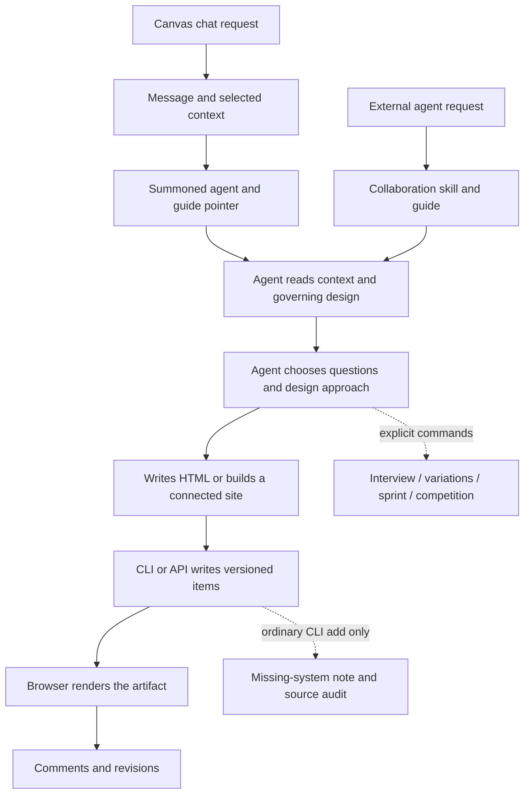

# isocan as a design partner

**Execution now lives in [the design-partner project](../projects/design-partner/journey.md),
with [eight phases and their proofs](../projects/design-partner/phases.md).**
That plan supersedes this report's implementation outline; the findings below
remain its evidence baseline. No product work or quality study is marked complete.

**Make the ordinary request produce the design partnership.** Someone should be
able to say “build me an inventory app” and receive thoughtful questions,
credible visual choices, a recommendation, and a working design that has been
inspected. They should not need to know `/grill-me`, `/variation`,
`/design-system`, or Impeccable to obtain that experience.

isocan has much of the underlying machinery. Its distinctive opportunity is
to make the brief, references, alternatives, decisions, and evolving artifact
visible together, and carry that understanding between people and agents.
Today those capabilities are distributed across commands and guidance. An
ordinary creation request does not reliably assemble them into a design
workflow. That is the P0 gap.

The recommendation is **one adaptive workflow, with strong defaults and a few
meaningful decisions**:

> Understand the job → resolve the design context → explore what is uncertain
> → recommend and choose → build → inspect and repair → remember the decision.

This should be lightweight for a small change and more exploratory for a new
product. An excellent default is not a universal palette. It is a dependable
standard of judgment, interaction, typography, content, and verification.

## What is established, and what is not

The assessment covers the checked-out source at `da47c5861a11a5bd64add503fbb3282d4239c29d`
and the newer remote-main snapshot at
[`cb272b208608d0a78bbd0c0435a78f3dccb72e3d`](https://github.com/dglazkov/isocan/tree/cb272b208608d0a78bbd0c0435a78f3dccb72e3d).
The latter matters: it includes the questionnaire dock merged on 14 September.
The shared working tree contained unrelated staged context work, which this
assessment does not treat as a completed release.

Evidence includes source tracing, executable questionnaire-helper probes,
a repeat of the existing seven synthetic HTML audit cases, existing research
and acceptance records, and current primary sources on design practice and
tools. The [probe](design-partner/probe.mjs) and
[results](design-partner/results-2026-09-14.json) identify the exact snapshot.
They do not contact a canvas, generate designs, or measure browser usability.

**No claim here establishes the quality of current model-generated results,
production deployment of a commit, or a conversion lift.** Those need the
controlled evaluation described below. The recommendations are product and
engineering judgments informed by the evidence, not measured effects.

## The flow today

### Two entrances, mostly one agent-mediated path

In canvas chat, the person posts a request, optionally attaching items or
referencing them. Group-mode messages with explicit roots can preview and save
a version-specific context manifest. An enrolled agent is summoned with the
activity payload, instructions to use the CLI, and a pointer to the agent
guide. The hosted cell's brief follows the same pattern. Neither summons
wrapper supplies a specific design-creation procedure.[^1]

An external coding agent discovers the collaboration skill, which points it to
`isocan --agent-help`. The guide tells it to orient, read context and the
design system, work through shared operations, reply on the canvas, and
continue the session protocol appropriate to its host. The remote snapshot's
guide is **2,601 lines**. Design advice exists, but a design-specific entry
point and compact creation procedure are not placed in the summons.[^2]

This is an account of the inspected paths, not a trace of a measured user
session. The crucial discretionary step is G: the agent determines how much
discovery, exploration, critique, and validation occurs.

### What each capability currently contributes

| Concern | What exists | What is missing from a dependable default |
| --- | --- | --- |
| Understanding the request | Canvas context, pins, inherited context, references, comments; explicit `/grill-me` interview | A short, adaptive design brief automatically used for creation |
| Structured questions | New questionnaire dock renders `/ask` JSON in main chat | Shared schema and answer lifecycle; discoverable agent instructions; reliable assets and request association |
| Design systems | Versioned `DESIGN.md`, token/CSS import and export, checks, scoped group systems | First-design direction, executable recipes, consistent governing-system resolution and delivery across creation paths |
| Alternatives | `/variation` defaults to three substantive alternatives with names and a recommendation | Automatic use when an important design decision is open; greenfield alternatives without an existing screen |
| Wireframes | Agents can author them; sprints and one competition pack support prototyping | Guidance on when structural exploration is worthwhile and an easy way to request it |
| Convergence | `prefer`, `choose`, versions; competition `take` preserves the arena | Capturing why a person chose something and carrying that decision into the next screen |
| Craft review | `/design-audit`, token audit, system checks, anti-pattern guidance | Normal browser inspection, interaction checks, and repair before declaring a new design complete |
| Impeccable | Listed as a skill source; command import accepts a Markdown file | A verified package integration, automatic routing, context adapter, capability handling and measured benefit |

The primitives are valuable. `/variation` explicitly asks for layout and
hierarchy changes rather than mere recoloring, requires meaningful names, and
asks the agent which one it would keep. `prefer` separates a preference from
the final act of adoption. Scoped systems let different areas of one canvas
have legitimate visual identities. These should anchor the workflow.[^3]

### The new questionnaire needs completion before it carries P0 discovery

The remote-main implementation adds choice lists, color cards, file picking,
URL collection, and freeform text. It is a useful delivery surface for
questions, but does not decide which questions are worth asking.[^4]

The source and probes expose specific limitations:

1. **“Upload” retains filenames only.** `handleFiles` reads `File.name` into
   local state; submission sends those names in Markdown. This path does not
   upload bytes or attach readable canvas items. A builder cannot inspect the
   reference merely because its filename appeared in an answer.
2. **Another agent can close the question.** `activeQuestion` treats a later
   non-system comment by any different author as an answer. The probe confirms
   that a second agent's unrelated update removes the active questionnaire.
3. **The schema is not validated beyond a nonempty questions array.** The
   parser accepts `{"questions":[{}]}`. Question and option identity,
   renderer shape, and usable content need shared validation.
4. **“Visual cards” show color swatches.** They do not show a proposed layout,
   type specimen, navigation model, or actual screen. They are palette choices,
   not evidence of a design direction.
5. **Answers lose their machine-readable identity.** `finish` posts prose
   with labels and selected titles. It does not retain a typed question ID,
   selected option IDs, source-question reference, and attachment versions in
   a shared answer object. It also appends an instruction to proceed even
   when answers have been skipped.
6. **The discoverable protocol has not caught up.** The examined agent guide
   does not mention this questionnaire payload. Its interfaces and selection
   logic live in the web component rather than shared core code.

The fixes are more consequential than adding more question renderers. A
question should belong to an identified request and respondent; an explicit
answer, skip, or dismissal should close it. Multiple agents must not dismiss
one another's questions. Files must become real accessible attachments, and
the answer must survive refresh and be readable from either surface. The
agent should see which reference bytes were available, not infer it from a
filename. Browser acceptance must also cover back navigation, freeform drafts,
two consecutive upload/URL questions, submission failure, and mobile focus.

### Design-system enforcement is late and uneven

The current policy deliberately starts with no system requirement for one
screen, nudges at two, and refuses another HTML addition when six screens
already exist without a recorded system or opt-out. The rationale is to derive
a system from real work rather than invent an abstract rulebook.[^5]

That protects consistency after creation. It does not determine whether the
first screen is good. Deriving the most common choices from weak drafts can
make weak choices consistent. **Keep the idea of documenting the finished
system, but introduce a concrete provisional direction before implementation.**
The direction should be grounded in users, content, references and a visible
design; the final system should reflect what survived review.

There are also coverage gaps, confirmed in both inspected snapshots:

- Arrival audit and missing-system notes are skipped in CLI JSON mode. The
  HTML refusal still applies; it is the helpful feedback that disappears.
- The automatic audit call is on ordinary CLI `add`, not a shared add/edit
  lifecycle. API writes and browser uploads do not acquire it merely by
  using the same operations.
- Any design-system item clears the canvas-wide standing, even if other
  groups have no applicable system. Presence of a document is not coverage.
- Arrival scoring reads local scoped systems directly rather than the full
  linked governing-design path.
- The existing audit credits undefined CSS variables, misses spacing and
  font shorthand, and can flag a hexadecimal string in prose. Repeating the
  seven synthetic cases reproduced those findings.[^6]

The already-written [design-lint research](2026-09-14-design-lint.md) and
[#299–302](https://github.com/dglazkov/isocan/issues/299) cover the diagnostic
foundation and repair loop. This recommendation builds on that work. A lint
score must not become an aesthetic approval or another blanket upload gate.

## The proposed design partnership

### 1. Read first, then ask only what changes the design

On every visual creation or substantial revision, assemble a compact brief
from the request, selected items, pinned context, relevant conversation,
governing design, incumbent screens, available assets, and permitted memory.
Inspect the actual content behind a reference. Do not ask people to transcribe
what the canvas or repository already says.

Use **zero to three questions in the first round**, depending on what is
known. A second round is justified only when an answer reveals a material
dependency. This is a proposed starting policy to evaluate, not a universal
human-factors constant. Explicitly requested interviews and sprints can go
deeper; ordinary creation should not inherit `/grill-me`'s goal of emptying
every decision frontier before building.

The question order should be:

| Decision | Useful question when unknown | What the agent should infer or recommend |
| --- | --- | --- |
| Person and situation | “Who uses this, and what are they trying to finish?” | Likely audience from existing context; distinguish first-time visitors from daily operators |
| Outcome | “What is the one action this should make easiest?” | Recommend the primary task and hierarchy |
| Constraints and material | “Is there a brand, existing screen, or content we must preserve?” | Find existing assets and systems first; show what was found |
| Scope | “Do you need a design prototype or an app connected to real data?” | Offer only when the request and repository leave that consequential choice open |
| Direction | “Which of these approaches better supports that job?” | Present visual evidence and explain the tradeoff |

Do not begin with “modern or minimalist,” favorite colors, font choices, or
framework menus. Those ask the person to do the designer's work without
seeing a design. Ask about a framework only when it affects a real delivery
constraint or the person wants that decision. Respect an established stack.

Every question should include an informed recommendation and allow a written
correction or “use your judgment.” Defaults are decisions the agent can make;
they are not claims that a user approved something. Mark inferred facts,
confirmed facts and delegated choices differently. Missing answers must not
silently turn into approval.

For a fully specified request, proceed and state the important assumption in
one sentence. For a sparse new app request, resolve audience and primary job
before committing to a major direction, while doing independent inspection
and low-cost exploration. If the person asks to “just build,” make provisional
choices and explain them with the result rather than forcing an interview.

### 2. Preserve three different kinds of context

| Record | What belongs there | How it should live in isocan |
| --- | --- | --- |
| Product brief | Audience, job, real capabilities, content, vocabulary, constraints and success | A small pinned, versioned item; answers link back to the request |
| Surface direction | Purpose of this screen, primary action, hierarchy, chosen approach, important states and tradeoffs | A brief beside the artifact or group, linked to the chosen alternative |
| Design system | Semantic tokens, typography, components, behavior, layout rules, assets and rationale | The existing scoped `DESIGN.md`, with linked recipes/reference items where necessary |

This avoids treating a palette as a product strategy or a temporary landing
page experiment as the brand for every screen. It also avoids inflating one
`DESIGN.md` until no agent reads it.

For visual authority, preserve explicit instructions and binding brand
constraints; resolve the nearest group system, ancestors, canvas, and
permitted inheritance through the existing shared rules. Incumbent code and
screens remain evidence even when a `DESIGN.md` is absent. Personal preferences
can inform proposals, but must not silently override a shared project's
design. Surface conflicts with a specific consequence and recommendation.

Record provenance: the item and version that supplied a constraint, whether it
was inferred or confirmed, and the decision that changed it. When the source
changes, mark dependent work as needing review. Do not silently restyle every
historical version or turn a rejected experiment into a default.

### 3. Make defaults fit the visitor's job

Impeccable's current distinction between operating, persuading, reading, and
experiencing is useful because these surfaces have different definitions of
success.[^7] isocan should make a similar distinction internally, without
requiring users to learn the labels.

| Surface | Strong default | What makes it distinctive |
| --- | --- | --- |
| Working app, dashboard, editor | Clear task hierarchy, familiar controls, compact but legible information, explicit states and responsive structure | Domain-specific workflow, useful data, precise interaction and thoughtful details |
| Landing page or campaign | A clear offer, credible evidence, purposeful imagery, a strong first viewport and a meaningful action | A specific narrative and visual point of view grounded in the product |
| Document or explainer | Readable measure, strong headings, navigation, source clarity and restrained interaction | Excellent editorial organization and appropriate diagrams |
| Portfolio, gallery, creative tool | Put the work itself first; keep navigation understandable | Art direction and interaction that serve the work |

Across all four, the baseline includes semantic HTML, keyboard access, visible
focus, readable contrast, real content structure, responsive behavior and
honest loading/error/empty states. Use WCAG 2.2 AA as the accessibility target
for the eventual app, with automated and manual checks; do not call a source
audit full accessibility verification.[^8]

Avoid universal aesthetic bans. A familiar sans, standard component, square
panel, or restrained layout may be exactly right for a tool. The current
anti-pattern rule can flag a single-family Inter or system stack without
establishing that its hierarchy is poor. Such rules should be mode-aware
advice with scope and exceptions, not a reason to make an operations tool
look like a campaign. Existing explicit visual requests outrank generic
anti-pattern preferences.[^9]

Ship reusable **behavior and craft defaults**: button states, form patterns,
empty states, responsive tables, navigation, type hierarchy, spacing rhythm
and content stress cases. Vary visual identity per project. A small set of
reviewed reference examples should demonstrate quality across genuinely
different product types, not seed one house look.

### 4. Match fidelity to the decision

Wireframes should be easy to obtain and offered when they help. They should
not be a compulsory ceremony before every HTML node.

| What is uncertain? | Best first artifact | Default breadth |
| --- | --- | --- |
| Workflow, navigation or information architecture | Low-fidelity clickable flow with realistic labels and content | Two materially different approaches to the main task |
| Brand expression or composition | A type/color/component specimen plus a designed first viewport | Two or three coherent directions with equivalent content |
| An extension to an established screen | A working design in the incumbent system | One recommended solution; explore only unresolved structure |
| A localized edit | The edited screen and a clear before/after | No forced discovery or alternate concepts |
| A concept needs stakeholder alignment | A short guided exploration or explicit sprint | Scope and time budget agreed for that session |

A wireframe must answer something: whether search or a queue should lead,
whether a detail pane should persist, whether onboarding requires a sequence.
Gray rectangles that omit labels, realistic content, and transitions answer
very little. Pair a structural exploration with one crafted anchor screen
when visual confidence is also important; this avoids asking someone to
imagine the eventual result from boxes alone.

For image-led marketing concepts, a rendered or generated comp can be useful.
For a task-driven app, executable HTML is usually the more informative early
artifact: it can expose navigation, overflow, data density and interaction.
Image generation should supply appropriate imagery or visual exploration,
not replace semantic controls with a screenshot of an interface.

These choices are consistent with the Double Diamond's broadening and
focusing of a problem and its solutions, without turning the model into a
mandatory linear process.[^10]

### 5. Show real alternatives, and make a recommendation

For a substantially open design, show two or three options that differ in a
decision that matters. Keep the task, content, screen size and comparison
fidelity equivalent. Name the idea and state what it optimizes.

An inventory application might compare:

- **Exceptions first:** a queue of stockouts, low-stock items and unresolved
  receipts. Best when attention is scarce and most items need no action.
- **Inventory workbench:** a searchable table with bulk actions and a stable
  detail pane. Best for frequent updates across many items.
- **Guided stocktake:** a focused count-and-confirm sequence. Best on a phone
  while walking shelves.

These are different ways to support work. Three versions of the same dashboard
with blue, green and purple accents are not equivalent exploration.

The agent should say, for example: “I recommend Inventory workbench because
you described frequent bulk updates. Exceptions first makes urgent work
clearer but adds navigation for routine editing.” The person can choose,
combine named strengths, request another approach, or delegate the decision.
“Looks good?” is not a useful critique prompt.

Parallel-prototyping research provides a rationale for comparing alternatives:
Dow and colleagues found better results and greater diversity in a study of
33 people creating web advertisements. That is evidence about human graphic
design in a bounded task, not proof that three AI-generated apps always beat
one. Breadth and cost must be measured in isocan.[^11]

Use existing variants and preference records carefully. Alternatives derived
from an existing HTML screen can retain that screen as their parent and use
the existing convergence path. **Do not point greenfield HTML alternatives
at a Markdown brief and then call `choose`**: the brief is not the screen to
replace. Use a direction group and a decision record, retain the alternatives,
and promote the selected work deliberately. Competition already distinguishes
adopting a winner from discarding the arena.[^3]

Keep a human preference as the human's preference. An agent recommendation
should not appear as a human vote. Record the reason alongside the choice:
“kept persistent details to reduce navigation” is reusable context; “B won”
is not enough. Do not infer a universal taste profile from one decision.

### 6. Build one complete task before multiplying screens

After selecting a direction, implement a representative end-to-end slice.
For the inventory example, that could be finding an item, adjusting its count,
handling an invalid entry, and confirming the saved result. The point is to
test the visual system under the actual demands of the application.

Default to the appropriate artifact path. A standalone HTML node is a good
portable prototype or self-contained tool. A real web application requiring
authentication, persistent shared data or a backend belongs in a connected
project/site with an appropriate runtime and deployment. An HTML preview
should not silently stand in for a finished app. The brief should make the
delivery stage explicit, and the chosen path should be tested where isocan
actually renders or projects it.[^12]

Carry realistic content: long names, many rows, zero results, invalid input,
loading, failure and success. Use clearly synthetic demonstration data where
real data is unavailable. Do not fabricate testimonials, customers, metrics,
prices, or backend behavior to make a screen look convincing.

Build from semantic tokens and reusable treatments. For self-contained HTML,
those can be small HTML/CSS/JS recipes with explicit states and permitted
overrides. For a connected React app, use its real components and approved
variants. Importing tokens is valuable, but a token document alone cannot
reproduce a component's behavior. The existing component-library research
already identifies this format boundary; there is no reason to change the
canvas artifact format just to install a React library.[^13]

Once the first slice has survived review, record the stable decisions in
`DESIGN.md` before expanding to a family of screens. Include when to use a
treatment, not only its value. Copying CSS variables into an HTML artifact
does not create a live dependency: record the design-system version used and
offer an explicit, reviewable update when it changes.

### 7. Inspect before declaring completion

Every materially new or redesigned HTML surface should receive a browser
review at its intended dimensions. Test the canvas iframe and the larger
viewer when both matter. A passing Node script does not establish that text
fits, controls are reachable, or the browser loads the intended fonts/assets.

Keep three different judgments visible:

1. **Mechanical correctness:** token/reference validity, syntax, detectable
   accessibility problems, missing assets, console failures and overflow.
2. **Task usability:** complete the primary workflow; inspect focus order,
   feedback, empty/error/loading states, content extremes and responsive
   behavior. A screenshot cannot establish these.
3. **Design quality:** hierarchy, appropriateness, specificity, composition,
   copy, and the one or two changes that would materially improve the result.

Batch the initial desktop/mobile inspection, fix material findings together,
then recapture the affected states. Start with a small correction budget and
expand only for a named unresolved problem or explicit request. Fixing a
defect in a newly commissioned design is part of building it; it should not
require the person to run a separate audit and approve every hygiene fix.
An explicitly requested audit of existing work should remain report-first.

Reports must name the artifact version, design-system version, rules used,
viewports, tested interactions and uncovered areas. A result becomes stale
when its inputs change. Use current main's conditional `item.edit` when
applying a repair to prevent overwriting another collaborator's edit.[^14]

Present a first pass as a first pass. Completion should state what works,
which direction was chosen, what was checked, and any specific remaining
limitation. Avoid a misleading “production ready” label based on appearance
or lint alone.

## A concrete experience

The following is a proposed interaction, not a current product transcript.

**Person:** “Build me a web app for managing inventory.”

**Agent:** “I’ll design around the daily inventory task. I found no existing
brand or screen to follow. Who will use it, and which matters most: updating
stock, handling low-stock items, or running stocktakes? I’d start with a
searchable workbench if this is used throughout the day.”

The questionnaire offers concise choices with a written-answer path. If the
person provides screenshots or a brand file, those become actual canvas
items, and the brief shows what the agent read. If real-data connectivity is
unclear, the agent asks the delivery question before presenting a prototype
as the finished application.

**Person:** “Warehouse staff. Lots of bulk updates. Mostly desktop, but
stocktakes happen on phones. Start with a prototype; you choose the look.”

The agent records a short brief, then puts two structural options and one
crafted anchor screen beside it. The directions use the same inventory
content. It recommends the workbench, with a focused mobile counting view,
and explains why a dashboard of summary cards would make routine edits
slower.

**Person:** “Use the workbench, but keep the low-stock queue from the other.”

The agent records that decision and implements the combined task model. It
tests search, bulk changes, validation, confirmation, the mobile count flow,
keyboard use and long item names. It repairs what fails, records the stable
design system, and presents a working prototype with the brief and rejected
directions still available.

**Person, next day:** “Add supplier management.”

The same agent—or a different external agent—reads the product brief,
accepted design and prior decision. It extends the workbench without asking
the audience and color questions again. It asks only if the new supplier task
creates a material choice that the existing context cannot answer.

That is the partnership: informed initiative, visible judgment, useful
choices, and memory of why the design exists.

## Using Impeccable correctly

### What the current package actually is

The inspected upstream snapshot is
[`2149fcce39a90bb409df5f16515f316a76dc6199`](https://github.com/pbakaus/impeccable/tree/2149fcce39a90bb409df5f16515f316a76dc6199),
dated 14 September 2026. The generated skill reports version **4.3.1**.
Its working entry is `.agents/skills/impeccable/SKILL.md`; the attempted
`skill/SKILL.md` path returned 404. This is an example of why integration
should pin and inspect a package rather than rely on a remembered command.

The current skill uses a launcher for context, references separate playbooks,
and distinguishes product facts, surface decisions and visual systems.
`teach` aliases `init`; `craft` is now a deprecated alias for ordinary new
visual work. `shape` is planning-only. Its README still describes `craft` as a
full flow, so the executable package's routing and referenced playbooks are the
better integration evidence.[^7][^15]

isocan currently names Impeccable as a source to discover, but that is not an
integration. `command add --from` fetches one URL and stores its text. It does
not install the relative references, launcher, assets, hooks or supporting
agents required by the current package. The broad claim that a published
skill “drops straight in” needs narrowing: self-contained instruction files
can; a package with dependencies cannot be assumed to.[^16]

### What to adopt, adapt, and evaluate

| Impeccable capability | Recommendation for isocan |
| --- | --- |
| Context before design; product facts separated from visual direction | Adopt the distinction; use canvas records as the authoritative source |
| `init` and `shape` discovery | Adapt to a short, gap-driven interview; preserve delegated decisions and avoid repeated confirmation |
| Preserve, extend or replace an incumbent design | Adopt explicitly; absence of a file does not erase an existing identity |
| Surface-specific design modes | Adopt internally to prevent marketing aesthetics overwhelming task UI |
| `critique`, `audit`, `polish`, `harden`, `adapt` | Route to relevant craft knowledge and checks at the right stage; keep technical and aesthetic judgments separate |
| Browser inspection and independent finish review | Evaluate with a bounded budget and evidence tied to actual artifact versions |
| Generated comps, randomized concept selection, elaborate direction ceremonies | Optional exploration tools to benchmark; not blanket defaults for every app or edit |
| Hooks and native runtime helpers | Capability-dependent integration with explicit versioning and truthful fallbacks |

The new-work playbook currently includes concept seeding, visual decision
pages, an image-led path when image generation is available by default, and
separate finish/documentation roles. These are substantial workflow choices,
not just advice about typography.[^17] There is no isocan evidence yet that
their entire cost improves everyday app work. Start with an adapted,
code-first workflow for operational UI and evaluate richer visual exploration
where imagery and art direction matter.

Do not silently claim to run Impeccable when only a rewritten checklist ran.
Support two truthful states: a verified compatible package with its required
resources available, or isocan's own workflow using explicitly attributed,
adapted guidance. Record the package/version and checks actually used in the
design receipt, not as jargon in the product's normal question flow.

### The integration boundary

Keep the collaboration skill a short doorway to the CLI's versioned guide.
Add a compact design procedure at the actual creation entry points and expose
its details on demand. Do not copy Impeccable's evolving instructions into
every harness directory or append its full reference corpus to every summons.

An integration should resolve the target and governing context once, then
materialize the compatible working files a native skill needs. Those files
are projections with item/version provenance, not competing authorities.
Capture approved results back into the canvas through normal operations.
Conflicts should require a fresh read and a clear reconciliation.

Capability discovery should establish whether the agent can read package
references, run the launcher, inspect a browser, generate images, and use any
review roles the selected playbook requires. An unavailable browser should
produce an explicitly unverified draft, not a false visual sign-off. Missing
optional image generation should lead to executable exploration where it
fits the task, rather than blocking the design.

Pin upstream source, retain its license and notices if distributing material,
and review updates against isocan's evaluation set. The inspected repository
contains Apache-2.0 license and attribution files.[^18] No Impeccable package
was installed and no application dependency was added by this assessment.

## What current primary sources suggest

These are documented capabilities or published findings, not a hands-on
ranking of competitors' output quality.

| Source | Relevant evidence | Implication for isocan |
| --- | --- | --- |
| Google Stitch, March and May 2026 | Infinite design canvas, contextual agent, DESIGN.md interchange, interactive flows, and steering while generation proceeds | A canvas containing AI output is becoming expected. The advantage must be the quality and continuity of the collaboration.[^19] |
| Lovable design systems | Components, machine-readable schema, guidelines and setup; verification on attachment; adherence checks during generation | A system should reach implementation and repair, not remain a document the agent might read.[^20] |
| Figma Make kits | Code packages, library variables/styles and usage guidance travel together | Carry rules, reusable implementation and examples as one usable kit.[^21] |
| DESIGN.md and DTCG | Rationale plus exact token values; interoperable structured token representation | Preserve the existing format investment; distinguish format conformance from component fidelity and design quality.[^22] |
| Design Council and parallel-prototyping research | Understand the problem, explore alternatives, focus and test | Make divergence purposeful and bounded; evaluate the incremental benefit for this product.[^10][^11] |

There is also a useful distinction in Lovable's plan/agent modes: reasoning
and execution can be separate when that serves the work.[^23] isocan should
support that choice without making an explicit mode switch a prerequisite for
every good design.

## The P0 implementation sequence

These are proposed delivery slices, ordered by dependency and expected value.
They are not elapsed-time estimates or a commitment that the work is built.

### Slice 1: One creation procedure and trustworthy questions

Put the adaptive flow in the versioned agent guide and make design intent
discoverable from canvas summons and external-agent entry points. Trigger on
the intended work, including an HTML visual face or a connected app; HTML
MIME alone cannot distinguish a designed screen from an imported archive.
Do not rely on the evaluation classifier as an execution router without
explicitly designing and testing that responsibility.

Promote question payload validation, question/answer identity and resolution
to shared core/API semantics. Extend #293's dock to read and write those facts.
Provide a documented CLI route for the same structured questions and answers,
while retaining readable Markdown fallbacks. Persist files as real items and
make visual alternatives reference item/version previews, not just swatches.

**Proof:** A sparse creation request from each entrance produces the same
brief; an attached reference is readable by the builder; another agent's
comment leaves the question open; only the intended answer resolves it.
A precise edit proceeds without unnecessary discovery. A returning session
does not ask the same settled questions.

### Slice 2: Contextual defaults and useful exploration

Add the small product brief and surface direction records. Resolve incumbent
designs and existing systems before generating defaults. Provide a reviewed
HTML recipe/reference kit for core interaction patterns and distinct example
surfaces. For established repositories, point to actual components instead.

Compose existing groups, variations, preferences and versions into a comparison
experience. Show actual layouts at comparable fidelity and require an agent
recommendation tied to the brief. Support greenfield direction selection
without overwriting the brief or discarding the comparison record.

**Proof:** An operational app, a marketing page, and a reading surface get
appropriate, recognizably different approaches. An existing brand is
preserved. A workflow question gets wireframes; a narrow refinement does not.
The accepted direction governs the next screen on either entrance.

### Slice 3: Reliable design-system application and browser completion

Use the already-scoped work in
[#300](https://github.com/dglazkov/isocan/issues/300),
[#301](https://github.com/dglazkov/isocan/issues/301), and
[#302](https://github.com/dglazkov/isocan/issues/302): accurate HTML diagnostics,
declarative recipe contracts, and the shared repair loop. Include JSON
feedback and both creation and revision. Resolve linked and scoped systems
consistently. A diagnostic should explain an existing repair and report what
could not be checked.

Add artifact-version browser evidence for the actual task, target widths,
and critical states. Automatic review should be bounded and should not start
a model turn after every unrelated canvas edit. Create/update the stable
system from accepted work; never add tokens just to make a diagnostic pass.

**Proof:** The same bad screen produces the same actionable reading through
CLI and web. A broken control or mobile overflow is caught through actual
browser use. Repair and undo work; concurrent changes are not overwritten;
stale evidence cannot authorize a final result.

### Slice 4: Verify the craft package and measure outcome lift

Implement the pinned Impeccable adapter only to the depth justified by its
dependency and capability probe. Compare the adapted workflow with and
without its guidance. Keep richer image-first and multi-agent exploration
optional until the results justify their cost.

Complete the existing design competition's still-owed distinctiveness and
cost measurement, and coordinate the designer/model factor with
[#276](https://github.com/dglazkov/isocan/issues/276). Its integration record
explicitly leaves human acceptance open; shipped mechanics do not establish
that persona packs improve designs.[^24]

**Proof:** Package resources resolve on the supported local and hosted
environments, the correct context is loaded, and controlled human evaluation
shows whether quality improves for the cost. A negative result is a useful
reason to narrow the integration.

### Changes to the two surfaces

| House-rule surface | Proposed treatment |
| --- | --- |
| Operation vocabulary | Reuse existing versioned items, comments, properties, groups and preferences where they faithfully express the act. Define any schema extension once in core. Use conditional `item.edit` for content repair on builds that support it; do not invent a parallel workflow store. |
| CLI | Design brief/context access, structured questions/answers, comparison selection and diagnostic receipts must all be reachable without a pointer. Final command names belong to implementation. |
| Agent guide | A concise default creation flow near orientation; detailed playbooks on demand; every new verb in the quick reference. |
| Shared core/API | One authority resolver, validated question protocol, evidence identity, coverage and decision semantics. No browser-only inference of whether a question was answered. |
| Browser | Reliable questionnaire, real reference upload, equal-fidelity comparisons, visible recommendation, durable answers and inspectable validation. |
| README and tests | Describe behavior only when shipped. Pure decisions get meaningful tests; upload, comparison, responsive and repair flows get real browser acceptance. |

The research changes only documentation and a bounded evidence probe. None of
these proposed product-surface changes is represented as implemented.

## How to know whether the results are amazing

The existing eval plan correctly emphasizes software design and separates
mechanical checks from judgment.[^25] Extend it with a small repeatable
design-partnership corpus before declaring the workflow successful.

Start with **12 synthetic briefs**, a proposed pilot size: sparse operational
app, complex workflow, dense dashboard, constrained brand extension,
marketing page with real proof supplied, imagery-dependent page, reading
surface, mobile task, accessibility-heavy form, simple local edit, misleading
reference, and a follow-up after a recorded preference. Include both entry
points. Use repeat generations to expose variance; do not treat one attractive
run as a distribution.

Compare three conditions:

| Condition | Purpose |
| --- | --- |
| Current default | Establish the actual baseline, including failures and abandoned runs |
| Adaptive isocan flow | Test discovery, context, alternatives and verification as a product improvement |
| Same flow plus the pinned craft integration | Isolate Impeccable's added value rather than attributing all workflow improvement to a skill |

Hold model, task facts, assets, time/token limits and maximum correction
rounds equal for the controlled comparison. Supply a scripted answer bank so
conditions receive the same available facts, while separately evaluating how
well they elicit those facts. Randomize presentation order and hide model and
condition labels from reviewers. Include ties and “neither is usable.” Keep
task failure and abandoned generations in the denominator.

Then run a smaller real-user study to measure the partnership cost: whether
questions are understandable, whether choices feel useful, and whether
people reach an acceptable result without repeatedly explaining themselves.
The simulated answer bank cannot measure that.

Measure these independently:

- **Task success:** can a representative user complete the primary workflow?
- **Brief adherence:** audience, constraints, content, brand and delivery scope.
- **Visual craft:** hierarchy, typography, spacing, composition, state design
  and responsiveness, judged with the actual brief available.
- **Distinctiveness:** product specificity and cross-project diversity, without
  rewarding novelty that harms use.
- **Partnership:** useful versus repeated questions, ability to steer,
  comprehension of alternatives, confidence in the agent's recommendation.
- **Reliability:** readable references, valid context, preserved decisions,
  no stale repairs, honest verification status.
- **Cost:** elapsed time to first useful visual and accepted result, tokens,
  model/browser/image costs, correction rounds and human attention.

Use version adoption, undo, preferences and later revisions as useful signals,
not self-interpreting truth. An undo can mean a change of mind; a chosen design
can be the least bad option. Ask for a reason on a sampled basis and relate
events to the request that produced them.

Set release criteria before the paid comparison. Proposed P0 reliability
criteria are: no lost reference uploads; no cross-agent dismissal; no silent
brand replacement; no claimed visual verification without evidence; and a
working primary task for every benchmark case considered ready to ship.
For quality, require a blind preference advantage with uncertainty reported
and no task-success regression, then decide whether the measured time and
cost tradeoff is acceptable. Twelve briefs are a pilot, not a reliable source
of tiny percentage improvements.

**The priority is the first useful design and the quality of the decision that
follows it.** A larger command menu, more persona packs, or a clean lint count
cannot substitute for that evidence.

## Sources

Repository links below point either to the inspected local files or the pinned
remote snapshot where the new behavior exists. External documentation was
accessed on 14 September 2026 unless a publication date is given.

[^1]: isocan, [summons helper](../../packages/rc/src/helpers.ts), `summonsPrompt`; [hosted brief](../../packages/cli/src/sheep.ts), `BRIEF`; [message context](../../packages/web/src/lib/messagecontext.ts), `useMessageContext`. Source inspection of the local and remote-main snapshots described above.
[^2]: isocan, [collaboration skill](../../.agents/skills/isocan-collab/SKILL.md) and [agent guide](../../packages/cli/src/agent-guide.md). Remote-main guide length and questionnaire-discovery check recorded in [probe results](design-partner/results-2026-09-14.json).
[^3]: isocan, [commands](../../packages/core/src/commands.ts), `/variation`, `/grill-me`, `/design-system`, `/design-audit`, `/sprint`; [convergence](../../packages/core/src/converge.ts); [preferences](../../packages/core/src/preference.ts); [competition guide](../../packages/modules/design-competition/agent-guide.md).
[^4]: isocan, [QuestionnaireDock at cb272b20](https://github.com/dglazkov/isocan/blob/cb272b208608d0a78bbd0c0435a78f3dccb72e3d/packages/web/src/components/QuestionnaireDock.tsx), `parseQuestionPayload`, `activeQuestion`, `handleFiles`, `finish`, visual-card rendering; [main-thread integration](https://github.com/dglazkov/isocan/blob/cb272b208608d0a78bbd0c0435a78f3dccb72e3d/packages/web/src/components/MainThreadPanel.tsx). [PR #293](https://github.com/dglazkov/isocan/pull/293), merged 14 September 2026. Implementation is the authority where the PR body describes changes later reverted.
[^5]: isocan, [design-system policy](../../packages/core/src/designsystem.ts), `DESIGN_SYSTEM_AFTER`, `DESIGN_SYSTEM_LIMIT`, `designStanding`; [CLI](../../packages/cli/src/main.ts), `refuseUnsystematisedScreen` and `noteMissingDesignSystem`; [Files panel](../../packages/web/src/components/FilesPanel.tsx), `NoDesignSystem`.
[^6]: isocan, [design audit](../../packages/core/src/designaudit.ts), `auditScreen`; [design-lint research](2026-09-14-design-lint.md); [seven-case probe](shadcn-lint/probe.mjs). Native cases repeated on Node 24.21.0 with matching findings. [API add/edit](../../packages/api/src/connect.ts) and CLI arrival audit inspected for lifecycle coverage.
[^7]: Paul Bakaus, [Impeccable skill 4.3.1](https://github.com/pbakaus/impeccable/blob/2149fcce39a90bb409df5f16515f316a76dc6199/.agents/skills/impeccable/SKILL.md), setup, modes and routing, commit dated 14 September 2026.
[^8]: W3C, [How to Meet WCAG 2.2](https://www.w3.org/WAI/WCAG22/quickref/), including keyboard access, contrast, focus, reflow, target size and status messages. This report proposes the target; it does not certify a design.
[^9]: isocan, [anti-pattern rules](../../packages/core/src/slop.ts), “The default typeface”; Paul Bakaus, [Operate guidance](https://github.com/pbakaus/impeccable/blob/2149fcce39a90bb409df5f16515f316a76dc6199/skill/reference/operate.md), typography, component and motion guidance.
[^10]: Design Council, [Framework for Innovation](https://www.designcouncil.org.uk/resources/framework-for-innovation/), Double Diamond and design principles. The proposed adaptive workflow is this report's application of the framework.
[^11]: Steven P. Dow, Alana Glassco, Jonathan Kass, Melissa Schwarz, Daniel L. Schwartz and Scott R. Klemmer, [Parallel Prototyping Leads to Better Design Results, More Divergence, and Increased Self-Efficacy](https://hci.stanford.edu/publications/2010/parallel-prototyping/ParallelPrototyping2010-final.pdf), ACM TOCHI 17(4), Article 18, December 2010. [DOI](https://doi.org/10.1145/1879831.1879836). Human web-advertisement study; application to AI app design remains a hypothesis.
[^12]: isocan, [item rendering](../../packages/web/src/components/ItemView.tsx), HTML frames and projected sites; [HTML asset inlining](../../packages/cli/src/inline.ts); [README](../../README.md). Exact browser/storage capabilities vary with the content-origin and runtime path; inspect the deployed path rather than assuming standalone browser behavior.
[^13]: isocan, [Component libraries, and what survives the trip to a canvas](2026-08-28-component-libraries.md), 28 August 2026, updated 30 August; [#143](https://github.com/dglazkov/isocan/issues/143). Historical package counts are not reused as current market counts.
[^14]: isocan, [operation vocabulary at cb272b20](https://github.com/dglazkov/isocan/blob/cb272b208608d0a78bbd0c0435a78f3dccb72e3d/packages/core/src/ops.ts), conditional `item.edit`; [#302](https://github.com/dglazkov/isocan/issues/302), shared repair-loop acceptance.
[^15]: Paul Bakaus, [Init](https://github.com/pbakaus/impeccable/blob/2149fcce39a90bb409df5f16515f316a76dc6199/skill/reference/init.md), [Shape](https://github.com/pbakaus/impeccable/blob/2149fcce39a90bb409df5f16515f316a76dc6199/skill/reference/shape.md), [Craft alias](https://github.com/pbakaus/impeccable/blob/2149fcce39a90bb409df5f16515f316a76dc6199/skill/reference/craft.md), and [README](https://github.com/pbakaus/impeccable/blob/2149fcce39a90bb409df5f16515f316a76dc6199/README.md). Same pinned snapshot.
[^16]: isocan, [CLI command import](../../packages/cli/src/main.ts), `command add --from`; [command definitions](../../packages/core/src/commands.ts), `/skill`; [agent guide](../../packages/cli/src/agent-guide.md), “A command is a skill.” The missing package resources are established by comparing this importer with the upstream skill's references and launcher requirements, not by claiming a full install was run.
[^17]: Paul Bakaus, [New visual work](https://github.com/pbakaus/impeccable/blob/2149fcce39a90bb409df5f16515f316a76dc6199/skill/reference/new-work.md), direction exploration, build-path defaults and finish review. Package source; not an isocan quality benchmark.
[^18]: Paul Bakaus, Impeccable [LICENSE](https://github.com/pbakaus/impeccable/blob/2149fcce39a90bb409df5f16515f316a76dc6199/LICENSE) and [NOTICE.md](https://github.com/pbakaus/impeccable/blob/2149fcce39a90bb409df5f16515f316a76dc6199/NOTICE.md). License identification only; integration should preserve applicable notices.
[^19]: Rustin Banks / Google Labs, [Introducing “vibe design” with Stitch](https://blog.google/innovation-and-ai/models-and-research/google-labs/stitch-ai-ui-design/), 18 March 2026; [New ways to design in real time with Stitch](https://blog.google/innovation-and-ai/models-and-research/google-labs/stitch-updates/), 19 May 2026. Vendor capability descriptions, not comparative quality measurements.
[^20]: Lovable, [Design systems](https://docs.lovable.dev/features/design-systems), components, schema/guidelines, setup verification and adherence checks. Framework and setup limitations are stated on the same page.
[^21]: Figma, [Get started with Make kits](https://help.figma.com/hc/en-us/articles/39241689698839-Get-started-with-Make-kits), code packages, library context and guidelines.
[^22]: Google Labs Code, [DESIGN.md](https://github.com/google-labs-code/design.md); Design Tokens Community Group, [Design Tokens Format Module 2025.10](https://www.designtokens.org/tr/2025.10/format/). DTCG is a community-group specification; format compatibility is not a certification of visual quality.
[^23]: Lovable, [Brainstorm in Plan mode](https://docs.lovable.dev/features/plan-mode), planning and execution responsibilities. Pricing details are outside this assessment.
[^24]: isocan, [design-competition phases](../projects/design-competition/phases.md), 13 September status and phase 0; [verification record](../projects/design-competition/verification-2026-09-13.md); [#276](https://github.com/dglazkov/isocan/issues/276), model/design-factor experiment.
[^25]: isocan, [evals plan](../projects/evals/plan.md), software-design corpus and judgment; [lift harness](../../scripts/lift.mjs). Proposed corpus sizes and release criteria in this report are recommendations, not existing measurements.
