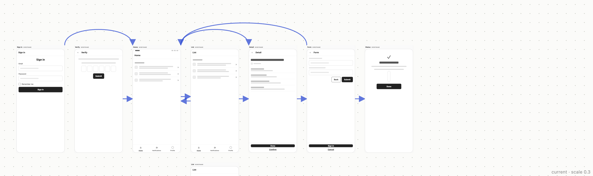
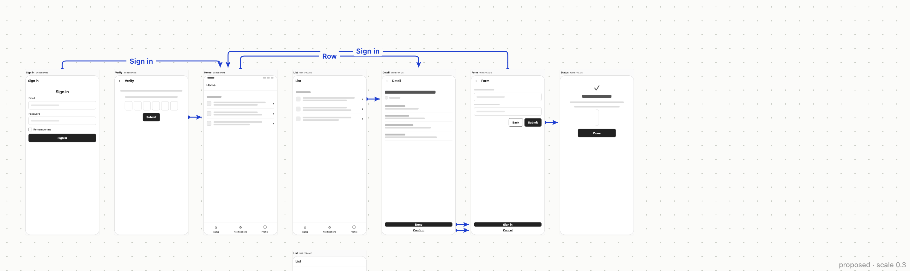
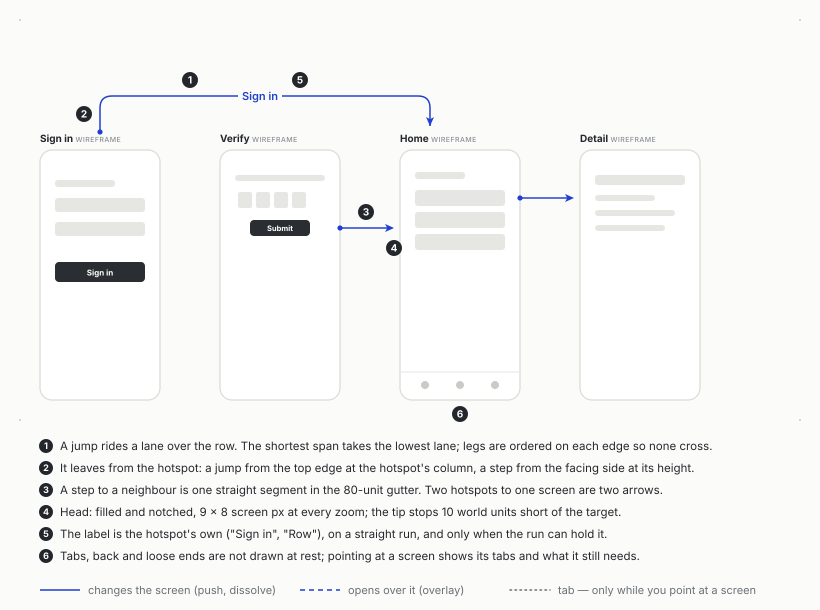
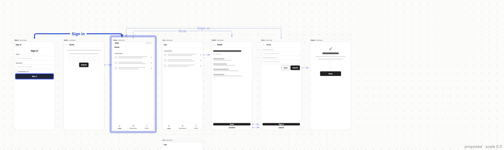
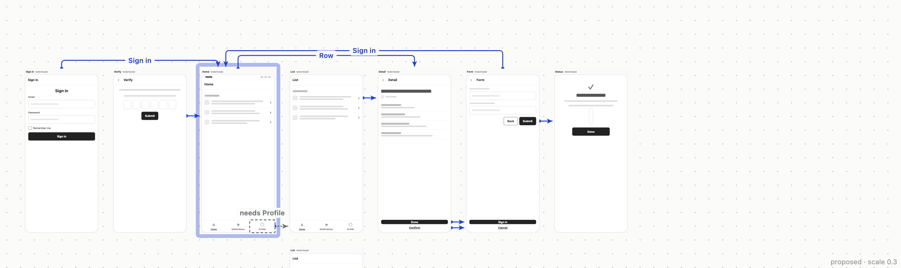
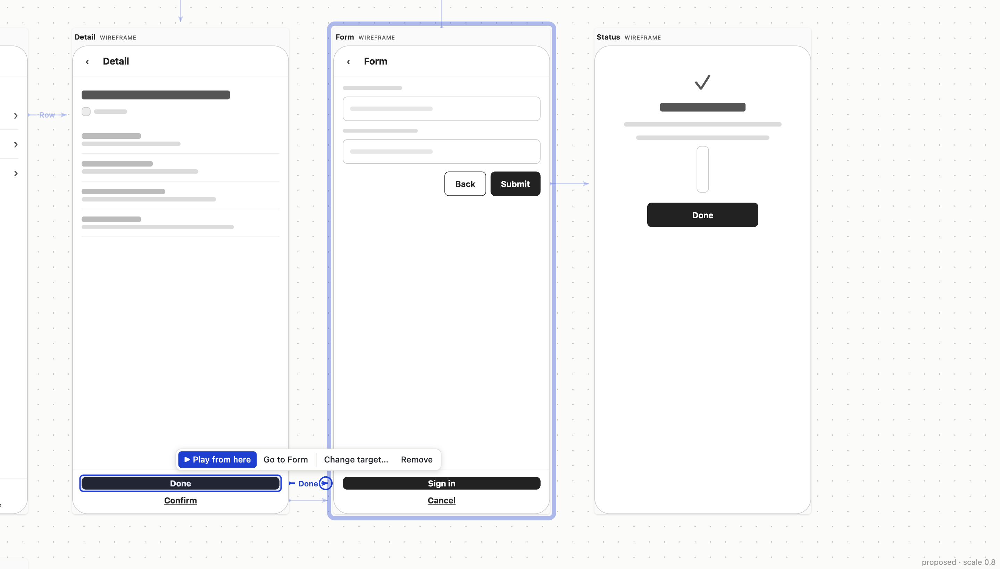

# Flow arrows that are arrows

**23 September 2026.** Dion, looking at the arrows the wireframes module draws
between kept screens (`packages/modules/wireframe/src/arrows.tsx`, design §7,
phase 5): *"the arrows between the screens look really strange. Can you make
them TRUE arrows? Take some time to research how best to do that. Also, I
can't seem to click on the arrow itself... would be nice to be able to do
something with it."*

The questions asked: how do the tools that do this well draw a connection
between two frames, and why does it work; what does isocan's link already know
that theirs do not; and what can be built inside the wireframe module's lazy
chunk, given that the entry chunk is at its ceiling.

Nothing is built. The code was read at `bfb1e65a` (phase 5). Everything
isocan-side was measured on 23 Sep 2026 against the recorded Jev flow the
module's own tests replay (`test/fixtures/jev-acme-couriers.json`: sign in,
verify, home, list, detail, form, status) and against the 4-screen flow in
`links.test.ts`. The proposal was drawn in a browser harness on that same flow
(`flow-arrows/`, method at the end). The field was read from each product's
own documentation and, where it is open, its source at a named commit. Where a
finding is second-hand or inferred, it says so.

## The short version

1. **Today's arrows are per pair of screens, not per link, and that is most of
   what looks wrong.** `screenEdges()` collapses every hotspot joining two
   screens into one line, so *Done* and *Confirm* on the detail screen are one
   arrow, and on the 4-screen fixture a tab (*Search*) and a push (*Apply*)
   share one. An arrow that stands for two hotspots cannot be labelled, cannot
   show what kind of link it is, and cannot be retargeted, because retargeting
   is per hotspot (`wire link <screen> <element>`).
2. **The geometry ignores the one thing isocan knows that a whiteboard does
   not: where on the screen the link starts.** Every step leaves at the
   screen's vertical middle. Every jump leaves one top corner and lands on
   another. On the Jev flow, form → home lands on Home's top-right corner at
   the exact point where home → detail departs.
3. **Every both-ways pair in both fixtures exists only because of a tab
   bar.** Take the nav hotspots away and neither fixture has one. The
   overlapping pairs Dion saw are chrome: a tab bar is on every top-level
   screen and reaches every other one. Figma answers the same problem twice, in its own
   docs. It hides the connections a component instance inherits, and where
   frames repeat the same interaction it shows only the first. Both answers
   say the same thing: draw the flow at rest, and show the chrome when asked.
4. **The canvas and the prototype can disagree.** `keptArrows()` infers links
   across *all* kept screens, while `wire links` and `wire prototype` group by
   flow (`keptFlowsOf`). On a canvas with two kept flows, the arrows join
   flow B's *Sign in* to flow A's *Home*, a link neither the prototype nor the
   CLI has (reproduced below). By the house rule, that is the wrong shape.
5. **Recommendation: orthogonal arrows, one per link, from the hotspot.** A
   step to a neighbour is a straight segment at the hotspot's height in the
   80-unit gutter. A jump rides a lane above the row, and the legs on each
   screen's top edge are ordered so no lane crosses another leg: **1 crossing
   on the fixture without that ordering step, 0 with it**. Heads are filled
   and notched, 9 × 8 screen px at every zoom, and stop 10 world units short
   of the target. Labels appear only where the straight run can hold them.
   Tabs, back and loose ends are drawn only while you point at a screen. None
   of this changes the shell or costs entry bytes.
6. **Clicking needs exactly one shell change, and the codebase already named
   it.** `modules.ts` says underlays *"DRAW, and nothing has needed to write
   from one yet — so they do not get it, and the day a module needs that it is
   a review question."* Today is that day. Retarget, unlink and reset are the
   existing `wire link` override (`item.update` on `wireLinks`), so no new op
   is needed. *Play from here* is the one new capability: the viewer has to
   pass a fragment to an HTML item's frame, and the prototype's router has to
   read it.


*Today, at 0.3 zoom (the harness ports `arrows.tsx` line for line).*


*The proposal, same flow, same zoom. Tabs and back links are not drawn at
rest.*

## What the arrows do today, measured

### The code, read

`arrows.tsx` asks `keptArrows()` for edges, and those are
`screenEdges(inferLinks(allKeptScreens))`: one `{from, to}` per ordered pair,
with back links and self-links dropped. It then draws one cubic per edge:

- **Steps** (the dominant axis is horizontal): from the source's side at its
  vertical *centre* to the target's facing side at its centre. When the pair
  links both ways, both lines shift by 18 world units.
- **Jumps**: when `|dx| > (wa + wb)/2 + 200`, the path bows above the row. For
  390-wide app screens that threshold is 590 world units, so any screen two
  places away (dx = 940) bows, lifted by min(240, 0.18·|dx|) = 169. The path
  runs `M x1 a.y C x1 a.y−lift, x2 b.y−lift, x2 b.y`, from the source's top
  corner on the side of travel to the target's opposite top corner, so the
  head points straight down at a corner.
- **The both-ways shift is not applied to jumps.** If A jumps to C and C jumps
  back to A, the two paths are the same curve reversed, drawn twice with a
  head at each end. Neither fixture has such a pair, so this is latent and
  found by reading the code.
- **Heads**: an SVG `<marker>` 8 × 8 in stroke-width units, and the stroke is
  `calc(2px / var(--scale))`, so every head is a **16 × 16 screen-px filled
  triangle** at every zoom, at the path's 0.7 opacity. `refX` is 9 in a
  10-unit box, which puts the tip 0.8 stroke widths, **1.6 px, inside the
  target**. There is no gap.
- **No pointer events**: `.wire-arrows { pointer-events: none }`, and the
  stylesheet says so on purpose: *"a drawing about the screens, never a click
  target"*.

### The links, counted

`inferLinks` on the two synthetic flows the tests use
(`flow-arrows/counts.mts`, run 23 Sep):

| | 4-screen fixture (`links.test.ts`) | Jev flow, all 7 kept |
| --- | ---: | ---: |
| links (one per hotspot that navigates) | 31 | 20 |
| … to another kept screen | 6 | 10 |
| … back (`LINK_BACK`) | 4 | 5 |
| … missing (`to: null`, names what it needs) | **19** | 3 |
| arrows drawn today (`screenEdges`) | 5 | 9 |
| arrows standing for more than one hotspot | 1 (*Search* tab + *Apply* push) | 1 (*Done* + *Confirm*) |
| both-ways pairs | 1, home ↔ list; the way back is the *Home* tab | 1, home ↔ list; *Notifications* tab one way, *Home* tab back |
| jumps (bow over the row) | 1 | 3 |

Two things in this table shape the design. **Missing links outnumber real
ones** on the recipe-default fixture (19 to 6), so drawing loose ends at rest
would bury the flow. And **the only both-ways pairs come from tab bars**: on
the Jev flow, home → list by the *Notifications* tab and list → home by
*Home*; on the 4-screen flow the way back is the *Home* tab too. The second one is not
even labelled `tab` by `inferLinks`. Rule 1 placed it by intent, with
transition `none`. So "is this chrome?" has to come from the hotspot being a
nav item, not from `rule`. `Hotspot.tab` already knows; `WireLink` does not
carry it.

### The flow bug, reproduced

Two kept flows. Flow B's *Sign in* sits in a row above flow A's *Sign in* and
*Home*. The script is `flow-arrows/two-flows.mts`; its output, verbatim:

```
canvas arrows: [{"from":"b_signin","to":"a_home"},{"from":"a_signin","to":"a_home"}]
prototype/wire links for flw_b []
prototype/wire links for flw_a [{"from":"a_signin","to":"a_home"}]
```

The canvas draws `b_signin → a_home`. The prototype does not play it, and
`isocan wire links` does not print it. The fix is small: draw per
`keptFlowsOf()`, which is the function the CLI and the prototype already use.

### What that looks like

In the *before* picture, the eye catches three things. The ⇄ knot between
Home and List is the tab bar, at mid-height, 18 units apart. Big heads point
straight down at corners. The two arcs over Home and List meet at one corner.
None of the lines tells you which button it belongs to.

## How the field draws a connection

Read on 23 Sep 2026 from each product's documentation. For tldraw, Excalidraw,
React Flow, mxGraph and Mermaid, the numbers come from source at the named
commit, not from a blog about it.

| Tool | Default routing | Where it starts and ends | Gap at the target | Head | Labels | Interaction |
| --- | --- | --- | --- | --- | --- | --- |
| **Figma prototype** ([guide](https://help.figma.com/hc/en-us/articles/360040314193-Guide-to-prototyping-in-Figma), [connect](https://help.figma.com/hc/en-us/articles/360040315773-Connect-your-prototype), [view](https://help.figma.com/hc/en-us/articles/4411431245335-View-prototype-connections)) | curved "noodle" (the curve itself is not documented) | *"the arrow or 'noodle' that connects the hotspot to the destination"*; the destination is a top-level frame | not documented | not documented | none: the interaction lives in a panel | drag the + from the hotspot; *"Hold and drag the connections to a new destination frame"*; select to edit; ⇧E toggles all |
| **FigJam** ([connectors](https://help.figma.com/hc/en-us/articles/1500004414542-Create-diagrams-and-flows-with-connectors-in-FigJam), [Figma's own agent guide](https://github.com/figma/mcp-server-guide/blob/main/skills/figma-use-figjam/references/create-connector.md)) | **ELBOWED** by default; straight and curved too | snaps to a side of a shape; magnets AUTO/TOP/LEFT/BOTTOM/RIGHT/CENTER | not documented | end cap `ARROW_LINES` (open), start none | on the line, draggable along it | drag the blue endpoint dot to another object or side |
| **tldraw** (source at `be38cf1f`) | arc; **elbow** since [v3.13](https://tldraw.dev/releases/v3.13.0) | binds by intersecting the line with the shape's outline; `isPrecise` aims at an anchor, otherwise at the centre | `BOUND_ARROW_OFFSET = 10` + half the stroke, in scene units | `arrow`: open, wings at ±30°, length `clamp(len/5, sw, 3·sw)`, so it shrinks on short arrows | `labelPosition` 0.5; **the body is clipped around the label** | drag either end to rebind; Alt binds exactly |
| **Excalidraw** (source at `4850bf33`; [elbow arrows 1](https://plus.excalidraw.com/blog/building-elbow-arrows-part-one), [2](https://plus.excalidraw.com/blog/building-elbow-arrows-part-two)) | straight; elbow arrows by A* over a sparse grid, cost = Manhattan length + bends | outline of the bound shape | `BASE_BINDING_GAP = 5` + half the target's stroke | per style | bound text containers | drag the endpoint |
| **React Flow** (xyflow at `159995fe`) | `default` = bezier; also `straight`, `step`, `smoothstep` (offset 20, radius 5), `simplebezier` | handles on node sides | none (the handle is the end) | `Arrow` / `ArrowClosed` markers | `label` with a background pill | `interactionWidth = 20` invisible hit path; `reconnectRadius = 10`; edges under nodes, `elevateEdgesOnSelect = false`; keyboard: *"Press enter or space to select an edge. You can then press delete to remove it or escape to cancel."* |
| **draw.io / mxGraph** ([styles](https://www.drawio.com/docs/manual/styles/connector-styles/), `mxConstants.js`) | straight, orthogonal, curved, entity relation | perimeter, with optional perimeter spacing | configurable | `DEFAULT_MARKERSIZE = 6` | on the edge | **line jumps** (arc, gap, sharp) where lines cross |
| **Mermaid** (`config.schema.yaml`) | `flowchart.curve` default **`basis`**; `step` and `linear` too | dagre's node boundary | n/a | filled | on the edge | none |
| **Miro** ([connection lines](https://help.miro.com/hc/en-us/articles/360017730733-Connection-lines)) | straight, elbow, curved | snaps to objects (⌘ disables) | n/a | per line | a caption; its font cannot be changed | drag the points; double-click resets bends |
| **Whimsical** ([connectors](https://whimsical.com/learn/boards/connectors)) | elbows or curves, per connector | shape handles | n/a | eight endpoint types | drag the label along the connector | — |
| **Axure RP** ([flow diagrams](https://docs.axure.com/axure-rp/reference/flow-diagrams/)) | connectors that *"reflow to remain attached"* | flow shapes, each with a page reference | n/a | styleable | yes | **generates** a flow diagram from the page tree |
| **Overflow** ([features](https://overflow.io/features/)) | not documented | *"Drag connectors from any layer on your artboard"*; hotspots drawn on screenshots | n/a | styleable | styleable apart from the line | — |
| **Balsamiq** ([linking](https://balsamiq.com/wireframes/cloud/docs/linking/)) | **no arrows at all** | — | — | — | — | a link hint on hover; **Option/Alt highlights every link on the board**; in presentation, a hand pointer names the target |

Not verified: Framer (not checked) and ProtoPie. ProtoPie's docs describe scene
changes as a *Jump* response set in the interaction panel. I found no drawing
of them on the canvas, but I read only search results, not the pages.

### Five mechanisms worth taking, and why each works

**1. The arrow belongs to the hotspot, not the frame (Figma, Overflow).**
Figma's definition is the whole idea: a connection joins *a hotspot* to *a
destination*. The source end is an element. The target end is a whole frame.
That asymmetry is exactly what `WireLink` already is: `from` + `key` on one
side, `to` a screen on the other. It is why the arrow should *start* at the
hotspot and *end* at the target's boundary.

**2. Repeated chrome is drawn once, or not at all (Figma, twice).** From the
connect guide: *"When there are matching interactions on a canvas, only the
first connection (the top-left one in view) is displayed. Select that
connection to display all other matching interactions in view."* Matching
means *"identical interactions that begin from matching objects in other
frames"*: same action and destination, identical names, matching hierarchy.
And for component instances: *"Figma won't display the inherited connections
on the canvas by default."* A tab bar is precisely a matching, inherited
interaction. The forum complaint that produced this, about a navbar making
connections impossible to follow, is the *"header nav and prototype
spaghetti"* thread. forum.figma.com's archive returns 403 from here, so that
wording is second-hand, taken from a search index.

**3. Back has no arrow (Figma).** *"Not all interactions have
destinations—for example, the Back trigger automatically returns to the
previous frame."* isocan already agrees: `screenEdges` drops `LINK_BACK`.
History is not a place, and drawing it would double every arrow.

**4. The head stops short, by a constant in scene units (tldraw, Excalidraw).**
tldraw subtracts `BOUND_ARROW_OFFSET = 10` plus half the stroke from the end
when the end is bound and has a head. Excalidraw's `getBindingGap` is
`BASE_BINDING_GAP (5) + strokeWidth / 2`. Both are in scene units, so the
gap scales with zoom. Steve Ruiz's talk
([Arrows at length](https://gitnation.com/contents/arrows-at-length)) gives
the reason for the arc arrow: offsetting a Bezier to pull the head back is
hard; *"you just reverse the arrow"*. A gap reads as *pointing at*, while a
tip buried in the outline reads as *stuck in*.

**5. Orthogonal routes are ordered, not just found (libavoid).** Wybrow,
Marriott and Stuckey,
[*Orthogonal Connector Routing*](https://users.monash.edu/~mwybrow/papers/wybrow-gd-2009.pdf)
(GD 2009), the algorithm behind Dunnart and Inkscape's connectors, works in
three stages: an orthogonal visibility graph, A* minimising a function of
length and bends, then **nudging**. Nudging orders connectors that share a
channel so the ordering *"does not introduce unnecessary crossings"*, and
pushes them a minimum distance apart. The paper says nudging is *"often
overlooked, but feedback from users of Dunnart and Inkscape suggests that it
has a significant impact on the perception of layout quality"*. It routes
diagrams under 100 nodes *"in a fraction of a second"* on 2009 hardware.
Excalidraw's published elbow router is the same family: A* on a grid placed
*"at shape corners, start and end point headings, and halfway between
shapes"*.

### What the readability research measured

- **Crossings dominate.** Purchase,
  [*Which aesthetic has the greatest effect on human understanding?*](https://eprints.gla.ac.uk/35804/)
  (GD 1997): *"reducing the number of edge crosses is by far the most
  important aesthetic"*. Bends and symmetry matter less. Fixing edges to an
  orthogonal grid was not significant on its own. So orthogonal routing is
  not the goal. It is the means to fewer crossings.
- **The standard arrow is not the best direction cue, but the problem it has
  is overlap.** Holten and van Wijk (CHI 2009) compared the standard arrow
  with tapered, curved, colour-gradient and combined representations. Tapered
  links, wide at the source and narrow at the target, were best. Clockwise
  curvature, where the bend itself says the direction, *"showed poor
  performance"*. Combining cues brought *"no significant performance
  gains"*. The authors put the arrow's trouble down to *"arrowhead overlap"*.
  I could not read the 2009 paper itself: the publisher elides the abstract
  and the PDF is paywalled. These findings are as summarised by the same
  group's
  [2010 follow-up](https://petra.isenberg.cc/publications/papers/Holten_2010_PEO.pdf),
  which found tapered and animated links significantly better than biased
  curvature. What this means here: keep the conventional head, which is what
  every tool above uses. Our graphs are sparse (5–10 arrows), so tapering's
  advantage is small against its unfamiliarity. But never let heads pile up
  on one point. That is today's corner problem exactly. And do not ask a
  curve to carry direction.
- Xu et al., *A user study on curved edges* (TVCG 2012), is widely cited on
  curves against straight lines. Its abstract is elided by the publisher's
  API and the paper is paywalled, so it is **not used here**.

## What isocan already has under another name

- **A clickable connection underlay: `anatomy/src/edges.tsx`.** Each
  connection is a `<g role="button" tabIndex=0>` with an `aria-label`, a
  16-unit-wide transparent hit path with `pointer-events: stroke`,
  `stopPropagation` on pointerdown so the canvas starts no marquee, and
  Enter/Space to activate. The pattern exists and has shipped. It navigates
  only through `activateItem`, which is provided only inside a module
  workspace (`ModuleWorkspace.tsx`), never on the plain canvas.
- **Retarget is `wire link`.** `isocan wire link <screen> <element> <target>`,
  `--none`, `--back` and `--clear` already write the one stored thing, a
  person's decision about one hotspot, as `wireLinks` on the source screen via
  `item.update`. Dragging an arrowhead to another screen is that same op. No
  new vocabulary.
- **Every hotspot is already stamped.** The renderer puts `data-hot="<key>"`
  on every hotspot, and a test holds `hotspots(spec)` and the stamps equal. So
  the hotspot's position on the screen can be *measured*, not guessed.
- **A safe frame to measure in.** `TextEditFrame.tsx` renders HTML in
  `sandbox="allow-same-origin"` + `srcDoc`, with scripts dead. Its comment
  calls it *"the measured pair"*, and a test pins the string. The same pair
  can lay out a wire off-screen and read its `[data-hot]` rects.
- **Camera and selection verbs for a host:** `WebHost.reveal` and
  `WebHost.select` exist. Underlays just are not handed a host.
- **Why the mind map's curve is not the answer here.** `mindmap/edges.tsx`
  argues that a map edge is *"a branch, not a wire"*: axis-aligned Bezier,
  handle at half the span. That is right for a tree of small text nodes
  fanning out. A flow between 390 × 876 rectangles in a grid with 80-unit
  gutters is a different drawing. Between neighbours, a curve from a port to
  the facing side at the same height *is* a straight line.

## The recommendation



The same sketch as SVG source, for anybody reading this as text:
[`flow-arrows/sketch.svg`](flow-arrows/sketch.svg). The pictures below are the
harness drawing the proposal on the Jev flow.

### 1. Geometry

**Inputs.** For each kept flow separately (`keptFlowsOf`), take the links from
`inferLinks`, **one arrow per link**, no longer per pair. Take the screens'
boxes, the drag delta (already in `UnderlayFacts`), and each hotspot's rect in
screen-local units. The rect comes from rendering `renderWire(readWire(file))`
in one hidden `allow-same-origin` srcdoc frame at the screen's document size
and reading `[data-hot]`. Cache it per blob hash, beside today's spec cache.
The harness measured **25 hotspots over 8 screens: frames loaded in 30–150 ms,
rects read in under 1 ms**. Measure what the renderer draws, not the fetched
bytes, so no foreign HTML ever renders same-origin. If measuring fails, fall
back to the slot's recipe region: a header near the top, a nav at the bottom,
main in the middle.

**Two route shapes, decided by the rows** (`readingOrder`'s rows, which is
also how "kept" is ordered):

- **Step**: the target is the next kept screen in the same row, with nothing
  between. The route is one horizontal segment at the **hotspot's height**,
  from the source's facing side into the gutter. It enters the target's
  facing side at the same height, clamped inside the target's frame. Two
  hotspots to one neighbour give two parallel arrows at their own heights
  (*Done*, *Confirm*). The hotspot separates them. If two ports fall within 16
  world units, nudge the second down.
- **Jump**: same row, not adjacent. The route leaves the source's **top edge
  at the hotspot's column**, rises to a **lane** above the row, crosses, and
  drops onto the target's top edge. Lanes sit at 44 + 26·k world units above
  the row's top. Assign them greedily: shortest span to the lowest lane that
  its interval does not overlap. Then **order the legs on each top edge**,
  the nudging step. Legs whose lane runs left sit on the left, lowest lane
  outermost; legs running right sit on the right, lowest lane outermost.
  Departure ports stay at their hotspot column; arrival ports are spread
  between them. **Measured on the Jev flow: 1 crossing with arrivals spread
  naively, 0 with this ordering.**
- **Different rows** (a kept variation below its original): a Z through the
  column gutter. Leave the facing side at the hotspot's height, go down the
  gutter, and enter the target's facing side. The harness did **not** test
  this case or screens dragged off the grid. For layouts the rules do not
  cover, draw a straight segment under the items. If people drag screens off
  the grid often, replace the rules with the Wybrow pipeline (visibility graph
  → A* on length + bends → nudging). It is bounded and published, and it
  answers the case where the rules run out.

**Obstacles.** The router avoids *every* item in the flow's band, not only
kept screens: unkept variations, the prototype item, notes. Lanes above a row
cap at four. A fifth jump dims to its label.

**Corners** are rounded with a radius of 18 world units, React Flow's
`smoothstep` idea. The routes stay orthogonal and never look like a circuit
diagram.

**Heads.** Filled, notched ("stealth"), **9 px long × 8 px wide on screen at
every zoom**. That is 6 × the 1.5 px stroke, close to mxGraph's 6 px marker on
a 1 px line. The heads stay `<marker>`s with `markerUnits="strokeWidth"`, so
the existing `calc(Npx / var(--scale))` stroke makes them zoom-invariant with
**no re-render on zoom**. The hover stroke is thicker, so it gets its own
marker, scaled down to keep the same 9 px head. The path ends **10 world
units** short of the target, tldraw's number, and the tip sits at the path's
end. A zoom-relative gap follows both precedents: 3 px at 0.3, 10 px at 1.0.

**Z-order: under the items, as now.** React Flow draws edges under nodes by
default, and the mind map does too. The routes never pass under a screen by
construction. The visible part is exactly the part a pointer can reach.

**What the 80-unit gutter allows, in numbers.** At the overview zoom of 0.3,
the gutter is 24 screen px: a 9 px head, a 3 px gap and 12 px of line.
Measured label pills at 11 px semibold: *Row* 33 px, *Done* 38, *Sign in* 47,
*Confirm* 54, *Notifications* 80. A label fits in a gutter when
label + head + 8 px ≤ 70·scale. So *Row* appears from about 0.71 zoom and
*Sign in* from about 0.91. On a lane (≥ 470 world, ≥ 141 px at 0.3) every
label fits.

### 2. Meaning

| A link that… | At rest | While you point at its source screen | Style |
| --- | --- | --- | --- |
| changes the screen (`push`, `dissolve`, a person's override) | drawn | drawn | solid, accent |
| opens over the screen (`overlay`) | drawn | drawn | **dashed** accent (5 / 4 px) |
| is a nav item (tab, side nav, navbar, drawer) | **not drawn** | drawn | dotted, ink-soft, grey head |
| goes back (`LINK_BACK`) | never | never | — |
| is missing (`to: null`) | **not drawn** | the hotspot outlined dashed **on the screen**, with *needs Settings* above it | ink-soft |
| is switched off (`none`) | not drawn | not drawn | — |

At rest, one visual variable beyond direction: dashed means overlay.
Everything else waits for attention. That follows Holten's finding that
stacking cues gains nothing, Figma's two chrome rules and Balsamiq's
hover-for-links. The *dissolve* on *Sign in* and whether a link was inferred
or set by hand are shown in the selected arrow's toolbar, not in the line.

**Loose ends are marked on the hotspot, not as stubs.** The harness tried a
dangling dashed stub out of the side. In an 80-unit gutter its label landed
*under the next screen*. So *needs X* goes on the screen, above the hotspot,
and only while you point at that screen (see *screen hover* below). That is
also where the prototype already marks it: `data-needs` hotspots are outlined
dashed in `prototype.ts`.

**Labels are the hotspot's own words.** `WireLink.label` gives *Sign in*,
*Row*, *Submit*. Put the label on the straight run, with a ground-coloured
background pill hiding the line behind it. That is tldraw's clip done more
cheaply. Show it at rest only where the run holds it. The rule needs no
re-render on zoom: each label carries its run in world units and its own
width in px (constant, because it is counter-scaled). Then
`opacity: clamp(0, calc(var(--run) * var(--scale) - var(--need)), 1)` fades
it in exactly when it fits. That is the same shape as the themes'
`(scale − 0.1) / 0.4` fade. On hover and selection the label always shows,
lifted above the port if the run is short.

`WireLink` needs one new field for this, `nav: true` when the hotspot is a
nav item (`Hotspot.tab` is already set). It is pure, in the module's core,
and tested.

### 3. Interaction

**Hover an arrow.** The arrow thickens to 2.5 px and the rest dim to 0.22.
The label shows. **The source hotspot is outlined on its screen, and the
target gets a halo.** The halo is a thick, soft ring drawn *under* the target,
larger than it, so it shows around the edges without covering anything, and
it fits the underlay's contract. The hotspot outline has to paint *above* the
source screen. The underlay slot promises *"beneath everything … a module can
only draw under the work"*. A transient, `pointer-events: none` outline around
the thing the person is pointing at does not cover the work, but it is a
change to what the slot promises. It needs a yes and one sentence in
`modules.ts`, and no bytes, because the module paints it.


*Hover: Sign in's button outlined on its screen, Home haloed, the rest
dimmed.*

**Point at a screen** to see its tabs and loose ends. Underlays are not told
the selection or the hovered item. A `pointermove` listener in the lazy
module, throttled to one frame and hit-testing kept screens through the SVG's
own `getScreenCTM().inverse()`, finds the screen without touching the shell.


*Pointing at Home: its Notifications tab to List (dotted grey), and its
Profile tab marked "needs Profile".*

**Hit targets.** An invisible twin path,
`stroke-width: calc(16px / var(--scale))`, with `pointer-events: stroke`. That
is anatomy's 16; React Flow uses 20. `stopPropagation` on pointerdown, as
anatomy does, so the canvas does not start a marquee. Selected and hovered
arrows paint last, so they win where hit paths overlap near a shared target.
One thing to verify in a browser: the canvas's long-press `hold` cancels only
for `a, button, input…`, so the arrow group may need to opt out.

**Click selects the arrow.** The selection is module-local state, not the
canvas selection, which holds item ids. Selecting an arrow **clears the item
selection**. Otherwise Delete, meant for the arrow, deletes a screen. A
counter-scaled toolbar appears above the label:

- **▶ Play from here**: opens the flow's prototype full screen *at the source
  screen*, with the hotspot briefly outlined so you see what to press. Shown
  only when the flow has a prototype. Otherwise it says `/wire prototype`
  makes one.
- **Go to *Home***: `host.reveal([target])`. Figma users have asked for
  exactly this ("go to noodle destination"; that thread is also behind the
  archive's 403, so it is second-hand).
- **Change target…**: a menu of the flow's kept screens in reading order,
  plus *Back* and *Nowhere*. Or **drag the head**. When selected, the head
  gets a 20 px ring (React Flow's `reconnectRadius` 10). Drag it and a
  rubber band follows. The kept screen under the pointer gets the halo. Drop
  it and the result is `item.update` of `wireLinks[key]`, one group, one
  undo, exactly what `wire link` sends. Dropping on nothing, or Esc, cancels.
  React Flow's example deletes the edge on a drop into nothing. That turns a
  slip into a destructive act, so it is not copied.
- **Reset**: only when the link is a person's override (`rule: "override"`).
  It is `wire link --clear`.
- **Unlink**: `wire link --none`, also Delete/Backspace, with the usual undo
  notice.


*Selected: Detail's Done → Form. Handle ring on the head, toolbar above. The
image also shows the gutter's limit: at 0.8 the label and the head fill the
80-unit gutter.*

**Keyboard.** Arrows are focusable (`tabIndex=0`, `role="button"`,
`aria-label="Sign in, from Sign in to Home"`). Enter selects, Delete unlinks,
Escape deselects. These are React Flow's keys and anatomy's roles. The
list-shaped door matters more: **`/wire links`**, a new mode of the existing
Wireframes dialog (`modeOf` already dispatches `prototype` and `style`). For
the selected screen, or the whole flow, it shows `isocan wire links` as a
table with a target picker per hotspot. It writes through the dialog's own
`host.send`. It needs no shell change and no entry bytes, and it works for a
screen reader, which a spatial graph never fully will.

**Read-only viewers and the past.** A viewer can hover, select, *play* and
*go to*. The writing actions are hidden. That needs `canEdit` beside the host;
until then, `host.send` refuses with its sentence. In the scrubber's past,
arrows draw from `past.canvas` as now and are not selectable.

### 4. Performance and the bundle

- **Phase A (the look, hover, screen-hover, `/wire links`)** lives entirely
  in the wireframe module's lazy chunk: `arrows.tsx`, a pure router in the
  module's core, the `nav` field in `links.ts`, `dialog.tsx`. The
  activation predicate (*two kept screens?*) is unchanged, so **the entry
  chunk does not move**. Routing is rules, not search: lane assignment is
  quadratic in about ten links, and it runs on the drag frames the underlay
  already re-renders on. Zoom costs nothing, because heads, strokes and
  labels are all CSS-scaled.
- **Phase B (select and write, play from here)** needs shell changes:
  `UnderlayFacts.host` (a `WebHost`, with `canEdit`), and an `openItem(id,
  hash?)` that makes the full-screen viewer put a fragment on an HTML item's
  frame `src`. The frame is a blob URL, so a fragment costs no cache and no
  server change. The types add no bytes. `ModuleUnderlays.tsx` building a host
  does add bytes to the entry. **That number is unmeasured**, and the entry
  was already 567 bytes over its ceiling at phase 5's close (728,367 against
  727,800, phases.md). So phase B lands the same way that finding did: as
  Dion's call, with this reason attached.

## What it would take, on both surfaces

1. **Ops**: none. Retarget, unlink and reset are `item.update` on
   `wireLinks`, as `wire link` sends.
2. **CLI**: `wire link` exists. Add **`wire play [screen]`**, which opens the
   flow's prototype at that screen. Under it goes a generic `isocan open
   <item> --at <anchor>` that puts the anchor on the frame.
3. **Agent guide**: the module's `agent-guide.md` gains `wire play`, and one
   line saying arrows are per hotspot, so `wire links` rows and arrows
   correspond one to one.
4. **Core**: the router, `nav` on `WireLink`, and the per-flow grouping, all
   pure in the module's core. Tests: crossings = 0 on the Jev fixture, step
   ports at hotspot heights, one arrow per link, no arrow across flows.
5. **README**: the wireframes line gains "click an arrow to play from there
   or change where it goes" when phase B lands.
6. **Browser walk, said out loud**: hover, point at a screen, select, drag a
   head to another screen, one undo, Delete, Play from here, keyboard
   Enter/Delete/Escape. One more thing to verify there: whether an HTML item's
   frame starts exactly at `item.y`. The harness assumes the wire's caption is
   part of the item, as it is in the file.

## One recommendation, and two runners-up

**Recommendation: redraw the arrows as orthogonal, per-hotspot flow arrows now
(phase A), and ask for the underlay host next (phase B).** Phase A fixes
everything Dion described as strange. Each arrow leaves the button it belongs
to. Steps are straight. Jumps ride ordered lanes: 0 crossings where the naive
lane assignment had 1. Heads are small, gapped and consistent. Tabs stop
knotting. The canvas stops disagreeing with the prototype. It costs no shell
change and no entry bytes, and it gives keyboard users `/wire links` on day
one. Phase B makes the arrow something you can use: play from here, go to,
change target, unlink. It is gated on the one shell question `modules.ts`
reserved for exactly this, and every write it makes is an op the CLI already
sends.

**Runner-up 1: curved noodles from the same ports, like Figma.** This is the
familiar look, and it lost on the geometry of this layout. Between neighbours
the port and the entry are at the same height, so a curve is a straight line.
For jumps, today's arcs lift by span alone, so two jumps of equal span over
the same stretch share a height, and a reversed pair shares one path. Both
come from reading the code; neither occurs in the two fixtures, but nothing
in a curve family prevents them. Curves also offer no
straight run for a label, and no channel in which to order legs and remove the
crossing Purchase measured as the cost that matters most. Holten's studies add
that curvature carries direction poorly. Choosing curves would mean choosing
familiarity over the measured result. That is a real reason, but the weaker
one here.

**Runner-up 2: no arrows at rest, links only on demand.** This is Balsamiq's
model: a hint on hover, Alt to see them all. It is clean and cheap, and it
lost because design §7 draws the links *"so the flow is visible before the
prototype exists"*. At rest, an arrow's value is reading a flow at a glance,
and Dion asked for better arrows, not fewer. The proposal keeps the idea
where it is right: chrome and loose ends only on demand. A later "hide
arrows" switch belongs in the hideable-controls registry
([Chrome you can turn off](2026-09-02-chrome-you-can-turn-off.md)), not in
this design.

Also considered and set aside: **tapered links** (the direction cue measured
best, but unfamiliar in UI flows, with little gain on 5–10 sparse edges), and
**a tab "bus"**, one line under the top-level screens with a tick per member.
The bus is an honest picture of a symmetric relation. It lost to *hide at
rest* because it is a new visual idiom that nobody asked for, and neither
Figma rule needs it.

## Method

Everything is in [`flow-arrows/`](flow-arrows/). Run from the repo root.

- `npx tsx docs/research/flow-arrows/gen.mts` replays the Jev fixture through
  the module's own rounds, lays the seven screens in one row as `flow.ts`
  does (GAP 80) with an unkept variation under the list, and writes
  `harness-data.js`, which is generated and not committed.
- `PLAYWRIGHT_CORE=<path to playwright-core/index.mjs> node
  docs/research/flow-arrows/shot.mjs` renders `harness.html` in Chrome. The
  harness puts each screen in an `allow-same-origin` srcdoc frame, measures
  `[data-hot]`, and draws either today's `arrows.tsx` (ported line for line)
  or the proposal. It prints load and measure times and the crossing count,
  and writes the PNGs shown here. `mode=proposed&naive=1` is the lane
  assignment without the ordering step: 1 crossing.
- `npx tsx docs/research/flow-arrows/two-flows.mts` is the flow bug: three
  kept screens in two flows, with the canvas arrows printed beside
  `screenEdges(inferLinks(flow))` for each flow.
- `npx tsx docs/research/flow-arrows/counts.mts` prints the link-count
  table: every link per flow, what `screenEdges` collapses it to, and which
  pairs run both ways.
- Label widths: 11 px semibold system-ui pills, measured with
  `getBoundingClientRect` in the same Chrome.
- Sources for the field: the pages linked in the table. Source files are at
  tldraw `be38cf1f` (`packages/tldraw/src/lib/shapes/arrow/{shared,
  arrowheads,straight-arrow}.ts`, `ArrowShapeUtil.tsx`,
  `tlschema/.../TLArrowBinding.ts`), Excalidraw `4850bf33`
  (`packages/element/src/binding.ts`), xyflow `159995fe`
  (`packages/react/src/components/Edges/BaseEdge.tsx`,
  `container/ReactFlow/index.tsx`, `components/EdgeWrapper/index.tsx`,
  `packages/system/src/constants.ts`), mxGraph `javascript/src/js/util/
  mxConstants.js`, and Mermaid `packages/mermaid/src/schemas/
  config.schema.yaml`. forum.figma.com's archive returns 403 from here, so
  its two threads are cited second-hand.
